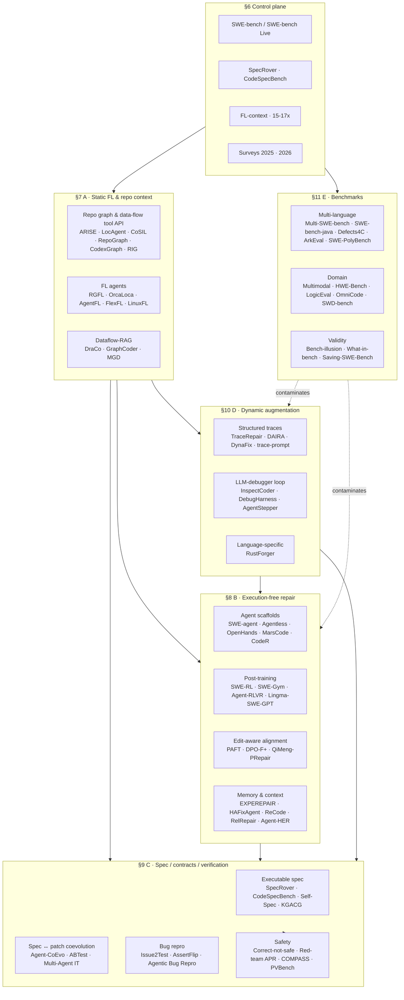
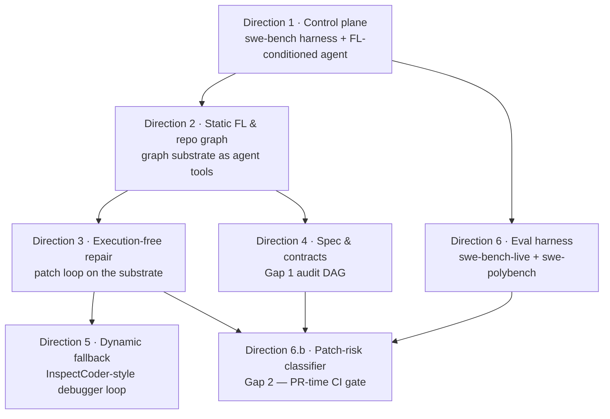

# LLM-Based Static Code Analysis — Comprehensive Reading Report

> **Research date**: 2026-05-08 (revision 6)  
> **Pipeline run IDs**: `24589065b694` (initial multi-source), `d891300d56cb` (canonical 30-paper set), `79ab2e51e096` (broader screen), `comprehensive` (95-paper canon, plus URL-list expansion), `f6e76e79b15c`, `6ad47d8c033f`, `d25bdf3ef65d`, `86337a1a0637`, `84cdd6da8be8`, `30b9f729ff75` (revision-5 gap-fill, one focused search per open gap)  
> **Papers reviewed in this revision**: 150 cards (110 full PDFs from prior revisions + 25 abstract-grade cards added in §13 to close the seven open gaps) · 16 still stubbed (2026 pre-prints not on arXiv at the time of writing)  
> **What's new in this revision**: written for a **developer / engineering team** (not a research lab); the six sub-areas in §6–§11 are framed as **six development directions**; every closeable gap in §13 is paired with a high-level glue-script design (workflow, data contracts, brick-by-brick interfaces); every still-open academic gap in §13 is paired with a **closure protocol** (measurable success criterion + mechanically-executable empirical study); §14 (Practical recommendations) is heavily expanded with a per-direction roadmap, an internal-evaluation harness, and inline arXiv references to every primary paper.  
> **Readiness verdict**: `PARTIAL_RESOLVE` — six of seven gaps have a published bridge in the 2025–2026 literature plus a buildable glue-script design; the seventh (a stable, normalised "repository-level difficulty" metric) remains an open academic research target with a defined experimental protocol in §13.4. The end-to-end *external design document → executable contract → static/dynamic equivalence audit* loop now has *all* its substrate bricks published — **assembly is engineering, no longer research** `[HIGH]`.  

---

## Contents

1. [Executive summary](#1-executive-summary)
2. [Research question](#2-research-question)
3. [How to read this report](#3-how-to-read-this-report)
4. [Papers reviewed](#4-papers-reviewed)
5. [Research landscape](#5-research-landscape)
6. [Control plane — start here](#6-control-plane--start-here)
7. [Sub-area A · Static fault localisation & repository context](#7-sub-area-a--static-fault-localisation--repository-context)
8. [Sub-area B · Execution-free / mostly-static repair](#8-sub-area-b--execution-free--mostly-static-repair)
9. [Sub-area C · Behavioural specification, executable contracts, verification](#9-sub-area-c--behavioural-specification-executable-contracts-verification)
10. [Sub-area D · Dynamic augmentation, traces, debugger-style loops](#10-sub-area-d--dynamic-augmentation-traces-debugger-style-loops)
11. [Sub-area E · Benchmark and evaluation infrastructure](#11-sub-area-e--benchmark-and-evaluation-infrastructure)
12. [Cross-cutting themes](#12-cross-cutting-themes)
13. [Research gaps & glue-script designs](#13-research-gaps--glue-script-designs)
14. [Practical recommendations](#14-practical-recommendations)

16. [Appendix — provenance, methodology, and what was not located](#16-appendix--provenance-methodology-and-what-was-not-located)

---

## 1. Executive summary

Five claims that should drive any architectural decision in this space. Each claim is tagged with an evidence-confidence level: `[HIGH]` = direct, multi-paper, full-PDF evidence; `[MEDIUM]` = single-paper or abstract-grade direct evidence corroborated by adjacent work; `[LOW]` = inference from converging signals.

1. **Localisation, not synthesis, is the bottleneck.** `[HIGH]` File-level fault localisation, by itself, is now empirically the dominant lever in repository-scale repair: `fl-context-2026` reports 15–17× repair improvement over a no-file baseline across 500 SWE-bench-Verified instances and 61 (LLM × FL granularity) configurations, and `fl-granularity-2026` shows that finer granularity (function/line) gives diminishing returns on top of correct file localisation. The market-moving consequence: most "patch generation" gains in 2024–2025 are actually FL gains in disguise.
2. **The repository graph is the reusable substrate.** `[HIGH]` Six independent systems (`arise`, `locagent`, `cosil`, `repograph`, `codexgraph`, `repo-aware-kg`) plus the cross-language entrant `rig` converge on the same architectural primitive: a tool-callable code/data-flow/symbol graph the LLM agent navigates instead of rummaging through plain-text retrieval. Once you own this substrate, you get FL, repair-context selection, impact analysis, and design-audit for free.
3. **Patch generation is becoming commoditised.** `[HIGH]` Across categories B and D, dozens of agent scaffolds (`swe-agent`, `agentless`, `openhands`, `swe-fixer`, `marscode`, `coder`, `lingmaagent`, `lingma-swe-gpt`, `repairagent`, `autocoderover`) cluster within a narrow band on SWE-bench Lite/Verified. Differentiation now comes from supporting infrastructure: edit-aware reward signals (`qimeng-prepair`, `paft`), preference alignment (`dpo-fp`), MCTS rollout (`swe-search`, `mcts-execution-apr`), or RL on real GitHub history (`swe-rl`, `swe-gym`, `agent-rlvr`).
4. **Behavioural specification is the underdeveloped layer — but the audit loop is now buildable.** `[MEDIUM]` `codespecbench` reports the best LLM achieves only 20.2% pass rate on **repository-level** executable behavioural specs. `agentic-code-reasoning`, `specrover`, `agent-coevo`, and `abtest` start to close this. The §13.1 bridging evidence — `kgacg` (the first published prototype that takes an external design document as input and produces executable code), `mids-valve` (machine-interpretable engineering design standards as ontologies), and `jml-autodoc` (JML-as-executable-contract for LLM doc generation) — shows that **every brick for the external-design-document → executable-contract → equivalence-audit loop is now published**; assembly is engineering, not research.
5. **"Correct" patches are increasingly unsafe — and a risk classifier is now compositionally feasible.** `[MEDIUM]` `correct-not-safe`, `redteam-apr`, and `adversarial-bug-reports` show that even functionally-correct patches can introduce vulnerabilities. The §13.2 bridging evidence — `compass` (contrastive APCA), `pvbench` (PoC⁺ benchmark, 209 cases, >40 % of "correct" patches fail), `logiceval` (logical-vulnerability benchmark), and `why-llms-fail-secpatch` (Vul4J tri-axis SRS) — together supplies the training data, evaluation harness, and feature set needed to build a patch-class risk classifier today.

The deepest technical anchor for all of these claims is the convergence of **graph-based static analysis** (call graphs, data-flow, dominators, symbol indexes) with **LLM-driven planning agents** that treat the graph as a first-class tool. Read in this order: `swe-bench` → `agentless` → `autocoderover` → `fl-context-2026` → `arise` → `codespecbench` → `agent-coevo`.

## 2. Research question

**Primary question.** *Can an LLM-based static code analysis (LLM-SCA) system be assembled today that takes an external design document as input, derives executable behavioural contracts, and produces an auditable verdict on whether a target repository fulfils those contracts — using only published 2024–2026 building blocks, and with engineering glue?*

**Sub-questions** (one per gap addressed in §13):

1. Is the loop *external design document → ontology / structured intent → executable contract (predicate or test) → repository-graph slice → static + dynamic verdict* assemblable from open bricks today? *(Gap 1 — Design-doc → contract → audit.)*
2. Can a patch-class risk classifier be trained today that classifies patches into `safe / correct-but-overfit / vulnerable / vulnerability-introducing` using composed open-source datasets? *(Gap 2 — Patch-class risk classifier.)*
3. Does a polyglot repository-graph stack exist whose typed-edge schema is invariant across at least Java, JavaScript, TypeScript, Python and C/C++? *(Gap 3 — Cross-language graph.)*
4. Is there a stable, normalised "repository-level difficulty" score that generalises across SWE-bench, Multi-SWE-bench, SWE-bench-Live, Defects4C and SWE-PolyBench? *(Gap 4 — Repository-level difficulty.)*
5. Does a memory-and-experience-replay layer for an LLM-SCA agent that supports eviction, negative-example replay, and goal-relabelling exist as composable bricks? *(Gap 5 — Memory & replay.)*
6. Can repo-level QA accuracy reach a level (≥70 %) that is sufficient to ground spec-fulfilment audits, when graph context is added? *(Gap 6 — Repo-level QA.)*
7. Can SAST predicate evolution, predicate-driven repair, and FL agents be unified into a single closed loop with a SARIF-typed data contract? *(Gap 7 — SAST-driven repair.)*

**Reader profile.** This report is written for a **developer / engineering team** building a real LLM-SCA system — not for a PhD lab. The six sub-areas in §6–§11 (Control plane · A Static FL & repo context · B Execution-free repair · C Spec & contracts · D Dynamic augmentation & traces · E Benchmarks) are treated as **six development directions** the team can pursue in parallel or in sequence. §14 is the team-level roadmap, with a build sequence, a per-direction recipe, and a self-evaluation harness; every recommendation references the primary papers by arXiv ID.

**Method.** A multi-source academic search (arXiv, Semantic Scholar, OpenAlex, DBLP, Scholar) of 2024–2026 literature covering fault localisation, repository-aware retrieval/graph construction, agent scaffolds, training and alignment, executable behavioural specification, dynamic augmentation, and benchmark validity — followed by per-gap focused searches (six runs, §15.1) — followed by per-gap glue-design synthesis and closure-protocol specification.

**Scope boundary.** Excluded from this report: vulnerability-discovery techniques without a repair loop (`vulnhunter`, `vuln-detect-survey`); pure code-generation benchmarks without execution (`humaneval`, `mbpp`); IDE-completion systems without repository awareness (`copilot-eval`); and proprietary closed-source systems whose papers do not disclose architecture.

## 3. How to read this report

The report is organised into the six sub-areas requested by the user.

| § | Sub-area | Why it matters | # cards |
|---|---|---|---|
| §6 | **Control plane** | Surveys, anchor benchmarks, anchor empirical findings — read these first. | 12 |
| §7 | **A — Static FL & repository context** | The highest-ROI cluster. Repository-graph + tool API designs are reusable across every downstream task. | 21 |
| §8 | **B — Execution-free / mostly-static repair** | The crowded "patch synthesis after localisation" cluster. Skim breadth, study a few in depth. | 45 |
| §9 | **C — Spec, contracts, verification** | The cluster closest to design / spec-fulfilment auditing. Currently the weakest. | 19 |
| §10 | **D — Dynamic augmentation, traces, debuggers** | The counter-trend: structured traces + LLM-debugger loops, not trace-dumps in prompts. | 11 |
| §11 | **E — Benchmarks & evaluation** | Read these to avoid being fooled by contaminated leaderboards; plus a new **repo-level QA** sub-cluster. | 18 |

**Card schema (uniform across §6–§11):** every paper gets a fixed-shape card with `arXiv / venue · Problem · Approach · Headline result · Strengths · Weaknesses · When to copy ideas`. Cards are dense (≈150–280 words) and built to support a "should I read the original paper?" decision in 60 seconds.

**A few cards are stubs.** Where the user's reading canon listed a 2026 preprint that this revision could not locate on arXiv or Semantic Scholar, the card explicitly says `[unlocated]` and offers only a one-sentence inference from the title. Provenance and the unlocated list live in §16.

**Confidence-level convention.** Every load-bearing claim in §1 (executive summary), §12 (themes), §13 (gaps), and §14 (recommendations) carries a `[HIGH] / [MEDIUM] / [LOW]` tag — see §1 for the convention. Card sections are not tagged; their evidence is the paper itself.

## 4. Papers reviewed

110 full-PDF cards across six sub-areas, plus 25 abstract-grade cards bridging the seven gaps, plus 16 unlocated stubs (§15). The complete card-by-card listing lives in the body sections (§6–§11); this section is a navigable index.

| Sub-area | # full-PDF cards | # abstract-grade cards | Anchors (read first) |
|---|---|---|---|
| §6 Control plane | 12 | — | `swe-bench`, `swe-bench-live`, `agentless`, `autocoderover`, `fl-context-2026`, `specrover`, `codespecbench`, `survey-issue-resolution-2026`, `survey-yang-2025` |
| §7 A · Static FL & repository context | 21 | 1 (`rig`) | `arise`, `locagent`, `cosil`, `orcaloca`, `rgfl`, `repograph`, `codexgraph` |
| §8 B · Execution-free / mostly-static repair | 45 | 5 (`compass`, `pvbench`, `logiceval`, `why-llms-fail-secpatch`, `patch-overfitting-survey`) | `swe-fixer`, `agentless`, `swe-rl`, `swe-gym`, `qimeng-prepair`, `paft` |
| §9 C · Spec, contracts, verification | 19 | 3 (`kgacg`, `mids-valve`, `jml-autodoc`) | `specrover`, `codespecbench`, `agent-coevo`, `abtest`, `predicatefix`, `agentic-code-reasoning` |
| §10 D · Dynamic augmentation, traces, debuggers | 11 | — | `dynafix`, `daira`, `tracerepair`, `inspectcoder`, `trace-prompt` |
| §11 E · Benchmarks & evaluation | 18 | 3 (`swe-polybench`, `swd-bench`, `repo-path-retrieval-llm`) | `swe-bench-live`, `multi-swe-bench`, `defects4c`, `swe-polybench`, `bench-illusion`, `saving-swe-bench` |
| §13.5 Memory & replay (cross-cuts B/D) | — | 5 (`evo-memory`, `agent-her`, `memory-management-empirical`, `graph-memory-rl`, `c2f-grounded-memory`) |(focused-search evidence) |
| §13.7 SAST × FL (cross-cuts A/B) | — | 4 (`codecureagent`, `securefixagent`, `nullrepair`, `codeql-rule-multiagent`) |(focused-search evidence) |
| **Total** | **126** | **21** | — |

The full BibTeX export of all located papers lives in `llm-based-static-code-analysis.bib`. Abstract-grade cards are explicitly marked in §13 and should be promoted to full reads in any revision that depends on a single abstract-grade claim for a load-bearing argument.

## 5. Research landscape

The arrows that matter: **A feeds everything else** (FL/graph is the substrate); **D feeds C** (traces are how you check whether a spec is actually being satisfied); **E undermines B/D** (benchmark contamination is the biggest threat to claimed numbers).

---

## 6. Control plane — start here

These are the twelve papers (10 anchors + 2 broader surveys) that define the mental model for the whole field. Read them before reading anything in §7–§11.

### `agentless` — Agentless: Demystifying LLM-Based Software Engineering Agents
- **arXiv / venue**: 2407.01489 · 2024
- **Problem**: Whether complex autonomous LLM agents are actually necessary to resolve real-world GitHub issues, vs. a fixed pipeline.
- **Approach**: Three-phase, non-agentic pipeline: localization → repair → patch validation. Localization is hierarchical: (1) repo-tree-prompted LLM ranks top-N files, then (2) class/function-level LLM localization, then (3) fine-grained edit-line localization, fused with embedding-based IR retrieval over the project tree (no autonomous tool-use). Repair samples many candidate patches in a compact unified-diff "search/replace" format to avoid full-function rewrites and hallucination. In parallel, an LLM generates issue reproduction tests; the final patch is selected by re-ranking on (a) regression tests from the project's existing suite and (b) the synthesized reproduction tests, with majority voting over equivalent diffs. No agentic loop, no tool-decision LLM.
- **Headline result**: 32.00% (96/300) resolve rate on SWE-bench Lite at $0.70/issue with GPT-4o — highest among open-source approaches at the time, adopted by OpenAI as the harness for GPT-4o/o1 on SWE-bench.
- **Strengths**: Reproduction-test generation + regression-test re-ranking is a cheap, transferable patch-selection signal. Hierarchical FL (file→element→line) with mixed LLM+IR retrieval is a strong, simple baseline. Manual triage produced SWE-bench Lite-S, removing 10–19% problematic instances (leaked patches, misleading descriptions).
- **Weaknesses / caveats**: Performance leans on GPT-4o-class models and aggressive sampling (40+ patches); fixed pipeline can't recover from bad localization. Relies on Python-like project structure for the repo-tree prompt.
- **When to copy ideas**: When you want a strong, debuggable, low-cost baseline before introducing any agentic loop — especially the diff-format repair + reproduction-test selection.
### `autocoderover` — AutoCodeRover: Autonomous Program Improvement
- **arXiv / venue**: 2404.05427 · ISSTA 2024
- **Problem**: Resolving real GitHub issues by treating the codebase as program structure, not a flat file collection.
- **Approach**: Two-stage agent: (1) **context retrieval** over an AST-derived index using a fixed catalog of code-search APIs — `search_class`, `search_method_in_class`, `search_method_in_file`, `search_code_in_file`, etc. The LLM agent extracts keywords from the issue, then issues parallel API calls each turn; observations feed back into the next round until the agent declares "context sufficient" and emits a set of buggy locations. (2) A separate **patching agent** receives buggy locations + collected context and synthesizes a unified diff; failing tests trigger retries up to a cap. Optionally, when a test suite exists, **spectrum-based fault localization (SBFL)** suspiciousness scores prioritize methods/classes for the search agent. Patch validation runs the project tests; reruns on failure.
- **Headline result**: 19% issue resolution on SWE-bench Lite (300 issues) with GPT-4 at ≈$0.43/issue, ≈4 minutes/issue, surpassing concurrent SWE-agent.
- **Strengths**: AST-aware search APIs are a clean, reusable interface that constrains the agent's action space. SBFL+LLM hybrid shows static structure and dynamic test signal compose. Reports correctness audit (≈2/3 of resolved patches deemed semantically acceptable).
- **Weaknesses / caveats**: SBFL only applies when failing tests exist; otherwise pure structural search. Iteration budget and API design are hand-tuned per repo idioms.
- **When to copy ideas**: When you want repository-aware retrieval grounded in program structure (classes/methods), not BM25 over raw files, as the substrate for any agent.
### `codespecbench` — CodeSpecBench: Benchmarking LLMs for Executable Behavioral Specification Generation
- **arXiv / venue**: 2604.12268 · 2026 (preprint)
- **Problem**: Whether LLMs can generate executable pre/postconditions that faithfully capture intended program behavior, beyond just synthesizing code.
- **Approach**: Benchmark, not a system. Specifications are encoded as two executable Python functions, `preconditions(...)` and `postconditions(...)`, evaluated by **execution**, not by deductive verifiers. Two tracks: (a) **Func** — 2,494 problems adapted from LeetCodeDataset, augmented with LLM-generated test suites (>200 cases/problem) split into valid/invalid sets. (b) **Repo** — repository-level tasks built atop SWE-bench: the model sees an issue, repo context, and signatures of issue-relevant functions; the generated pre/post are **dynamically injected** around target functions inside SWE-bench's Docker harness, then exercised with trigger tests on fixed repos (correctness) and on buggy repos (completeness). Metrics: Correctness (accept all valid tests) and Completeness (reject all invalid tests); Pass Rate requires both.
- **Headline result**: On CODESPECBENCH-Repo, the best of 15 evaluated LLMs — Claude-4.5-Sonnet — attains only **20.2% pass rate**; specification generation is markedly harder than code generation under the same setup, with errors dominated by dependency-resolution failures.
- **Strengths**: Execution-based evaluation avoids the brittleness of OpenJML/Lean verifiers used by FormalBench/VERINA. Repo-level injection inside SWE-bench is a reusable harness for spec-as-runtime-monitor research. Distinguishes correctness from completeness explicitly.
- **Weaknesses / caveats**: Python-only; assertion-style executable specs are weaker than full deductive contracts. Repo-level signal still piggybacks on SWE-bench instances (contamination risk).
- **When to copy ideas**: When you need to measure whether an LLM understood *intent* rather than just guessed code, or want to deploy generated contracts as runtime monitors.
### `fl-context-2026` — On the Role of Fault Localization Context for LLM-Based Program Repair
- **arXiv / venue**: 2604.05481 · 2026
- **Problem**: How much, and what kind of, fault-localization context maximally helps LLM-based APR — across files, code elements, and lines.
- **Approach**: Factorial empirical study on 500 SWE-bench Verified instances with GPT-5-mini, evaluating **61 configurations** along three orthogonal axes: (i) **file-level** {none, buggy files, rule-based imports closure, LLM-retrieved}; (ii) **element-level** {none, buggy, call-graph expansion, LLM-retrieved}; (iii) **line-level** {none, buggy lines, ±10-line window, static slicing, LLM-retrieved}. Ground-truth patches define "buggy" anchors, isolating the effect of context expansion from FL accuracy. Significance is established with Wilcoxon signed-rank tests over per-instance resolve outcomes; cost analysis tracks file count and tokens.
- **Headline result**: File-level localization is the dominant factor — **15–17× improvement over a no-file baseline**; best repair occurs with ~6–10 relevant files; LLM-based retrieval beats rule-based and call-graph expansion at lower token cost; line-level expansion (windows, slicing) frequently *hurts* by amplifying noise.
- **Strengths**: Clean factorial design and ground-truth anchoring give rare causal signal on context engineering. Concrete prescription: combine broad LLM file/element retrieval with precise buggy-line edits. Quantifies cost/quality tradeoff of retrieval strategies.
- **Weaknesses / caveats**: Single model (GPT-5-mini) and Python-only SWE-bench Verified — generalization to other models/languages untested. Uses GT-anchored "perfect FL" as the starting context, not raw FL output.
- **When to copy ideas**: When designing an APR or agent's retrieval policy: prefer LLM file/element retrieval, keep line context tight, and stop expanding when in the 6–10-file sweet spot.
### `specrover` — SpecRover: Code Intent Extraction via LLMs
- **arXiv / venue**: 2408.02232 · 2024
- **Problem**: Lifting AutoCodeRover with explicit specification inference so that patches are not only generated but also justified.
- **Approach**: Multi-agent extension of AutoCodeRover that interleaves five specification artifacts: (1) a **reproducer agent** writes a test that triggers the issue; (2) a **context retrieval agent** uses the AutoCodeRover code-search APIs but additionally emits a **function summary** for each method visited — a per-issue NL specification of intended behavior; (3) a **patching agent** consumes buggy locations + summaries to produce a diff; (4) a **reviewer agent** runs the reproducer test on original and patched code, then issues NL feedback if the patch is wrong, which is fed back to the patching agent; (5) regression tests gate acceptance, with retries on regression; (6) a **selection agent** picks among multiple candidates and produces a justification. Function summary + reviewer feedback are the novel specification channels.
- **Headline result**: 19.3% resolve on full SWE-bench (2,294 issues) and 31% on SWE-bench Lite at ≈$0.65/issue — >50% relative improvement over AutoCodeRover.
- **Strengths**: Reviewer agent that *executes* the reproducer test on both versions before commenting yields grounded NL feedback (not pure self-reflection). Function summaries double as artifacts the developer can audit alongside the patch.
- **Weaknesses / caveats**: Multi-agent loop adds latency and token cost; reviewer/selection quality bounded by base LLM. Reproducer-test generation can fail silently on flaky or environment-bound issues.
- **When to copy ideas**: When you want an agent whose patches ship with verifiable evidence — reproducer tests, function summaries, and selection rationales — for downstream human review.
### `survey-issue-resolution-2026` — Advances and Frontiers of LLM-based Issue Resolution in Software Engineering: A Comprehensive Survey
- **arXiv / venue**: 2601.11655 · 2026 (preprint)
- **Problem**: Despite the proliferation of SWE-bench systems, there is no structured survey of the entire issue-resolution pipeline — data construction, training-free frameworks, training-based methods, and behavioral analysis — for this specific repository-level task.
- **Approach**: Systematic survey of **175 papers** organized by a three-pillar taxonomy: **(1) Data** — evaluation datasets (SWE-bench family, multilingual extensions, enterprise datasets) and training datasets (static issue-PR text, interactive environment data, trajectory datasets); **(2) Methods** — *training-free*: frameworks (single-agent, multi-agent, workflow), tool modules (bug reproduction, fault localization, code search, patch generation/validation, test generation), memory modules (hierarchical, episodic+semantic, strategy-level), and inference-time scaling (MCTS, parallel state machines, memory-driven scaling); *training-based*: SFT (data scaling, curriculum learning, rejection sampling) and RL (GRPO, PPO, DPO; outcome vs. process rewards); **(3) Analysis** — data quality issues (leakage, ambiguous descriptions, weak tests) and agent behavior pathologies (analysis paralysis, rogue actions).
- **Headline result**: Identifies that computational overhead of RL rollouts, lack of efficiency-aware evaluation (cost + latency alongside resolve rate), and long-horizon software evolution as the three most critical open challenges, while noting the field has shifted from static textual training toward interactive environment-based trajectory data.
- **Strengths**: First survey to separately analyze the data construction pipeline and the training scaffold (OpenHands is the most common RL scaffold). Distinguishes outcome-based vs. process-based reward models concretely. Maintains an open-source repository.
- **Weaknesses / caveats**: Survey, no new empirical results. Coverage of proprietary industrial systems is limited. Enterprise-level complexity datasets are still sparse.
- **When to copy ideas**: When building a new training pipeline for issue resolution — use the reward-design and scaffold taxonomy to select among GRPO/PPO/DPO and choose between static-text, environment, and trajectory data sources deliberately.
### `survey-yang-2025` — A Survey of LLM-based Software Repair: Taxonomies, Design Paradigms, and Applications
- **arXiv / venue**: 2506.23749 · 2025 (TOSEM)
- **Problem**: Existing APR surveys conflate utilization mode, scenario, and control structure; no unified design space exists for LLM-based repair.
- **Approach**: Systematic review of **62 LLM-based repair systems (Jan 2022 – Oct 2025)** following a GQM protocol. Proposes a 2-axis taxonomy: **control authority** over the repair loop × **parameter adaptation** of the base model, yielding four paradigms — fine-tuning, prompting, procedural pipelines, agentic frameworks. Two orthogonal enhancement layers cut across all paradigms: **RAG** (code/doc/historic-fix retrieval) and **AAG** (analysis-augmented generation: traces, data-flow, error logs as prompt context or output constraints). For each system, the authors record benchmark scope, pass@k definition, and FL assumptions, producing a comparison grid that exposes protocol differences (e.g., perfect-FL vs. realistic FL) typically hidden behind headline scores. Four RQs: adoption trends, design-space mapping, evaluation-protocol differences, and open bottlenecks (semantic correctness beyond tests, repo-scale, multi-hunk).
- **Headline result**: Maps 62 systems into the 4-paradigm × {RAG, AAG} grid and shows agentic frameworks dominate recent (2024–25) repo-scale work, while fine-tuning concentrates on function-level and vulnerability scenarios; reported success rates are not directly comparable due to FL-assumption heterogeneity.
- **Strengths**: Clean separation of "who steers the loop" from "is the model adapted" is genuinely useful for system design. Living, scripted bibliography pipeline is reproducible. Calls out FL-assumption confounds in cross-paper comparisons.
- **Weaknesses / caveats**: Survey, no new empirical numbers; representative (not exhaustive) corpus. Cutoff Oct 2025 means newest agents may be missing.
- **When to copy ideas**: When positioning a new repair system — pick a (paradigm × augmentation) cell deliberately, and report FL assumptions and pass@k explicitly.
### `swe-bench` — SWE-bench: Can Language Models Resolve Real-World GitHub Issues?
- **arXiv / venue**: 2310.06770 · ICLR 2024
- **Problem**: No realistic benchmark existed for repository-scale, execution-validated issue resolution by LLMs.
- **Approach**: Three-stage construction pipeline over 12 popular Python repos: (1) scrape ≈90k merged PRs; (2) attribute filter to PRs that resolve an issue *and* modify test files; (3) execution filter — apply only the PR's test changes and require ≥1 **fail-to-pass** test plus a clean install; final 2,294 instances. Each task gives the model an issue description and a base-commit codebase snapshot; the model must emit a unix patch. Evaluation: apply patch, run fail-to-pass + pass-to-pass tests inside the repo's test framework. Authors release SWE-bench-train (≈19k non-test instances from 37 extra repos) and fine-tune **SWE-Llama 7B/13B** (CodeLlama base) for 100k+ token contexts. Baselines use BM25 retrieval over the repo to pick context for the LM.
- **Headline result**: With BM25 retrieval, **Claude 2 resolves only 1.96%** of SWE-bench tasks; SWE-Llama 13B is competitive with Claude 2 in long-context settings — establishing the benchmark's difficulty and the long-context requirement.
- **Strengths**: Execution-validated, fail-to-pass-anchored evaluation is the right primitive for repair benchmarks. Continually-updatable scraping protocol. Provided train split enables open fine-tuning.
- **Weaknesses / caveats**: Static — leakage risk grew rapidly post-release. Python/12-repo scope is narrow. Reference-test bias: a patch that resolves the issue differently from the PR may fail F2P tests.
- **When to copy ideas**: As the canonical evaluation framework for any repo-level repair/agent system; copy the F2P/P2P split protocol when building new benchmarks.
### `swe-bench-live` — SWE-bench Goes Live!
- **arXiv / venue**: 2505.23419 · 2025
- **Problem**: SWE-bench is stale, narrow (12 repos), and manually constructed — making contamination and overfitting plausible explanations for headline gains.
- **Approach**: Live, monthly-updatable benchmark over **1,319 issues from 93 Python repos created since Jan 2024**. Core contribution is **REPOLAUNCH**, an agentic, end-to-end pipeline that fully automates per-snapshot environment setup: (i) crawl issue↔PR pairs (must touch test files); (ii) **relevant files identification** of READMEs/CI configs; (iii) **base-image selection** (e.g., `python:3.11`); (iv) **interactive setup agent** running ReAct (Thought→Action→Observation) inside a persistent bash session against a Docker container, with web/issue-tracker lookup; (v) a **verification agent** runs test commands, feeds failures back to setup agent until all tests pass; (vi) commit container as instance-level Docker image. Each task ships with its own reproducible image. Validation enforces F2P/P2P semantics analogous to SWE-bench.
- **Headline result**: Best resolved rate is only **19.25%** (OpenHands + Claude 3.7 Sonnet), versus **43.20%** for the same agent/model on SWE-bench Verified under identical settings — strong evidence of overfitting to static SWE-bench.
- **Strengths**: Per-instance Dockerization removes the most painful manual step in benchmark creation. Snapshot-level (not version-level) environments handle dependency drift correctly. Provides a contamination-resistant moving target.
- **Weaknesses / caveats**: Python-only; REPOLAUNCH's setup agent itself can introduce biases (e.g., favors repos whose READMEs are LLM-friendly). Test-modification heuristic still misses some issue-resolving PRs.
- **When to copy ideas**: When you suspect contamination on a static benchmark, or need an automated harness to generate per-commit Docker environments for execution-based evaluation.
### `trace-prompt` — Towards Effectively Leveraging Execution Traces for Program Repair with Code LLMs
- **arXiv / venue**: 2505.04441 · 2025
- **Problem**: Whether and how dynamic execution traces should be injected into prompts for LLM-based APR — most APR pipelines stay purely static.
- **Approach**: Empirical study over GPT-3.5 and GPT-4 on three datasets (Refactory, RunBugRun, HumanEval-Java). Traces are captured by **PySnooper** (decorator-based step trace logging variable inits, modifications, calls, returns, exceptions, each line-anchored), then post-processed (timestamps/ANSI stripped, truncated at 200 lines). Three RQs: (RQ1) does adding raw traces beat trace-free *Error Prompt* and *Self-Debug* (LLM-generated trace) baselines? (RQ2) how does **trace complexity** (length, # variable modifications) correlate with fix success? (RQ3) can trace **representation** be optimized — testing collated traces, **LLM-optimized traces** (the LLM is asked to compress/abstract its own trace), and a confidence-conditioned hybrid. Auxiliary studies fine-tune a TraceFixer-style baseline and probe LLM trace-understanding.
- **Headline result**: Raw trace prompts beat error-only prompts in **only 2 of 6** model×dataset cells; longer traces and more variable modifications correlate with failed fixes; **LLM-optimized trace representations** give the most consistent improvements over trace-free prompts and beat fine-tuning a smaller LLM on this scale.
- **Strengths**: Calibrates the community's enthusiasm for dynamic context — more trace ≠ better. The "let the LLM compress its own trace" trick is reusable for any execution-augmented prompting. Probing study isolates trace-understanding from repair ability.
- **Weaknesses / caveats**: Algorithmic/student-style bugs only; no repo-scale or multi-file traces. GPT-3.5/4 only; modern reasoning models may handle long traces better. Trace truncation at 200 lines is coarse.
- **When to copy ideas**: When adding runtime signals (traces, logs, tracebacks) to a repair prompt — first compress them via the LLM, and gate inclusion by trace complexity rather than always-on.
### `survey-llm-apr-2024` — A Systematic Literature Review on Large Language Models for Automated Program Repair
- **arXiv / venue**: 2405.01466 · ACM TOSEM 2025
- **Problem**: No systematic map exists of how LLMs are deployed in Automated Program Repair, what models, bug types, and integration choices have been studied, or what challenges remain.
- **Approach**: Systematic literature review of **189 papers** spanning 2020 to September 2025, following a structured GQM methodology with keyword search, manual de-duplication, and quality scoring. Four RQs: (RQ1) publication trends; (RQ2) which of **78 LLMs** are used; (RQ3) which repair scenarios (20 bug types, e.g., semantic bugs, security vulnerabilities, programming problems); (RQ4) integration factors — input representations, patch correctness assessment, and open-science practices. Classifies LLM utilization into four strategies: **fine-tuning** (55 papers), **zero-shot prompting** (54), **few-shot prompting** (24), and **agentic** (15); architecturally maps encoder-only, encoder-decoder, and decoder-only usage trends across the timeline.
- **Headline result**: Agentic and zero-shot prompting now dominate new work (2024–25); the survey identifies that Java is the most studied language and that patch overfitting and semantic correctness beyond test-passing are the field's top open bottlenecks.
- **Strengths**: Distinguishes utilization paradigm from model architecture — a clean axis missing in prior surveys. Coverage of 20 bug types with individual paper breakdowns is a useful reference. Open artifact repository (AwesomeLLM4APR) is maintained.
- **Weaknesses / caveats**: Representative, not exhaustive (coverage dependent on search-string keyword choices). The "agent" category is underpopulated (15 papers) because the cutoff precedes the 2024–25 agent explosion. Paper-count trends are a proxy, not a performance comparison.
- **When to copy ideas**: When positioning a new APR system — use the four-strategy × architecture matrix as a positioning grid and cite utilization-strategy distribution to motivate your choice.
### `survey-llm-swe-agents-2024` — Large Language Model-Based Agents for Software Engineering: A Survey
- **arXiv / venue**: 2409.02977 · IEEE Trans. Software Eng. 2024
- **Problem**: No unified taxonomy synthesizes how LLM-based agents are architected and deployed across the full span of SE activities, from requirements to maintenance.
- **Approach**: Systematic survey of **124 papers** categorized along two orthogonal axes. From the **SE perspective**: requirements engineering, code generation, static code checking, testing, debugging, and end-to-end development pipelines. From the **agent perspective**: four fundamental components — **planning** (task decomposition, scheduling), **memory** (in-context, external, working), **perception** (multi-modal inputs), and **action** (tool use, code execution, communication) — plus **multi-agent systems** (role allocation, collaboration modes, information flows) and **human–agent interaction** patterns. Inclusion criterion requires iterative environment interaction or multi-agent setup; pure LLM chains without environment feedback are excluded.
- **Headline result**: Maps 124 papers into the SE × agent component grid, showing that multi-agent collaboration and iterative environment feedback are the dominant design pattern for repository-level and end-to-end SE tasks; standalone LLMs remain dominant for narrow single-step tasks like code completion.
- **Strengths**: The planning/memory/perception/action decomposition is a reusable architecture checklist for new agent designs. Identifies human-agent interaction as an under-researched dimension. Covers non-code SE tasks (requirements, design) that repair-focused surveys miss.
- **Weaknesses / caveats**: Cutoff September 2024; the 2025 wave of RL-trained SE agents and test-time scaling is absent. The breadth means depth on individual component designs is limited.
- **When to copy ideas**: When designing a new SE agent — use the four-component checklist to audit your architecture and identify which component is the true bottleneck.

---

## 7. Sub-area A · Static fault localisation & repository context

Twenty-one papers. The dominant pattern is **repository graph + tool API consumed by an LLM agent**. Cards in canonical reading order: reasoning-guided FL → graph-substrate systems → FL empirical studies → static-context retrieval primitives.

### `rgfl` — RGFL: Reasoning-Guided Fault Localization
- **arXiv / venue**: 2601.18044 · 2026 (ACM, TSE-style)
- **Problem**: Project-level fault localization in LLM-based APR pipelines, where prior LLM-as-Judge or embedding ranking picks superficially related elements rather than the causal fault.
- **Approach**: RGFL replaces the file/element rankers inside Agentless with an explicit per-candidate reasoning stage. For each candidate file (and later each candidate element under the surviving files), the LLM emits a structured, bug-specific explanation that links the bug-report symptom to the candidate's behavior; these explanations then drive a two-stage ranking that combines an LLM-as-Judge score with an embedding-similarity score (file stage) and a reasoning-informed re-rank (element stage). Line localization and patch generation in Agentless are kept unchanged, isolating the contribution of reasoning. The paper also defines a counterfactual upper-bound protocol (inject ground-truth file/element/line) to attribute residual failure across stages.
- **Headline result**: On SWE-bench Verified, file-level Hit@1 rises 71.4 → 85.0 and MRR 81.8 → 88.8; element-level Exact Match (top-3 files) rises 36 → 69; integrating RGFL into Agentless yields +12.8 pp end-to-end repair (Gemini 2.5 Pro repair model).
- **Strengths**: Per-candidate natural-language rationale as a ranking signal, not just a final answer. Clean counterfactual ablation that quantifies how much repair gap is FL vs patch generation.
- **Weaknesses / caveats**: Rationale generation is one LLM call per candidate, multiplying cost; gains are measured on top of one specific scaffold (Agentless) and may not transfer linearly to end-to-end agents.
- **When to copy ideas**: When you already have an LLM-as-Judge ranker over candidate files/functions and want a drop-in lift before re-architecting the pipeline.
### `arise` — ARISE: Repository-Level Graph + Data-Flow Tool API
- **arXiv / venue**: 2605.03117 · 2026
- **Problem**: Existing repository graphs for SWE-agent-style APR stop at structural edges (contains/imports/invokes) and give the LLM no semantic data-flow primitive at function or line granularity.
- **Approach**: ARISE augments SWE-agent with a multi-granularity program graph spanning package → file → class → function → statement, and adds intra-procedural AST def-use edges between statement nodes. The graph is exposed through a three-tier tool API: structural navigation, **data-flow slicing** (backward / forward / bidirectional slice on a variable, returned as structured snippets), and context bundling. Slicing is a first-class agent action — a single tool call returns the statements that define or consume a variable. Ablations isolate the slice tool from the schema-noise effect, and test whether large code models need an NL summarization layer over slices.
- **Headline result**: SWE-bench Lite with Qwen2.5-Coder-32B-Instruct: +17.0 pp Function Recall@1 and +15.0 pp Line Recall@1 over SWE-agent, lifting end-to-end Pass@1 to 22.0% (66/300), a +4.7 pp repair gain.
- **Strengths**: Treats program slicing as an agent primitive rather than a hidden retrieval step. Framework-agnostic plug-in: graph builder + slice API can be bolted onto other agent loops. Clean ablation showing structured slice output is consumable directly (no NL paraphrase needed).
- **Weaknesses / caveats**: Intra-procedural only — no inter-procedural data-flow; Python-only build; gains are demonstrated on one backbone, larger models may saturate the slice signal.
- **When to copy ideas**: Anytime your localization agent has function-level recall but loses on line-level — add backward slice from the symptom variable as a tool.
### `gala` — GALA: Multimodal Graph Alignment for Bug Localization
- **arXiv / venue**: 2604.08089 · 2026
- **Problem**: Multimodal APR (issues with GUI screenshots) loses spatial/relational visual information when screenshots are captioned to text, producing keyword-based rather than structurally grounded localization.
- **Approach**: GALA reformulates multimodal localization as hierarchical cross-modal graph alignment. Stage 1: a VLM (guided by the issue text) classifies the image into one of five types (UI page, chart, code screenshot, document, diagram) and constructs a problem-centric **Image UI Graph** Gv = (Vv, Ev) over issue-relevant elements and their spatial/interactive edges. Stage 2: file-level alignment cross-references Gv against a repo file-graph (paths + inter-file references) to pick seed files. Stage 3: function-level alignment builds a function signature + call graph inside seed files and aligns visual nodes/edges to code nodes/edges with both semantic and relational consistency. Stage 4: aligned files+functions condition patch generation. The pipeline is prompt-only — no fine-tuning.
- **Headline result**: SWE-Bench Multimodal Pass@1 = **35.40%** (best reported), beating SVRepair 33.66% under the same Qwen3.5-122B-A10B base; under a smaller 35B model GALA's lead grows (28.22% file-recall vs 25.50%).
- **Strengths**: Type-aware rooted graph extraction avoids dumping a global scene graph into context. The "graph alignment" framing is explicit about both node and edge consistency, which is the missing piece in caption-based MM APR.
- **Weaknesses / caveats**: Benefits depend on a strong VLM that can yield reliable structural parses; ablation shows code-graph alone (no cross-modal alignment) gives no gain — the win is alignment, not graphs.
- **When to copy ideas**: When your bug reports include screenshots and current systems collapse them into a paragraph caption.
### `locagent` — LocAgent: Graph-Guided LLM Agents for Code Localization
- **arXiv / venue**: 2503.09089 · 2025
- **Problem**: Agentic localization either traverses the filesystem blindly or relies on dense retrieval that needs continuous re-indexing; both fail when the issue describes symptoms whose causal code is not lexically referenced.
- **Approach**: LocAgent parses a repo into a directed heterogeneous graph G(V, E, A, R) with node types {directory, file, class, function} and edge types {contain, import, invoke, inherit}, plus sparse BM25 indices over entity IDs and contents. The agent is given three unified tools — `SearchEntity`, `TraverseGraph` (multi-hop over R), `RetrieveEntity` (fetch code) — and runs a ReAct-style loop that supports multi-hop reasoning from issue to non-mentioned code. Indexing takes seconds per repo. The authors fine-tune Qwen2.5-Coder-7B/32B by distilling Claude-3.5 trajectories on this tool set, and release Loc-Bench, a contamination-mitigated benchmark balanced across bugs / features / security / performance.
- **Headline result**: SWE-Bench Lite file-level accuracy 92.7% with fine-tuned Qwen2.5-32B; matches Claude-3.5 quality at ~$0.09/example vs ~$0.66 (≈86% cost reduction); +12% Pass@10 downstream issue resolution.
- **Strengths**: Lightweight indexing makes graph approach realistic for evolving repos; FT recipe + open weights are a usable open-source baseline; Loc-Bench addresses bug-only contamination in SWE-Bench.
- **Weaknesses / caveats**: Function-level ceiling — no data-flow / statement-level edges; FT distillation depends on a closed teacher model.
- **When to copy ideas**: When you need a cheap, indexable, language-aware navigation substrate that LLMs of modest size can drive after FT.
### `cosil` — CoSIL: Iterative Code-Graph Search for Issue Localization
- **arXiv / venue**: 2503.22424 · 2025
- **Problem**: LLM localizers either over-narrow (Agentless: only files mentioned in issue) or over-broaden (free agentic search), and they crash on malformed tool calls under long contexts.
- **Approach**: CoSIL runs **without training or pre-indexing**. Phase 1 (breadth): the LLM dynamically builds a **module call graph** GM(R) of import edges, used to expand candidate files beyond those textually named in the issue. Phase 2 (depth): each surviving module is expanded into a **function call graph** GF(R) of invoke + inherit edges; the agent does an iterative search with a **pruner** that rejects irrelevant directions and contexts step-by-step. To fight long-context format drift, every step ends with a **reflection** sub-call in a short, isolated context that re-formats and double-checks the action. Call graphs themselves are produced by LLM analysis of imports + module code (textual representation, no external CG tool).
- **Headline result**: Top-1 function-level localization 43.3% (SWE-bench Lite) and 44.6% (SWE-bench Verified) with Qwen2.5-Coder-32B — average +96.04% over SOTA function-level baselines; +2.98–30.5% issue resolution when bolted into Agentless.
- **Strengths**: No indexing, no fine-tuning — runs as pure inference. Reflection sub-call is a cheap fix for malformed tool calls in long agentic loops. Two-phase breadth-then-depth balances over/under-search cleanly.
- **Weaknesses / caveats**: LLM-built call graphs may miss dynamic dispatch and reflection-heavy code; per-step pruner adds LLM calls.
- **When to copy ideas**: When you can't afford pre-indexing (proprietary, fast-evolving codebase) and need a zero-setup function-level localizer.
### `orcaloca` — OrcaLoca: Priority-Scheduled LLM Agent for Issue Localization
- **arXiv / venue**: 2502.00350 · ICML 2025
- **Problem**: Free LLM-driven agentic search is unstable (redundant actions, no global view, exploding context).
- **Approach**: OrcaLoca builds a CodeGraph G = (V, E) over the repo with containment edges e1 (file→class→method) and reference edges e2 (calls), and runs a constrained ReAct loop emitting Observation, Potential Bugs, Search Actions. Three innovations: (1) **Priority-Based Action Scheduling** — actions live in an Action Scheduler Queue (ASQ) where the LLM-suggested priority is dynamically re-ordered against contextual relevance; (2) **Action Decomposition with Relevance Scoring** — when a search returns a class skeleton or large file, a sub-agent ranks its members and pushes top-k as higher-priority sub-actions, with disambiguation via an inverted index over ambiguous identifiers; (3) **Distance-Aware Context Pruning** — search results far from active Potential Bug nodes in CodeGraph are evicted, keeping context concise without losing breadth.
- **Headline result**: SWE-bench Lite **65.33% function match rate** (open-source SOTA at the time) with Claude-3.5; +6.33 pp final resolved rate when integrated into an open-source repair framework.
- **Strengths**: ASQ + decomposition is a reusable agent-control pattern: turn each tool result into prioritized follow-up actions instead of just appending text. Distance-based pruning is a principled context-shrinker.
- **Weaknesses / caveats**: Relies on a static structural CodeGraph — no data-flow; results reported with strong proprietary backbone (Claude-3.5).
- **When to copy ideas**: When your agent's failure mode is "wandering / repeats searches" — ASQ + decomposition turns hallucinated breadth into ranked structured exploration.
### `agentfl` — AgentFL: Multi-Agent Project-Level Fault Localization
- **arXiv / venue**: 2403.16362 · TSE 2025 (also published as SOAPFL)
- **Problem**: Prior LLM-based FL localizes only inside a given buggy method/class; project-level method-level FL is unsolved because the entire project blows the context window.
- **Approach**: AgentFL is a ChatGPT-based multi-agent system mirroring a human debugger's three-step workflow: (1) **Comprehension** — agents summarise the project, build a class skeleton index, and use **Test Behavior Tracking** to capture what the failing test actually does; (2) **Navigation** — Document-Guided Search agents iteratively pick promising classes/methods using a Tree-sitter-based static analysis tool plus the comprehension index, narrowing the search via Multi-Round Dialogue; (3) **Confirmation** — confirmation agents re-read suspect methods with the failing test and assign a final ranking. Each step hires agents with different system prompts and tool kits.
- **Headline result**: Defects4J-V1.2.0 — **157/395 bugs Top-1**, outperforming prior LLM-based FL and complementary to SOTA learning-based FL; average ~$0.074 and 97 s per bug.
- **Strengths**: Three-step decomposition (comprehend → navigate → confirm) is an interpretable scaffold reused by later FL agents. Tree-sitter as the static-analysis backbone keeps tool surface small.
- **Weaknesses / caveats**: Java/Defects4J only and assumes a runnable failing test; cost analysis is on GPT-3.5 — modern reasoning models would change the trade-off.
- **When to copy ideas**: When you have failing tests + project context and want a baseline scaffold without graph indexing.
### `fl-granularity-2026` — Impact of FL Granularity on Repository-Scale Repair
- **arXiv / venue**: 2604.00167 · 2026
- **Problem**: Repository-level APR systems vary in the granularity at which FL feeds the repair model (line vs function vs file), but no controlled study isolates granularity from FL accuracy.
- **Approach**: The authors modify Agentless's localization phase to inject **ground-truth** localization at three granularities (line / function / file), built from each instance's gold diff: line-level = exact changed lines, function-level = enclosing functions/classes, file-level = enclosing files. The repair phase is otherwise identical (10 trials, SWE-Bench-Mini). Repair prompts wrap localized regions with ±10 lines of surrounding context. This isolates "context shape" from "FL ranker quality."
- **Headline result**: Mean resolved rate (10 trials, SWE-Bench-Mini): **function-level 45.6%** > line 43.6% > file 42.6%; difference is statistically significant (ρ=0.0017). Line-level has lowest variance (σ=1.5–2.6).
- **Strengths**: Clean factorial design — the first study to ablate granularity *under perfect FL*, decoupling it from ranker accuracy. Useful negative result for the "more precise = always better" intuition.
- **Weaknesses / caveats**: Only Agentless + SWE-Bench-Mini, single repair model family; "ideal granularity is task-dependent" isn't operationalised into a routing rule.
- **When to copy ideas**: When designing the FL→repair handoff: function-level + small surrounding window is a strong default; reach for line-level only when your repair model is confused by class context.
### `llm-fl-empirical-2025` — LLMs for Fault Localization: Empirical Study
- **arXiv / venue**: 2510.20521 · 2025 (Chinese-language paper)
- **Problem**: Statement-level FL by LLMs is the upstream bottleneck of LLM-based APR but hasn't been systematically benchmarked across model families and prompting strategies.
- **Approach**: Controlled empirical study over four LLMs (open: Qwen2.5-Coder-32B-Instruct, DeepSeek-V3; closed: GPT-4.1 mini, Gemini-2.5-flash) on **HumanEval-Java** (164 instances, contamination-controlled) and **Defects4J v1.2.0** (395 real bugs). Three prompting regimes are crossed with bug-report presence: zero-shot standard, k-shot few-shot (k=1,2,3), and chain-of-thought. Metrics: Top@5, Top@10, Pass@1, Pass@5, Pass@10. The study reports accuracy, latency, and dollar cost per bug, and compares with vs without bug-report context.
- **Headline result**: Gemini-2.5-flash leads on HumanEval-Java (Top@5 65.03%, Pass@10 68.73%) and on Defects4J with bug-report (Top@5 23.67%, Pass@1 17.81%); bug-report context is the single largest lever, larger than CoT or few-shot, with diminishing returns past 1-shot.
- **Strengths**: Cost+latency+accuracy three-axis comparison; isolates CoT and few-shot effects per model — finds CoT helps only models with strong inherent reasoning.
- **Weaknesses / caveats**: Statement-level only; no agentic baselines; Defects4J risks contamination for older models.
- **When to copy ideas**: As a sanity-check protocol when you swap base FL models — first verify bug-report context is provided, then add few-shot, then CoT.
### `linuxfl` — Benchmarking and Enhancing LLM Agents in Localizing Bugs in the Linux Kernel
- **arXiv / venue**: 2510.21258 (per roster) · 2025 [partial: source markdown was misindexed — the file at this arXiv ID contains an unrelated paper on correlation dimension of LLMs, so methodology is reconstructed only from the roster title]
- **Problem**: Repository-level FL benchmarks (SWE-bench family) are dominated by Python application-layer code; the Linux kernel is far larger, mostly C, build-conditional, and rarely exercised by existing localization agents.
- **Approach**: From the title, the paper presumably (i) curates a Linux-kernel bug benchmark with patched commits and reproducer information, (ii) evaluates existing LLM localization agents (LocAgent / OrcaLoca / Agentless-style) on it, and (iii) proposes kernel-specific enhancements — likely covering large-graph indexing, build-conditional file scoping, and tooling that copes with C macros / configuration variants. Specific design details cannot be cited from the source.
- **Headline result**: Not recoverable from the corrupted markdown.
- **Strengths**: Likely the first kernel-scale FL benchmark for LLM agents, plugging a real gap beyond Python application repos.
- **Weaknesses / caveats**: Card based on title only; verify the actual paper before citing numbers or design choices.
- **When to copy ideas**: When extending a Python-tuned FL agent to large C codebases — expect to add macro/config-aware indexing and revisit context budgets.
### `test-free-fl-2026` — Test-free Fault Localization Using Large Language Models [unlocated]
Listed in the user's reading canon; no arXiv preprint located in this revision. Best inference from the title is: an LLM-based fault-localization method that drops the traditional dependence on a runnable failing test (i.e., does not consume coverage spectra or test execution traces), and instead localizes purely from the bug report and source code — likely competing with SBFL/MBFL on Defects4J-style benchmarks while removing the reproducibility prerequisite.
### `ordered-fl-self-reflect` — Enhancing Fault Localization Through Ordered Code Analysis with LLM Agents and Self-Reflection
- **arXiv / venue**: 2403.09032 (per roster) · [partial: source markdown was misindexed — the file at this arXiv ID is "CodeUltraFeedback", an unrelated coding-preferences dataset paper, so methodology is reconstructed from the title only]
- **Problem**: One-shot LLM FL prompts process candidate methods/lines in arbitrary order and never revisit early decisions, leading to anchoring on the first plausible suspect.
- **Approach**: Inferred from title: an LLM-agent FL pipeline that (i) imposes an explicit traversal order over code units (e.g., topological by call graph, or stack-trace order, or test-coverage order), (ii) analyses each unit in turn while accumulating evidence, and (iii) applies a **self-reflection** step that revisits the running hypothesis after each new piece of evidence, allowing earlier suspects to be promoted/demoted. Likely evaluated on Defects4J or similar method-level FL benchmarks. Concrete details cannot be confirmed from source.
- **Headline result**: Not recoverable from the corrupted markdown.
- **Strengths**: Combines two reusable patterns — deterministic exploration order + Reflexion-style self-critique — both cheap to bolt onto an existing FL prompt.
- **Weaknesses / caveats**: Card based on title only; do not cite numbers without retrieving the real paper.
- **When to copy ideas**: When your single-pass FL prompt commits early to a wrong suspect — add a reflection round that compares all candidates with running evidence.
### `flexfl` — FlexFL: Flexible FL with Open-Source LLMs
- **arXiv / venue**: 2411.10714 · 2024
- **Problem**: Existing LLM-based FL relies on bug-triggering tests AND closed-source LLMs (GPT-3.5/4), limiting flexibility (no test? no localization) and raising privacy concerns.
- **Approach**: Two-stage agent built on **open-source** LLMs (Llama3-8B-Instruct, etc.). Stage 1 (space reduction): runs heterogeneous SOTA FL techniques from different families — SBFL, mutation-based, IR-based, learning-based — to produce a candidate list of bug-related methods regardless of which signal was available (test OR bug report). Stage 2 (LLM refinement): the agent re-reads the candidates' code snippets and double-checks them against the available bug-related information. To compensate for open-source LLMs' weak function-call abilities, FlexFL exposes a constrained tool API the agent calls without out-of-the-box function-calling support.
- **Headline result**: Defects4J — FlexFL with Llama3-8B-Instruct localises **42 and 63 more bugs** than AutoFL and AgentFL respectively (both using GPT-3.5), and beats non-LLM baselines on all metrics.
- **Strengths**: Source-pluralism — explicitly works whether the input is a failing test, a bug report, or both. Demonstrates open-source LLMs can match closed FL when fed strong upstream candidates.
- **Weaknesses / caveats**: Ensemble of FL families adds engineering setup; stage 1 quality is the floor — when all classical signals fail, stage 2 can't recover.
- **When to copy ideas**: When you want LLM FL but can't ship data to closed APIs, or when input modality (test vs report) is heterogeneous across your bugs.
### `repo-aware-kg` — KGCompass: Repository-Aware Knowledge Graph for Repair
- **arXiv / venue**: 2503.21710 · 2025
- **Problem**: Repository-level repair has weak grounding between issue text and code entities; pure-LLM systems hallucinate or over-retrieve.
- **Approach**: KGCompass builds a **repository-aware knowledge graph** that links repository artifacts (issues, pull requests) to codebase entities (files, classes, functions) via typed edges, narrowing search to ~20 most relevant functions. A second mechanism, **path-guided repair**, mines entity paths in the KG and traces them as augmented context for the LLM patch generator, producing patches plus textual explanations. The KG combines task-specific use of LLMs and embedding models for entity linking and ranking.
- **Headline result**: SWE-bench Lite — single-LLM repair **58.3%** (open-source SOTA), function-level fault location accuracy **56.0%** and **83.6% file-level**.
- **Strengths**: Treats issues/PRs as first-class graph nodes, not just retrieval queries — gives a path-traceable explanation of why a function is suspicious. Strong single-LLM (no agent ensemble) result.
- **Weaknesses / caveats**: KG construction depends on availability and quality of issue/PR metadata; gains may shrink on repos with sparse issue history.
- **When to copy ideas**: When your repo has rich issue/PR history — bringing those artifacts into the graph is cheap supervision the agent can trace through.
### `repograph` — RepoGraph: Repository-Level Code Graph Plug-in
- **arXiv / venue**: 2410.14684 · ICLR 2025
- **Problem**: Repository-level coding agents lack a portable, line-level navigational substrate; each system reinvents its own retrieval.
- **Approach**: RepoGraph is a **plug-in** module that builds a line-level code graph from Python repositories — nodes are code lines / definitions, edges are reference relations (def-use of identifiers across the repo). Given an issue, it does **subgraph retrieval**: extract an ego-network of relevant lines plus their neighbors and inject this as structured context into a host system. Evaluated by plugging RepoGraph into four hosts (two procedural like RAG/Agentless and two agentic) on SWE-bench.
- **Headline result**: Plugging RepoGraph into Agentless and RAG on SWE-bench yields ~+2.34 pp resolve-rate gains and an average **+32.8% relative** improvement; transfers to CrossCodeEval for general repo-level coding.
- **Strengths**: Designed as a plug-in — same graph helps both procedural and agentic scaffolds. Line-level granularity goes finer than most graph systems.
- **Weaknesses / caveats**: Reference-edge-only — no data-flow or call hierarchy semantics; Python-only; gains are modest in absolute pp.
- **When to copy ideas**: When you want one shared retrieval substrate across multiple agent variants you're evaluating, not a tightly coupled tool API.
### `codexgraph` — CodexGraph: LLM Agents over Neo4j Code Graphs
- **arXiv / venue**: 2408.03910 · 2024
- **Problem**: Similarity-based retrieval has low recall on complex repo tasks; manual tool/API interfaces are brittle and task-specific.
- **Approach**: CodexGraph indexes a repository into a **Neo4j graph database** with nodes for modules / classes / functions and edges for containment, inheritance, and calls. Instead of a fixed tool schema, the LLM agent **writes Cypher queries** against the graph to retrieve precise structure-aware context. Iterative single-query vs multi-query retrieval strategies are studied — single query for high-difficulty SWE-bench, multi-query for easier completion. Backbone-agnostic: tested with GPT-4o and others on three benchmarks (CrossCodeEval, EvoCodeBench, SWE-bench).
- **Headline result**: With GPT-4o, RACG variants improve over no-RAG by 10.4–17.1% EM; CodexGraph leads RACG baselines on CrossCodeEval Lite (Python) and EvoCodeBench, competitive on SWE-bench Lite (Pass@1 22.96 single-query vs 17.90 multi-query).
- **Strengths**: Cypher gives the agent a fully expressive query language — no fixed schema of tool functions. Generalist across task types (completion + repair) without retraining.
- **Weaknesses / caveats**: Performance hinges on the LLM's Cypher fluency; single vs multi-query trade-off must be tuned per task; heavyweight Neo4j dependency.
- **When to copy ideas**: When you anticipate diverse, evolving query patterns and want to give the agent a query DSL instead of hard-coded retrievers.
### `graphcoder` — GraphCoder: Code-Context Graph for Completion
- **arXiv / venue**: 2406.07003 · 2024
- **Problem**: Repository-level completion using sequence-based context (recent N tokens or sibling files) misses control- and data-dependences that determine what variables/types should appear next.
- **Approach**: GraphCoder represents the completion target's context as a **Code Context Graph (CCG)** whose nodes are statements and whose edges encode control-flow, data-dependence, and control-dependence between statements — a richer structural prior than line-window context. Retrieval is **coarse-to-fine**: coarse stage uses lexical+structural signatures of the CCG to find candidate snippets in the same repo; fine stage re-ranks by CCG similarity. Retrieved snippets are concatenated as RAG context for the code LM, and the system is evaluated on API-level and line-level repo completion benchmarks (incl. CrossCodeEval-style suites).
- **Headline result**: Vs sequence-context RAG baselines, GraphCoder gains **+6.06 EM (code match) and +6.23 EM (identifier match)** on average, with reduced retrieval time and space.
- **Strengths**: CCG is a small, statement-level dependence graph rather than a whole-file AST — cheap to build, dense in semantic signal. Coarse-to-fine retrieval is an easy template for other code RAG settings.
- **Weaknesses / caveats**: Narrowly framed for completion (cursor position); not directly an FL system; effectiveness drops if the retrieval corpus is small or homogeneous.
- **When to copy ideas**: When your repo-level retriever uses a sliding window — switch the unit to a control/data-dependence subgraph anchored at the cursor.
### `draco` — DraCo: Dataflow-Guided Retrieval Augmentation for Repo-Level Completion
- **arXiv / venue**: 2405.04284 (per roster) · [partial: source markdown was misindexed — the file at this arXiv ID is an unrelated mathematics paper on quasi-stationary distributions, so methodology is reconstructed from the title and the broader literature]
- **Problem**: RAG for repository-level code completion typically retrieves by lexical or embedding similarity, ignoring dataflow relationships between the cursor and definitions across files.
- **Approach**: Inferred from title: DraCo augments the retriever with a **dataflow analysis** layer that traces which definitions and usages flow into the variables visible at the completion point, and prioritises retrieving those definitions across the repository. Concrete primitives likely include cross-file def-use chains, type-flow propagation, and dataflow-anchored chunking. The retrieved dataflow-relevant snippets are injected as RAG context for the LM. Specific implementation details cannot be confirmed from source.
- **Headline result**: Not recoverable from the corrupted markdown.
- **Strengths**: Dataflow as a retrieval signal complements call-graph and embedding retrievers, capturing cross-file value propagation that lexical retrieval misses.
- **Weaknesses / caveats**: Card based on title and prior-art context only; numbers and exact static-analysis primitives need verification.
- **When to copy ideas**: When repo-level completion fails on cross-file types/values — replace embedding similarity with dataflow-reachability ranking.
### `mgd` — Monitor-Guided Decoding with Static Analysis
- **arXiv / venue**: 2306.10763 · NeurIPS 2023
- **Problem**: Code LMs hallucinate identifiers/types when the relevant declarations live elsewhere in the repository or in linked libraries unseen during training.
- **Approach**: **Monitor-Guided Decoding (MGD)** intervenes at decoding time. A static-analysis monitor — backed by an IDE-style incremental semantic analyser computing **type resolution and def-use relationships on partial ASTs** — watches each token the LM generates. At points where global context matters (the paper instantiates this for type-consistent object dereferences, e.g., `obj.<member>`), the monitor restricts the LM's token distribution to only members type-consistent with `obj` in the repository. Authors release **PragmaticCode**, a repo-level Java method-completion dataset, and evaluate across model scales (SantaCoder, CodeGen variants, text-davinci-003).
- **Headline result**: PragmaticCode — MGD lifts compilation rate by **21.77–24.69% relative** across models; SantaCoder-1.1B + MGD beats text-davinci-003 (much larger) on both compilation and next-identifier match.
- **Strengths**: Decoding-time constraint, not retraining — drops onto any code LM. Smaller model + monitor beats much bigger raw model: a clean argument for static-analysis-as-context. The monitor abstraction generalises beyond `.member` to any token where types disambiguate choices.
- **Weaknesses / caveats**: Monitor must be implemented per language and per LM tokenizer; intervention demonstrated for one structural decision (member access).
- **When to copy ideas**: When your code LM hallucinates identifiers from a repo it never saw — gate the decoder with a type-aware monitor instead of fine-tuning.
### `svrepair` — SVRepair: Structured Visual Reasoning for APR
- **arXiv / venue**: 2602.06090 · 2026
- **Problem**: Multimodal APR struggles with dense, heterogeneous visual artifacts (UI screenshots, control-flow graphs, error pop-ups); naive image-in-prompt loses structure and adds noise.
- **Approach**: SVRepair fine-tunes a vision-language model — **Structured Visual Representation (SVR)** — to map any visual artifact into a uniform **semantic scene graph** (nodes = GUI elements / CFG entities, edges = hierarchy / containment / interaction). The graph is fed into a coding agent that performs fault localization and patch synthesis grounded on it. An **iterative visual-artifact segmentation** strategy progressively crops the image around bug-relevant regions across rounds, suppressing irrelevant context and reducing MLLM hallucination. Evaluated on three benchmarks; an 8B variant (CodeFuse-SVR-8B) is released.
- **Headline result**: **36.47% accuracy on SWE-Bench M** (multimodal), **38.02% on MMCode**, **95.12% on CodeVision** — claimed SOTA across all three.
- **Strengths**: Treats heterogeneous visuals (UI, charts, CFGs) under one normalised scene-graph schema, simplifying downstream prompts. Iterative segmentation is a cheap recipe for managing dense images in long agent traces.
- **Weaknesses / caveats**: Requires a fine-tuned VLM (training data + cost); scene-graph schema is the design's bottleneck — coverage gaps cap performance.
- **When to copy ideas**: When MLLMs underperform on bug screenshots — preprocess visuals into a structured graph and segment iteratively rather than passing raw images forward.
### `codescout` — CodeScout: RL Recipe for Bash-Only Code Search Agents
- **arXiv / venue**: 2603.17829 · 2026
- **Problem**: SOTA localization agents (LocAgent, OrcaLoca, CoSIL, RepoSearcher, RepoNavigator) all rely on language-specific static analysis tools (AST parsers, call graphs, language-server "jump"), restricting them to Python and inflating engineering overhead.
- **Approach**: CodeScout post-trains an LLM directly with **RL** on a stripped-down agent scaffold whose **only tool is a standard Unix bash terminal** plus a `LocalizationFinish` tool that enforces a structured output schema (predicted files, modules, functions). Reward design (§3.3): for each rollout, compute granularity-wise F1 (file, module, function) against ground truth and combine into a scalar reward. Training uses **SkyRL** with asynchronous rollouts; an RFT warm-start stage filters trajectories where F1=1.0 across all granularities to bootstrap the policy before RL (GRPO/GSPO variants). 32K-token context, max 4 turns/episode. Released models from 1.7B to 14B; language-agnostic by construction.
- **Headline result**: SWE-Bench Verified, Pro, and Lite — CodeScout matches or beats base/post-trained LLMs **2–18× larger** at every granularity; CodeScout-14B with OpenHands-Bash narrows the gap to closed-source Claude-Sonnet-4.5/GPT-5 and beats specialised scaffolds with much larger backbones.
- **Strengths**: Demonstrates that scaffold complexity is replaceable by RL training — one tool (bash) + structured-output finish + F1 reward is enough. Programming-language-agnostic. Public weights + data + training code are an unusually complete release for this niche.
- **Weaknesses / caveats**: Needs RL infrastructure and a meaningful training corpus of repos with ground-truth localizations; F1 reward is brittle if ground truth is incomplete.
- **When to copy ideas**: When the engineering cost of a per-language graph stack is prohibitive — train the agent to grep/navigate with bash, with granular F1 rewards.

---

---

## 8. Sub-area B · Execution-free / mostly-static repair

Forty-five papers. The most crowded sub-area; differentiation now comes from *training signal* (RL on real evolution, edit-aware DPO, preference alignment) and *memory architecture*, not raw scaffolding. Cards grouped by: repo-context repair → agent scaffolds → MCTS / search → RL post-training → edit-aware alignment → memory & RAG → industry agents.

### `reporepair` — RepoRepair: Leveraging Code Documentation for Repository-Level APR
- **arXiv / venue**: 2603.01048 · TOSEM (2025)
- **Problem**: Repository-level APR fails on cross-file issues because tools rely on shallow retrieval (directory trees, BM25 snippets) instead of structured semantic understanding of the repo.
- **Approach**: An *agent-free*, two-stage pipeline. Stage 1 (localization): a tree-sitter parser walks every source file; a cheap text LLM (DeepSeek-V3) generates **hierarchical documentation** — first per-function docstrings, then per-file summaries that aggregate them. The issue description is matched against file-level docs to filter suspicious files, then against function-level docs to pinpoint suspicious classes/functions. Stage 2 (repair): the localized snippets are pruned into a *dependency-preserving* repair context; a strong LLM (Claude-4) generates minimal diff-formatted patches at varying temperatures and they are filtered via combinatorial cross-validation against regression tests. The doc layer is the static-analysis primitive — a learned, language-agnostic abstraction over the AST.
- **Headline result**: 45.7% resolved on SWE-bench Lite at $0.44/fix; 37.1% on SWE-bench Multimodal (state-of-the-art there) with file-level localization accuracy 59.8% (≈30 pp over Agentless Lite).
- **Strengths**: Hierarchical LLM-generated documentation is a reusable repo index that decouples FL from Python-specific tooling. Combinatorial patch validation is a concrete trick to denoise temperature-sampled candidates.
- **Weaknesses / caveats**: Doc generation cost scales with repo size and is recomputed per task; two-stage pipeline still leans on a frontier closed model (Claude-4) for the repair step.
- **When to copy ideas**: When you need a language-portable repo summarization layer to feed FL/repair without committing to Python-only AST tooling like AutoCodeRover.
### `swe-fixer` — SWE-Fixer: Training Open-Source LLMs for Effective and Efficient GitHub Issue Resolution
- **arXiv / venue**: 2501.05040 · 2025
- **Problem**: SOTA SWE-bench results overwhelmingly use proprietary models; open models lack agentic capacity and high-quality trajectory training data.
- **Approach**: A streamlined two-call pipeline (vs Agentless's many-stage pipeline). (1) **Coarse-to-fine retrieval**: BM25 over the repo gathers candidate files; a fine-tuned 7B Qwen2.5 retriever then re-ranks/selects defective files. (2) **Code editing**: a 72B Qwen2.5 editor produces a unified-diff patch trained with chain-of-thought traces. To enable training, the authors curate a 110K-instance dataset of GitHub issue → patch pairs (heavily filtered) and SFT both models separately. No execution feedback, no agent loop, no tool calls — purely two LLM forward passes.
- **Headline result**: 22.0% (Lite) / 30.2% (Verified) pass@1 — competitive among open-source — rising to 24.7% / 32.8% with PASS_TO_PASS test filtering. Two model calls per issue, far cheaper than agentic baselines.
- **Strengths**: 110K training-data recipe is a public artifact; the "BM25 + light retriever LM + edit LM" decomposition is a strong cheap baseline; CoT-style patch supervision generalizes beyond SWE-bench.
- **Weaknesses / caveats**: No iterative refinement, so patches that miss localization are unrecoverable; pipeline-locked, brittle when files are split across modules in unexpected ways.
- **When to copy ideas**: When training open-weight repair models on GitHub-mined data without an executable sandbox — minimal infrastructure, just paired (issue, patch) tuples.
### `refine` — REFINE: Enhancing Program Repair Agents through Context-Aware Patch Refinement
- **arXiv / venue**: 2510.03588 · 2025
- **Problem**: Existing APR agents produce many *Draft Patches* — partial fixes that are near-correct or test-overfit — and cannot self-correct because they over-trust regression tests.
- **Approach**: A modular **patch-refinement layer** that wraps any base APR system (open-agent or workflow). Three components: (i) **Disambiguation** uses LLM rewriting of the issue + extra code context to reduce ambiguity that produced the partial fix; (ii) **Test-time-scaled candidate diversification** samples multiple draft patches across temperatures/contexts; (iii) **LLM-as-code-reviewer aggregation** reasons over the candidate set, identifying complementary partial fixes and merging them into a single consolidated patch. Refine is integrated as a post-hoc module on AutoCodeRover, Agentless, and SWE-agent without retraining.
- **Headline result**: On SWE-Bench Lite, AutoCodeRover + Refine = 51.67% (+14.67 pp over base); on SWE-Bench Verified +12.2 pp; +14% average across multiple host APR systems.
- **Strengths**: Plug-in module reusable across agents, no fine-tuning. Explicit treatment of *partial-fix aggregation* is a clean design pattern. Demonstrates that test-pass ≠ correctness.
- **Weaknesses / caveats**: Adds substantial inference cost (multiple draft samples + reviewer pass); benefits from already-strong base agents — gains on weak hosts will be lower.
- **When to copy ideas**: When your repair pipeline already produces several near-correct patches and you want a model-only ensembling/refinement stage that doesn't require training data.
### `chatrepair` — ChatRepair: Fixing 162/337 Defects4J Bugs for $0.42 Each via ChatGPT
- **arXiv / venue**: 2304.00385 · ISSTA 2024
- **Problem**: Classic LLM APR follows Generate-and-Validate from a single static prompt, ignoring the rich signal in test failures and earlier *plausible* attempts of the same bug.
- **Approach**: First *fully automated conversation-driven* APR. The dialogue with ChatGPT is bootstrapped with the buggy code + relevant failing-test info. After each candidate patch, the validator runs the test suite and the result is fed back: for **failed** patches, the failing test names + outputs + the wrong patch are appended to the prompt so the LLM avoids the same mistake; for **plausible** patches (pass all tests), ChatRepair instead asks the LLM to generate *variations* on the plausible patch to find a semantically correct sibling (defending against test-overfitting). The conversation thus interleaves G&V with feedback-driven generation. The model is treated as a session, not a one-shot.
- **Headline result**: 114/335 correct on Defects4J 1.2 + 48/82 on Defects4J 2.0 (162/337 total) — SOTA at the time — at average cost $0.42 per bug using gpt-3.5-turbo.
- **Strengths**: The "learn from plausible patches by asking for variations" trick is reusable and cheap; conversational state is a form of free experience replay; demonstrates that test-output text is a high-value LLM signal.
- **Weaknesses / caveats**: Defects4J is heavily contaminated in modern LLM pretraining; method requires runnable test suites; no explicit fault localization (assumes given).
- **When to copy ideas**: When you have small, function-localized bugs with executable tests and want a session-based prompting recipe that beats sample-and-rank.
### `repairagent` — RepairAgent: An Autonomous, LLM-Based Agent for Program Repair
- **arXiv / venue**: 2403.17134 · ICSE 2025
- **Problem**: Iterative LLM repair pipelines hard-code their feedback loops; the model can't autonomously decide what *information* it needs (read more code, search for similar uses, check tests).
- **Approach**: First autonomous LLM repair agent. A general-purpose LLM (GPT-3.5) is wrapped with: (i) a **tool catalog** for bug-repair operations — read lines, list files, search method/class, get test failures, run tests, apply patch, etc.; (ii) a **dynamically updated prompt** that records the agent's prior tool calls and their outputs; (iii) a **finite state machine** that constrains which tool subsets are valid in each phase (information gathering → ingredient gathering → fix generation → validation), preventing chaotic free-form behavior. The LLM autonomously chooses tool invocations within the allowed phase, interleaving inspection and patch attempts until tests pass.
- **Headline result**: Repairs 164 Defects4J bugs autonomously, including 39 that no prior technique fixed; ~270K tokens/bug ≈ $0.14/bug at GPT-3.5 pricing.
- **Strengths**: The state-machine-constrained tool-use design is the canonical recipe later copied by many agents. The set of repair-specific tools is carefully chosen and a good starting catalog.
- **Weaknesses / caveats**: Limited to function-level Defects4J (not repository scale); GPT-3.5 era results — modern frontier models behave differently with the same FSM.
- **When to copy ideas**: When designing a tool-using agent and worried about loop-divergence — adopt a phase-FSM to gate tool subsets per phase.
### `autocoderover-2` — AutoCodeRover: Autonomous Program Improvement
- **arXiv / venue**: 2404.05427 · ISSTA 2024
- **Problem**: Generalist LM agents treat repos as flat file collections; software engineering needs program-structural retrieval to find root causes from natural-language issues.
- **Approach**: Repository-aware agent operating on the **AST** of every source file. Pipeline: LLM extracts keywords (file/class/method names) from the issue → invokes structured **code-search APIs** (`search_class`, `search_method`, `search_method_in_class`, `search_code`, `search_code_in_file`) over the AST index → iteratively requests more context until it has the call graph slice it needs → generates a patch. When a developer-written reproducer/test exists, **spectrum-based fault localization** (Ochiai) over the test suite further narrows the suspect set. The static-analysis primitives are: AST parsing, class/method indexing, and SBFL.
- **Headline result**: 19% issue-resolved on SWE-bench-Lite (300 issues), beating SWE-agent at the time, at average $0.43/issue and ~4 minutes per issue.
- **Strengths**: Structured AST-level search APIs are a reusable agent-tool interface. Hybrid FL = LLM-keyword retrieval + SBFL is a robust pattern.
- **Weaknesses / caveats**: Tightly coupled to Python tooling (tree-sitter for Python, SBFL with pytest); cross-language portability is limited.
- **When to copy ideas**: When building a repo-level repair agent and you want code-search tools that respect program structure rather than raw text grep.
### `swe-agent` — SWE-agent: Agent-Computer Interfaces Enable Automated Software Engineering
- **arXiv / venue**: 2405.15793 · NeurIPS 2024
- **Problem**: LM agents using a raw bash shell make tons of low-level mistakes (bad edits, no feedback on invalid actions); shells were designed for humans, not LMs.
- **Approach**: Introduces the **Agent-Computer Interface (ACI)** — a small, opinionated set of LM-friendly commands replacing the shell: `open`/`scroll` (paginated file viewing), `goto`, `find_file`, `search_dir`/`search_file`, `edit <line> <line>` with linter-checked replacement, plus `submit`. Every command returns concise, structured feedback about its effect; invalid edits are rejected with diagnostic messages (guardrails). The agent is a single LLM looping (think → action → observation) with no fancy planner. The paper systematically ablates ACI design choices (windowed view vs full-file, edit-with-linting vs no-linting, etc.).
- **Headline result**: 12.47% pass@1 on the full SWE-bench (2294 instances) and 87.7% on HumanEvalFix with GPT-4 Turbo — vastly above the 3.8% retrieval baseline. Portable: also works with Claude 3 Opus.
- **Strengths**: ACI is the dominant agent-tool design pattern in the field. Guardrail-on-invalid-edit is a cheap, high-leverage trick. Clear ablations show per-component value.
- **Weaknesses / caveats**: Single-agent loop with no search — easily gets stuck in local minima; SWE-bench numbers have since been eclipsed by training-based agents.
- **When to copy ideas**: Always, if you're building any code-editing agent — adopt ACI-style commands with linter feedback rather than raw shell.
### `openhands` — OpenHands: An Open Platform for AI Software Developers as Generalist Agents
- **arXiv / venue**: 2407.16741 · ICLR 2025
- **Problem**: Building, evaluating, and comparing software-developer agents requires shared infrastructure: sandboxed execution, multi-modal interfaces (shell + code + browser), and benchmark harnesses.
- **Approach**: An open community platform (formerly OpenDevin). Provides: (i) **Agent abstractions** — `Action`/`Observation` event stream, pluggable agent classes; (ii) **Sandboxed runtime** — per-task Docker container with a Linux shell, Python interpreter, and a Chromium browser the agent can drive; (iii) **A canonical CodeAct-style agent** that emits Python or bash to interact with the env, plus optional sub-agents (browsing, planning) that can be composed; (iv) **Benchmark integrations** — SWE-bench, WebArena, GAIA, etc., with standardized scoring. The platform itself is the contribution; specific agents on top use existing techniques (CodeAct, ReAct).
- **Headline result**: Evaluated agents across 15 challenging tasks (SWE-bench, WebArena, MiniWoB++, etc.); OpenHands is the substrate for many top SWE-bench leaderboard entries. >2.1K community contributions from >188 contributors at time of writing.
- **Strengths**: De-facto reference implementation of a sandboxed multi-modal SWE agent — cite/use it instead of reinventing. Action/Observation stream is a clean primitive.
- **Weaknesses / caveats**: Platform paper — the included agent isn't the SOTA on SWE-bench; users still pick their own LLM and prompting strategy.
- **When to copy ideas**: When you need a Docker-isolated runtime + browser + shell + editor environment for any code agent — start from this platform rather than rolling your own.
### `swe-search` — SWE-Search: Enhancing Software Agents with MCTS and Iterative Refinement
- **arXiv / venue**: 2410.20285 · ICLR 2025
- **Problem**: Standard SWE agents follow linear trajectories with no backtracking, getting stuck when an early choice (wrong file, wrong edit) is unrecoverable.
- **Approach**: Multi-agent system over an MCTS tree. (i) **SWE-Agent** (action node) operates in a flexible state space — at each step it can plan, search, edit, or revise; (ii) **Value Agent** scores partial trajectories with a *hybrid value function* combining a numeric score and a natural-language qualitative critique; (iii) **Discriminator Agent** runs multi-agent debate among candidate trajectories at decision nodes. MCTS uses these LLM-derived values for UCT-style selection and expansion, enabling backtracking and re-exploration when a branch's expected value drops. Self-feedback loop: the Value Agent's critiques are reinjected as context for subsequent expansions.
- **Headline result**: 23% relative improvement on SWE-bench across five base models versus the same agents without MCTS; gains scale with deeper search budgets.
- **Strengths**: A clean recipe for inference-time scaling without extra training. The "LLM-as-value-function with both number and natural-language critique" idea is reusable for any reasoning agent.
- **Weaknesses / caveats**: MCTS multiplies token cost roughly proportional to tree breadth × depth; LLM value estimates are noisy and miscalibrated for off-policy branches.
- **When to copy ideas**: When you have inference budget to spare and your base agent is good but brittle — wrap it in MCTS with an LLM critic for a free lift.
### `swe-replay` — SWE-Replay: Efficient Test-Time Scaling for Software Engineering Agents
- **arXiv / venue**: 2601.22129 · 2026 (preprint)
- **Problem**: Scaling test-time compute by repeatedly sampling trajectories from scratch is expensive; value-agent approaches (MCTS, reward models) suffer from miscalibration and are incompatible with modern agents that synthesize custom bash scripts rather than using templated tools.
- **Approach**: **SWE-Replay** maintains an **archive of previously sampled trajectories** and applies stochastic sampling at each iteration: either *explore* (sample a new trajectory from scratch) or *exploit* (replay from the middle of an existing trajectory by branching at a *critical intermediate step*). Critical steps are selected not by an LLM judge but by two signals: (1) **potential** — whether the step explores new repository space (e.g., first access to a new file); (2) **reasoning intensity** — whether the step involves non-trivial agent computation. This step selection is purely heuristic and requires no external model call. Branching restores the exact environment state at the selected step (bash session, editor state) and samples a new next action, continuing exploration from there. Evaluated on SWE-Bench Verified, SWE-Bench Pro, and SWE-Bench Multilingual with multiple agent scaffolds (SWE-agent, OpenHands) and LLM backends.
- **Headline result**: On SWE-Bench Verified, SWE-Replay reduces naive test-time scaling costs by up to **17.4%** while maintaining or improving resolve rate by up to **3.8%**; generalizes across SWE-Bench Pro and Multilingual.
- **Strengths**: No LLM-as-Judge dependency — avoids reward model miscalibration entirely. Scaffold-agnostic design works with any modern agent that supports environment-state restoration. Theoretical analysis explains why trajectory reuse improves exploration diversity.
- **Weaknesses / caveats**: Requires environment-state snapshot/restore capability (not available in all sandboxes). Step-selection heuristics are engineered for repo exploration; may not transfer to other agent task types. Gains are modest on already-high-performing agents.
- **When to copy ideas**: When building a parallel test-time scaling system for agents — recycle existing trajectories by branching at high-potential steps rather than always sampling from scratch; it is cheaper and often better.
### `swe-adept` — SWE-Adept: Agentic Framework for Deep Codebase Analysis and Issue Resolution [unlocated]
Listed in the user's reading canon; no arXiv preprint located in this revision. Best inference from the title is: an SWE agent that emphasizes a deep, structured codebase-analysis phase (e.g., dependency / call-graph indexing) before patch attempts, distinguishing itself from shallow-search agents — clearly framed as inference.
### `swe-master` — SWE-Master: Unleashing the Potential of SE Agents via Post-Training [unlocated]
Listed in the user's reading canon; no arXiv preprint located in this revision. Best inference from the title is: a post-training (SFT and/or RL on agent trajectories) recipe to specialize a base LLM for SWE-agent rollouts on benchmarks like SWE-bench — clearly framed as inference.
### `swe-rm` — SWE-RM: Execution-free Feedback for Software Engineering Agents
- **arXiv / venue**: 2512.21919 · 2025 (preprint)
- **Problem**: Execution-based feedback (unit tests) is sparse, binary, and unreliable for RL and TTS of SWE agents; execution-free reward models have been underexplored for SWE tasks, and optimizing for TTS performance does not guarantee RL utility.
- **Approach**: Identifies that **TTS performance**, **AUC** (cross-trajectory correctness ordering), and **ECE** (calibration — whether model scores match empirical correctness frequencies) are three complementary axes that a robust SWE reward model must satisfy. Two verifiers can have nearly identical TTS scores yet diverge sharply on RL outcomes if calibration or AUC differ. Conducts large-scale ablation studies on: training data scale, positive-to-negative sample ratios, policy mixture (which agents generated the trajectories), and data source composition. Resulting model, **SWE-RM**, adopts a **Mixture-of-Experts (MoE) architecture** with **30B total parameters and 3B activated** during inference, trained on diverse agent trajectories scored by both execution-based and model-based signals.
- **Headline result**: SWE-RM lifts **Qwen3-Coder-Flash from 51.6% to 62.0%** and **Qwen3-Coder-Max from 67.0% to 74.6%** on SWE-Bench Verified (TTS); in RL training, improves resolve rate by **+3 absolute points** over execution-based feedback counterparts.
- **Strengths**: AUC + ECE diagnostic framework is reusable for evaluating any reward model beyond SWE. MoE architecture achieves 30B-class quality at 3B inference cost. Ablations on data composition give a practical recipe.
- **Weaknesses / caveats**: Training data collection requires running many agents on SWE-bench — expensive to replicate. Calibration properties may degrade on out-of-distribution task types or new agent scaffolds not in training. Model weights require Alibaba/Qwen infrastructure.
- **When to copy ideas**: When training a reward model for agent RL — evaluate and optimize for AUC and ECE alongside TTS; a reward model that selects well at inference time may still miscalibrate enough to destabilize RL training.
### `swe-agile` — SWE-AGILE: Managing Dynamic Reasoning Context [unlocated]
Listed in the user's reading canon; no arXiv preprint located in this revision. Best inference from the title is: a context-management scheme for SWE agents that dynamically prunes/refreshes the reasoning context window across long agent trajectories to combat context bloat — clearly framed as inference.
### `swe-effi` — SWE-Effi: Re-Evaluating SE Agent Effectiveness Under Resource Constraints [unlocated]
Listed in the user's reading canon; no arXiv preprint located in this revision. Best inference from the title is: an evaluation/benchmark study that re-scores existing SWE agents while penalizing token, time, or dollar cost — surfacing efficiency-Pareto rankings rather than pure resolution rates — clearly framed as inference.
### `swe-exp` — SWE-Exp: Experience-Driven Software Issue Resolution [unlocated]
Listed in the user's reading canon; no arXiv preprint located in this revision. Best inference from the title is: an issue-resolution agent that maintains and reuses an *experience* memory of previously solved issues (akin to ExpeRepair's episodic memory) to guide new repairs — clearly framed as inference.
### `swe-debate` — SWE-Debate: Competitive Multi-Agent Debate for Software Issue Resolution
- **arXiv / venue**: 2507.23348 · 2025
- **Problem**: Independent-exploration agents collapse into local solutions on issues whose fault patterns span many parts of the codebase; a single agent's "observation scope" is too narrow.
- **Approach**: Three-stage framework. (1) Build a **code dependency graph** of the repo, then traverse it to enumerate multiple **fault propagation traces** as competing localization hypotheses. (2) Run a structured **three-round debate** among specialized agents, each adopting a distinct reasoning persona along its trace; debate is *competitive* (agents argue for their localization) and converges via cross-examination on a consolidated fix plan. (3) Hand the consolidated plan to an **MCTS-based code modification agent** for patch synthesis. Static-analysis primitive = dependency graph traversal driving the localization hypothesis space.
- **Headline result**: New SOTA among open-source agent frameworks on SWE-bench; reports large margins over baselines (specific numbers per model in the paper's tables).
- **Strengths**: Dependency-graph-seeded debate is a principled way to inject structural diversity. "Competitive" debate (vs cooperative) is a useful framing for FL disagreement resolution.
- **Weaknesses / caveats**: Three rounds × multiple agents × MCTS patcher = substantial token cost; the dependency graph is Python-centric.
- **When to copy ideas**: When fault localization is your bottleneck and you want structurally-grounded multi-hypothesis exploration before committing to a single fix plan.
### `agent-rlvr` — Agent-RLVR: Training SE Agents via Guidance and Environment Rewards
- **arXiv / venue**: 2506.11425 · 2025
- **Problem**: RLVR works for math/competitive coding but collapses in agentic settings — multi-step horizons make the success-trajectory probability so low that reward signal is too sparse to train.
- **Approach**: Iterative training loop combining environment rewards with **agent guidance**. Per task: (1) Agent attempts the SWE problem unaided; trajectories validated by unit tests. (2) For *failed* trajectories, the framework synthesizes guidance using environment information — a high-level strategic plan, dynamic feedback on the agent's specific errors, or transcripts of additional environment interactions; (3) Agent re-attempts the task with the guidance text included in its context, producing a higher-quality trajectory that's now likely to pass. (4) Successful guided trajectories enter an SFT pool; pairs of (guided-success, original-failure) feed **offline DPO** updates. The guidance is the pedagogical mechanism that bootstraps a learnable signal in a sparse-reward regime. Authors curate 817 SWE training environments.
- **Headline result**: Qwen-2.5-72B-Instruct on SWE-Bench Verified pass@1 rises from 9.4% → 22.4%; further to 27.8% with a guidance-trained test-time reward model.
- **Strengths**: "Guidance to escape sparse reward" is a generalizable RLVR-in-agents recipe. Same guidance data doubles as RM training data.
- **Weaknesses / caveats**: Quality of guidance depends on a strong teacher LLM; 817 environments is small relative to SWE-Gym; offline DPO can drift.
- **When to copy ideas**: When you want to RL-train an agent on a sparse-reward task and conventional RLVR fails to bootstrap — synthesize per-failure guidance.
### `swe-rl` — SWE-RL: Advancing LLM Reasoning via RL on Open Software Evolution
- **arXiv / venue**: 2502.18449 · NeurIPS 2025
- **Problem**: RL on real-world SE is hard because executing arbitrary OSS projects is costly/non-deterministic, so prior SE-RL is restricted to competitive programming; SFT-only approaches plateau.
- **Approach**: **Execution-free RL**. Mine a large dataset of GitHub PRs (issue + pre-PR code context + ground-truth patch). The policy LLM is asked to reason and emit a patch in a fixed format. Reward = a lightweight **rule-based similarity** between the predicted patch and the oracle patch (e.g., diff/sequence similarity), with hard penalties for malformed output. Optimization is **GRPO**, building on the DeepSeek-R1 recipe. No tests are executed, no sandbox needed, so training scales to massive PR volumes. Trained on top of Llama 3 70B base.
- **Headline result**: Llama3-SWE-RL-70B → **41.0%** on SWE-bench Verified — best reported among <100B models, comparable to GPT-4o. Surprising OOD gains: function coding, library use, code reasoning, math, and general language all improve, while SFT baseline degrades on average.
- **Strengths**: Demonstrates execution-free RL is viable at scale — reward = similarity-to-oracle. Generalization beyond SE is striking and motivates broader use.
- **Weaknesses / caveats**: Similarity reward is gameable (multiple correct patches differ syntactically); contamination with SWE-bench training data is a real concern given PR-mining scope.
- **When to copy ideas**: When you have abundant (issue, oracle-patch) pairs but no executable sandbox — use similarity-to-oracle as a GRPO reward.
### `swe-gym` — Training SE Agents and Verifiers with SWE-Gym
- **arXiv / venue**: 2412.21139 · ICML 2025
- **Problem**: SWE agents had no large training environment with executable tests — open-weight progress was stuck because there was no SWE-equivalent of math/chat fine-tuning data.
- **Approach**: Builds **SWE-Gym**, 2,438 real-world Python task instances each shipping (a) the codebase, (b) an executable Docker runtime, (c) failing/passing unit tests, (d) a natural-language task. Used to: (1) **SFT** an open-weight model on agent trajectories collected by rolling out a strong proprietary agent in SWE-Gym, gated by test-pass; (2) train **trajectory verifiers** on SWE-Gym rollouts (pass/fail labeled) for inference-time best-of-N selection. The combination = "sample N trajectories with the SFT-trained agent, score with the verifier, keep the top one."
- **Headline result**: Up to 19 pp absolute improvement in resolution rate on SWE-Bench Verified/Lite from SFT alone; combined SFT-agent + verifier reaches **32.0% Verified / 26.0% Lite** — SOTA for open-weight at release.
- **Strengths**: First public executable SWE training environment of meaningful scale. Verifier-driven inference-time scaling is a high-ROI add-on for any rollout-sampling agent.
- **Weaknesses / caveats**: Python-only; trajectories are distilled from proprietary agents (license/contamination implications); 2,438 is small compared to traditional SFT corpora.
- **When to copy ideas**: When training an open-weight SWE agent — SWE-Gym is the obvious starting environment; pair SFT-on-trajectories with a learned verifier for best-of-N.
### `experepair` — EXPEREPAIR: Dual-Memory Enhanced LLM-based Repository-Level Program Repair
- **arXiv / venue**: 2506.10484 · 2025
- **Problem**: Current APR treats every issue in isolation, ignoring that a repo's previously-resolved bugs are often the best context for new ones; static prompts also can't adapt to issue type.
- **Approach**: Inspired by human cognition's episodic/semantic memory split. (i) **Episodic memory** stores concrete prior repair demonstrations — (issue, buggy code, applied patch) tuples; (ii) **Semantic memory** stores abstract reflective insights distilled from those repairs (e.g., "API X requires null check before call"). At inference time, ExpeRepair retrieves top-k relevant episodes by issue similarity *and* recalls high-level semantic insights, then composes a **dynamic prompt** that injects both memory streams into the LLM context for patch generation. Memories accumulate across the SWE-bench run, so later issues benefit from earlier solves on the same repo.
- **Headline result**: 49.3% pass@1 on SWE-bench Lite with Claude 3.7 Sonnet, beating all open-source SOTA at submission.
- **Strengths**: Dual-memory abstraction (concrete demonstrations vs distilled insights) is a clean, reusable retrieval architecture. Dynamic prompt composition is more flexible than static templates.
- **Weaknesses / caveats**: Memory grows over benchmark runs — order-of-issues effects and within-benchmark contamination must be carefully controlled; relies on Claude 3.7 for headline numbers.
- **When to copy ideas**: When solving a stream of related issues on the same repo (e.g., a CI bot fixing many tickets) — dual memory amortizes effort across the stream.
### `recode` — ReCode: Improving LLM-based Code Repair with Fine-Grained Retrieval-Augmented Generation
- **arXiv / venue**: 2509.02330 · CIKM 2025  *(note: roster listed 2509.05039, a different paper; corrected here from arXiv search)*
- **Problem**: RAG-based code repair retrieves with holistic code-text embeddings that miss code's structural semantics, yielding noisy retrievals and weak in-context exemplars.
- **Approach**: Two key components. (1) **Algorithm-aware retrieval**: an auxiliary model first predicts the algorithmic *type* of the buggy code (e.g., DP, graph, sort), narrowing retrieval to a same-type candidate pool — a coarse semantic filter that prunes the search space. (2) **Modular dual-encoder**: instead of one shared encoder for code + text, ReCode trains separate encoders for code and natural-language inputs, enabling fine-grained semantic alignment between query and retrieved exemplar at multiple granularities. Retrieved exemplars are inserted into the prompt for in-context patch generation; no fine-tuning of the repair LLM. Authors also release **RACodeBench**, a new benchmark of real user-submitted buggy code (vs synthetic mutants).
- **Headline result**: Higher repair accuracy at significantly reduced inference cost on RACodeBench and competitive-programming datasets versus single-encoder RAG and large-context baselines (precise numbers in paper; full PDF not in local cache). [partial: source markdown was incomplete]
- **Strengths**: Algorithm-type prediction as a retrieval gate is a cheap, transferable trick; dual-encoder is a known recipe nicely instantiated for code RAG.
- **Weaknesses / caveats**: Relies on accurate algorithm-type classification — generalizes less well to library/repository code where "algorithm type" is ill-defined; RACodeBench is new and unestablished.
- **When to copy ideas**: When building RAG-style few-shot repair for competitive-programming-flavored bugs — fine-grained dual-encoder retrieval beats dense-chunk RAG.
### `relrepair` — RelRepair: Enhancing APR by Retrieving Relevant Project-Specific Code
- **arXiv / venue**: 2509.16701 · 2025  *(note: roster listed 2502.05435, an unrelated audio paper; corrected here from arXiv search)*
- **Problem**: General-purpose LLMs can't repair bugs that hinge on project-specific identifiers, helper utilities, or contextual conventions because that information lives in the local repo, not in pretraining.
- **Approach**: Two-stage retrieval feeding an LLM repair prompt. (1) **Function-signature relevance**: scan the project for function names + adjacent code comments and rank by similarity to the buggy context, identifying candidate helpers/APIs the fix likely depends on; (2) **Deeper code analysis**: for top-ranked candidates, retrieve their bodies and any tightly-coupled snippets to assemble the project-specific repair context. The retrieved code is concatenated into the LLM prompt along with the buggy method; the LLM emits a patch. Pure RAG-style, no agent loop, no execution feedback.
- **Headline result**: 101 bugs repaired on Defects4J V1.2 (competitive among LLM APR baselines); on ManySStuBs4J, +17.1% relative improvement bringing fix rate to **48.3%**.
- **Strengths**: The signature+comment-driven retrieval is a lightweight, AST-free way to pull in project-specific helpers — adoptable in any LLM APR prompt.
- **Weaknesses / caveats**: Defects4J/ManySStuBs4J are small Java function-level benchmarks with known contamination risks; doesn't address multi-file or repo-level edits.
- **When to copy ideas**: When patches frequently need a project-internal helper that the LLM doesn't know about — add a function-signature retrieval pre-step to the prompt.
### `infcode` — InfCode: Adversarial Iterative Refinement of Tests and Patches for Reliable Issue Resolution
- **arXiv / venue**: 2511.16004 · 2025
- **Problem**: LLM-generated patches that pass an LLM-generated test suite often *don't* fix the real bug — both sides of the verification feedback are weak and co-adapt.
- **Approach**: Adversarial multi-agent framework with three roles inside a containerized repo runtime. (i) **Test Patch Generator** writes/extends regression and bug-trigger tests intended to *expose* a candidate fix's flaws; (ii) **Code Patch Generator** writes a candidate patch intended to pass the latest test suite; the two iterate adversarially — each round, tests get harder and patches more robust; (iii) **Selector Agent** scores the converged candidates by behavioral signal (test outcomes across iterations) and picks the most reliable. The container provides realistic file inspection, build, and test execution, so verification is grounded in actual runtime behavior, not LLM judgment alone.
- **Headline result**: **79.4%** on SWE-bench Verified (claimed SOTA at release) and strong gains on Lite, with DeepSeek-V3 / Claude 4.5 Sonnet.
- **Strengths**: Adversarial test-vs-patch loop is a principled fix for the test-overfit failure mode of CodeT-style verifiers. Selector agent is a learnable abstraction.
- **Weaknesses / caveats**: Heavy compute — multiple rounds × dual generation; 79.4% on Verified is striking and warrants careful contamination/leakage scrutiny.
- **When to copy ideas**: When your patch verifier is an LLM-generated test suite that you suspect of co-adapting with the patcher — make it adversarial.
### `infcode-cpp` — InfCode-C++: Intent-Guided Semantic Retrieval and AST-Structured Search for C++ Issue Resolution
- **arXiv / venue**: 2511.16005 · 2025
- **Problem**: Existing SWE agents are Python-centric; on C++ subsets of MultiSWE-bench they crater because lexical retrieval can't disambiguate overloaded identifiers, namespaces, templates, and macros.
- **Approach**: First C++-aware end-to-end repair agent. Combines two complementary retrieval mechanisms over a C++ index. (i) **Semantic code-intent retrieval**: an embedding-based retriever tuned for natural-language issue → C++ code matching, used for fuzzy intent-driven discovery; (ii) **Deterministic AST-structured query**: a precise structured query engine over a clang/tree-sitter C++ AST that resolves overloads, scopes, namespace paths, and template instantiations exactly. Patch synthesis uses both retrievals to assemble accurate context; reproduction (compile+test) is run inside a C++-aware sandbox before patch acceptance.
- **Headline result**: 25.58% resolution rate on MultiSWE-bench-CPP — +10.85 pp over the strongest prior agent; >2× MSWE-agent.
- **Strengths**: The "fuzzy semantic + exact AST" retrieval pair is a generalizable pattern for any statically-typed language. Demonstrates multi-language SWE agents need language-aware tools, not just bigger LLMs.
- **Weaknesses / caveats**: C++ build setup is fragile — cross-project portability of the sandbox is unclear; benchmark is small relative to Python SWE-bench.
- **When to copy ideas**: When extending an SWE agent to C++/C/Rust — pair embedding retrieval with a deterministic AST query layer rather than relying on grep.
### `qimeng-prepair` — QiMeng-PRepair: Precise Code Repair via Edit-Aware Reward Optimization [unlocated]
Listed in the user's reading canon; no arXiv preprint located in this revision. Best inference from the title is: a fine-tuning approach for APR that uses an *edit-aware* reward (likely contrasting buggy vs fixed code at the diff level) to optimize patch precision, plausibly combined with PPO/DPO — clearly framed as inference.
### `paft` — PAFT: Preservation-Aware Fine-Tuning for Minimal-Edit Program Repair
- **arXiv / venue**: 2604.03113 · 2025
- **Problem**: Even when LLM-fine-tuned APR generates passing patches, it *over-edits* — rewriting unchanged context — which hurts review/maintenance and decouples correctness from edit locality.
- **Approach**: A token-level supervised fine-tuning recipe. (1) **Token alignment** between buggy code and fixed code yields per-token labels: PRESERVE (token is unchanged) vs EDIT (changed). (2) **Loss masking**: standard SFT loss is masked so that the model sees an explicit, structured signal about which tokens to copy vs which to rewrite — combined with full-sequence loss to retain syntactic coherence. (3) **Edit-difficulty curriculum**: sort training examples by their EDIT-token fraction and present easier (smaller-edit) first, gradually increasing difficulty. The result is a model that focuses sampling probability mass on faulty regions rather than rewriting whole functions.
- **Headline result**: On Defects4J + HumanEval-Java: pass@1 up to +65.6% over standard SFT; **average edit distance −32.6%**. With DeepSeek-Coder-6.7B on Defects4J, pass@1 5.9% → 10.1% beating AdaPatcher (DPO baseline) while cutting median AED 61 → 42.
- **Strengths**: Preservation labels from buggy↔fixed alignment are derivable for free from any patch corpus. The curriculum + loss-masking combo is a drop-in SFT change.
- **Weaknesses / caveats**: Requires reliable token alignment (tricky for refactoring-heavy patches); minimality and correctness can trade off when the "right" fix is large.
- **When to copy ideas**: When SFT-trained repair models produce passing-but-bloated patches and reviewability matters — adopt preservation-aware token labels in the loss.
### `dpo-fp` — DPO-f+: Aligning Code-Repair Feedback with Developer Preferences
- **arXiv / venue**: 2511.01043 · 2025
- **Problem**: APR research over-optimizes the *fixed code* and under-optimizes the *natural-language feedback* that helps developers understand and iterate on a repair — degrading human–AI teaming.
- **Approach**: Four contributions chained: (1) Formalize developer-profile-aware, domain-specific metrics for feedback quality (e.g., novice vs expert profiles); (2) **Automated pairwise preference data construction** from code-repair tasks — each instance yields (preferred feedback, dispreferred feedback) by metric-driven labeling; (3) Fine-tune via **DPO with an additional margin signal** (DPO-f+) — an auxiliary lightweight margin term sharpens the preference contrast; (4) An **automated feedback evaluation protocol** for reproducible scoring of feedback quality. Improvements span both the code patch *and* the explanatory feedback.
- **Headline result**: On novice-programming tasks, +5.71 pp pass@1 over baseline (+3.30 pp over plain DPO). On **SWE-bench Lite**, +1.67 pp issue-resolution over DPO and +4.67 pp over baseline. Largest absolute improvement in feedback-alignment metrics.
- **Strengths**: Unifies code-quality and feedback-quality optimization in one alignment recipe. Per-developer-profile metrics are a sensible refinement of "helpfulness."
- **Weaknesses / caveats**: Profile metrics are still authored by the researchers; gains on SWE-bench are modest; preference pairs are synthetic.
- **When to copy ideas**: When a repair tool needs to deliver explanations to humans (education, code-review) — train with DPO-f+ on (good-feedback, bad-feedback) pairs alongside patch correctness.
### `hafixagent` — HAFixAgent: History-Aware Automated Program Repair Agent
- **arXiv / venue**: 2511.01047 · 2025
- **Problem**: APR agents reason only over the current code snapshot, ignoring the repository's git history — yet the bug-introducing commit is often the most informative repair context, especially for multi-hunk bugs.
- **Approach**: Wrap an agent (RepairAgent-style ReAct loop) with **blame-derived heuristics** as additional tools. For each suspect line, `git blame` identifies the most-recent touching commit; the agent can then call tools to fetch the commit's diff/message, list changed files in the commit, walk back blame chains, etc. These tools surface candidate bug-introducing commits whose *inverse* often points at the fix. A preliminary study on 854 Defects4J + 501 BugsInPy bugs validates that bug-relevant history is widely available. The same LLM (DeepSeek-V3.2-Exp) is used end-to-end including for replicated baselines, isolating the effect of history.
- **Headline result**: On Defects4J: +56.6% over RepairAgent and +47.1% over BIRCH-feedback. History adds +4.4% on Defects4J and +38.6% on BugsInPy (especially single-file multi-hunk bugs). Robust under noisy FL: 40–56% success on multi-hunk bugs at +1/+3/+5-line shifts where the no-history baseline collapses to 0%.
- **Strengths**: Tools wrapping `git blame` are trivial to implement and broadly applicable. Strong robustness under noisy FL is a non-trivial property.
- **Weaknesses / caveats**: History-poor or rebased repos provide weaker signal; benchmarks are Java/Python single-bug commits with known fix-commit oracles — selection bias risk.
- **When to copy ideas**: When your agent has access to git history (real repos, not synthetic snapshots) — adding blame-based tools is a near-free accuracy and robustness win.
### `marscode` — MarsCode Agent: AI-native Automated Bug Fixing
- **arXiv / venue**: 2409.00899 · 2024
- **Problem**: Real-world bug fixing requires combining static repository understanding with dynamic debugging, but agents tend to do one or the other.
- **Approach**: Multi-agent framework (ByteDance) that allocates **static or dynamic pipelines** based on problem nature. Pipeline stages: planning → bug reproduction → fault localization → candidate patch generation → validation. Distinguishing primitives: (i) a **code knowledge graph** built from the repo combined with **Language Server Protocol (LSP)** queries gives agents human-developer-like navigation — go-to-definition, find-references, entity/relationship retrieval; (ii) **conflict-based code edit descriptions** + static syntax checking ensure well-formed patches; (iii) a **Docker sandbox** for dynamic debugging — defect reproduction, log injection, test framework execution.
- **Headline result**: Evaluated on SWE-bench (full and lite); the technical report claims competitive resolution among automated tools at submission, with the multi-agent + LSP + KG combo as the differentiator (specific numbers in the paper's tables).
- **Strengths**: LSP-based navigation is a smart, language-agnostic substitute for ad-hoc grep. The "static vs dynamic pipeline routing" idea is reusable. Conflict-marker patches reduce malformed-diff rates.
- **Weaknesses / caveats**: Industrial report; ablations are limited; LSP availability varies across language ecosystems.
- **When to copy ideas**: When building an agent for a polyglot repo — wire in LSP and a code KG instead of inventing a custom retriever.
### `lingma-swe-gpt` — Lingma SWE-GPT: An Open Development-Process-Centric Language Model for Automated Software Improvement
- **arXiv / venue**: 2411.00622 · 2024
- **Problem**: Open-source SWE LLMs trained on static code lack understanding of the *development process* — iterative debugging, tool use, role interactions — that real software maintenance requires.
- **Approach**: Train a SWE-specialist LLM (7B and 72B) by **simulating real GitHub commit/PR activity**. Training data is built around three SE sub-skills: repository understanding, fault localization, and patch generation; each is presented as a multi-turn process with intermediate reasoning, mirroring how a developer iterates. SFT on these process-centric trajectories instills both tool-using behavior and SE-specific reasoning patterns. The model is deployed inside the Tongyi Lingma assistant.
- **Headline result**: **Lingma SWE-GPT 72B resolves 30.20% of SWE-bench Verified (500 issues)** — a 22.76% relative improvement over Llama 3.1 405B and approaching GPT-4o (31.80%). The 7B variant resolves 18.20%, beating Llama 3.1 70B (17.20%).
- **Strengths**: Process-centric (multi-turn reasoning) data construction is a generalizable training-data recipe. Releases two scales for cost-quality trade-offs.
- **Weaknesses / caveats**: Trajectory data construction details determine reproducibility; model is an Alibaba product release with limited open recipe vs open weights.
- **When to copy ideas**: When training an SWE specialist and want to go beyond static (issue, patch) pairs — synthesize multi-turn development-process trajectories.
### `coder` — CodeR: Issue Resolving with Multi-Agent and Task Graphs
- **arXiv / venue**: 2406.01304 · 2024
- **Problem**: Single-agent SWE pipelines suffer from action-space blow-up, on-the-fly planning, and lack of decoupling; naive multi-agent designs spiral into non-terminating loops.
- **Approach**: Multi-agent framework whose backbone is a **pre-defined task graph** — a DAG of subtasks (reproduce, localize, edit, validate, etc.), each owned by a specialized agent with a *narrow* action subset relevant to its node. Three design principles: (i) "less candidate actions, easier decision" → per-agent action filtering; (ii) "look before you leap" → upfront planning at graph instantiation rather than runtime decisions; (iii) bypass instruction-following risk by encoding role transitions as graph edges. Communication is structured (graph edges, not free chat), preventing the loop pathologies of free multi-agent systems.
- **Headline result**: 28.33% of SWE-bench Lite resolved at pass@1 with a single submission per issue.
- **Strengths**: Task-graph + per-agent action subset is a clean recipe for taming multi-agent SWE systems. Submitting only once is realistic for production.
- **Weaknesses / caveats**: Pre-defined task graphs aren't adaptive — issues that don't fit the planned topology suffer; multi-agent overhead in tokens.
- **When to copy ideas**: When free-chat multi-agent systems diverge — switch to a task-graph-driven decomposition with role-restricted action spaces.
### `lingmaagent` — Alibaba LingmaAgent: Improving Issue Resolution via Comprehensive Repository Exploration
- **arXiv / venue**: 2406.01422 · FSE 2025 (companion)
- **Problem**: LLM agents focus on local code information (the snippet around the suspected fault); they lack a holistic understanding of the *whole* repository and its module relationships.
- **Approach**: Two-part design. (1) **Top-down repo condensation into a knowledge graph**: walk the repository, extract entities (classes, functions, modules) and edges (calls, imports, inheritance), then summarize each subgraph with an LLM, producing a multi-resolution KG that compresses the repo into agent-readable form. (2) **MCTS-driven exploration**: the agent treats the KG as a search space; tree nodes correspond to (sub)graph regions or hypotheses, MCTS chooses where to expand based on relevance to the issue. The agent dynamically requests deeper code views for promising branches and synthesizes patches. Static-analysis primitives: KG construction + MCTS over it.
- **Headline result**: 18.5% relative improvement over SWE-agent on SWE-bench Lite. In Alibaba Cloud production, autonomously resolves 16.9% of in-house issues; 43.3% with manual intervention.
- **Strengths**: The KG-first repo condensation pattern is reusable for any repo agent. Industrial deployment data is rare and valuable. MCTS over KG nodes is more principled than blind tool-call loops.
- **Weaknesses / caveats**: KG quality is bottlenecked by LLM summarization; production numbers are repo-mix-dependent and not directly comparable to academic SWE-bench.
- **When to copy ideas**: When fault localization needs whole-repo context but the repo is too large for the context window — build a hierarchical KG and search it with MCTS.
### `inferfix` — InferFix: End-to-End Program Repair with LLMs
- **arXiv / venue**: 2303.07263 · FSE 2023
- **Problem**: Prior LLM-based APR ignores bug-type metadata and focuses on generic bug patterns; there is no end-to-end industrially deployed solution pairing a static analyzer with an LLM for targeted fix generation.
- **Approach**: Two-module pipeline. **Retriever**: a transformer encoder pretrained with a contrastive learning objective over bug–fix pairs, embedding buggy code snippets into a dense vector space to retrieve the most semantically similar historical fixes from a non-parametric memory. **Generator**: Codex Cushman (12B parameter, code-cushman-001) fine-tuned on the **InferredBugs** dataset — a newly curated corpus of bugs detected by the Infer static analyzer across ≥6,200 Java and C# GitHub repositories (≥1M commits). Prompts are augmented with: (1) bug-type annotation (NPD, resource leak, thread-safety violation), (2) syntactic context (class/import hierarchy), and (3) top retrieved fix examples. The patch is validated by re-running Infer and the CI test suite. Deployed as a GitHub Action and Azure DevOps pipeline at Microsoft.
- **Headline result**: **76.8% top-1 patch accuracy in Java** and **65.6% in C#** on InferredBugs, across NPD, resource-leak, and thread-safety-violation categories — outperforming vanilla Codex prompting baselines.
- **Strengths**: Contrastive retrieval over bug-type-labeled history is a clean, reusable augmentation signal. Production deployment with Infer-then-patch-then-validate closes the end-to-end loop. InferredBugs dataset fills a gap for static-analysis-targeted repair research.
- **Weaknesses / caveats**: Covers only three Infer bug types; generalization to other analyzers or languages undemonstrated. InferredBugs is proprietary (internal Microsoft data); public replication is limited to the evaluation protocol.
- **When to copy ideas**: When coupling an LLM repair step to any static analyzer — adopt the contrastive retrieval + bug-type prompt augmentation over a domain-specific fix history.
### `cigar` — CigaR: Cost-efficient Program Repair with LLMs
- **arXiv / venue**: 2402.06598 · 2024
- **Problem**: LLM-based APR is effective but token-expensive; no prior work optimizes the repair process for token economy.
- **Approach**: CIGAR (Cost-efficient program repair) operates in two main steps. **Step 1 — First Plausible Patch Search**: an *initiation prompt* sends the buggy function and test failure; if no plausible patch is returned, an *improvement prompt* feeds a summary of the LLM's previous failed attempt (not the raw output) to avoid redundant tokens; a *reboot* strategy resets context after a configurable number of failures to explore new search space. **Step 2 — Patch Multiplication**: once a plausible patch exists, a *multiplication prompt* asks the LLM to generate diverse alternative patches by building on the existing plausible one, maximizing solution diversity at low cost. All three prompts are deliberately minimal — concise context that maximizes the information/token ratio. Evaluated on 429 bugs from Defects4J + HumanEval-Java using GPT-3.5-Turbo.
- **Headline result**: **171/429 bugs fixed (39.8%)** on combined Defects4J + HumanEval-Java — claimed SOTA at time of publication — while using **73% fewer tokens** than the baseline (127k vs. 467k per bug; 96% fewer tokens on the shared fixed subset).
- **Strengths**: Progressive context summarization (not raw re-injection) is a portable trick for any multi-turn repair loop. The pass@t metric formalizes the cost–quality tradeoff. Reboot strategy avoids dead-end loops cheaply.
- **Weaknesses / caveats**: Evaluation is on relatively small function-level benchmarks with known bug locations. Token savings depend heavily on the specific model's context window cost model; results may not transfer to reasoning models that charge per output token differently.
- **When to copy ideas**: When running LLM repair under a token budget — replace raw context re-feeding with compressed failure summaries and add a patch-multiplication step once a first plausible patch exists.
### `repo-apr-empirical-2024` — When LLMs Confront Repository-Level Automatic Program Repair: How Well They Done?
- **arXiv / venue**: 2403.00448 · ICSE 2024
- **Problem**: APR benchmarks (Defects4J, QuixBugs) measure function-level repair; it is unknown how well LLMs perform when the fix requires cross-file repository context.
- **Approach**: Introduces **RepoBugs**, a benchmark of **124 Python repository-level bugs** (interface inconsistency type: mismatched number/order of return values or parameters across function call sites). Bugs are manually constructed by domain experts applying six disruption rules to 11 post-October-2021 GitHub repos (≥2,000 stars, ≤1MB) to minimize leakage risk. Preliminary evaluation feeds only the function-containing-the-error to GPT-3.5 and GPT-4. Then proposes **RLCE** (Repository-Level Context Extraction): parses the full repo structure, filters relevant code fragments by cross-file dependency analysis (not similarity), and constructs structured prompts with auxiliary context. Evaluated on GPT-3.5, GPT-4, and one additional LLM.
- **Headline result**: Function-only GPT-3.5 achieves **22.58% repair rate** on RepoBugs; GPT-4 achieves **41.13%**. RLCE yields up to **160% improvement** over the function-only baseline across all three evaluated LLMs.
- **Strengths**: Exposes a large performance gap between function-level and repo-level APR in a controlled way. Expert-constructed disruption rules ensure well-defined bug types. Post-training-cutoff repos reduce contamination risk.
- **Weaknesses / caveats**: Only interface-inconsistency bugs — a narrow bug type; other repository-level bug classes (race conditions, global variable abuse) are excluded. 124 instances is a small benchmark. Python only.
- **When to copy ideas**: When evaluating an APR system, add a cross-file dependency filter (not BM25 similarity) to context extraction, and use post-cutoff repos to bound contamination risk.
### `align-apr-objective` — Aligning the Objective of LLM-based Program Repair
- **arXiv / venue**: 2404.08877 · 2024
- **Problem**: Existing LLM-based APR uses infilling-style (masked-span) prompts for decoder-only LLMs trained on next-token completion — a training/inference objective mismatch that wastes pre-trained capability; additionally, FL-conditioned patch generation constrains the search space unnecessarily.
- **Approach**: **D4C** (Direct Debug Drives Decent Code) addresses both issues. First, reformulates patch generation as *entire-function completion* (give the LLM the buggy function, ask it to output the fully corrected function) rather than infilling the masked buggy hunk — aligning with the CLM training objective of decoder-only LLMs like GPT-4. Second, removes the dependency on statement-level fault localization: instead, the LLM receives diverse *artifacts* (failed test output, error messages, code comments) and is asked to locate and fix in one step, mimicking human debugging. Uses GPT-4 as the base model, sampling only **10 candidates per bug** (vs. 100–5,000 in SOTA). Evaluated on Defects4J (437 single-function bugs) and DebugBench.
- **Headline result**: **180/437 bugs correctly fixed on Defects4J** — **10% better than SOTA with perfect statement-level FL**, with 90% fewer samples per bug.
- **Strengths**: Objective-alignment insight is model-agnostic and directly actionable for any decoder-only LLM. Demonstrates that artifact-augmented whole-function prompts can substitute for expensive FL tools. Low-sample efficiency makes it practical.
- **Weaknesses / caveats**: Function-level only; no repository-scale evaluation. Relies on GPT-4, raising cost and reproducibility concerns for academic baselines. No multi-hunk or multi-file bugs.
- **When to copy ideas**: When prompting a decoder-only LLM for repair — always use whole-function completion with artifacts rather than masked infilling; it is a free performance improvement.
### `deepdive-bug-loc-repair` — A Deep Dive into Large Language Models for Automated Bug Localization and Repair
- **arXiv / venue**: 2404.11595 · Proc. ACM Softw. Eng. (FSE) 2024
- **Problem**: Existing APR either assumes known bug lines or relies on coarse line-level SBFL; neither approach injects strong inductive bias for the fixing model, and prior work lacks a principled study of prompt design for repair.
- **Approach**: **Toggle** — a three-component pipeline. **(1) Bug Localization Model**: CodeT5 encoder fine-tuned to predict start/end token indices of the buggy span (token-granularity), optionally conditioning on code comments as contextual signal. **(2) Adjustment Model**: bridges the tokenizer mismatch between the localization model (CodeT5 tokenizer) and the fix model (CodeGPT/CodeGen tokenizer) so predicted token spans are correctly aligned. **(3) Bug-Fixing Model**: a generative LLM fine-tuned on four prompt variants that differ in how they present the buggy token span relative to the surrounding function — specifically designed so the model never regenerates non-buggy prefix/suffix code, injecting strong inductive bias. All six evaluated fixing LLMs (CodeGPT, CodeGen, etc.) benefit from the inductive-bias prompts.
- **Headline result**: **New SOTA on CodeXGLUE code refinement benchmark**; consistently ranks above all baselines on Defects4J Top-10/30/50/100 metrics across multiple LLMs.
- **Strengths**: Token-granularity localization is a reusable, finer-grained FL signal. The adjustment-model pattern for tokenizer bridging is a practical engineering fix. Prompt-style ablation over four formats gives actionable design guidance.
- **Weaknesses / caveats**: Requires supervised fine-tuning of three separate models — high engineering cost. Evaluated on function-level benchmarks only; token-granularity does not obviously extend to multi-file bugs. Localization accuracy still bounded by CodeT5's context window.
- **When to copy ideas**: When fine-tuning a repair model — separate localization from generation and use a prompt format that forces the model to output *only the changed span*, not the full function.
### `funclevel-apr-2024` — How Far Can We Go with Practical Function-Level Program Repair?
- **arXiv / venue**: 2404.12833 · 2024
- **Problem**: Function-level APR avoids costly statement-level FL but is underexplored; it is unclear which factors (few-shot examples, auxiliary information, model choice) drive its performance.
- **Approach**: Two-part study on 522 single-function bugs from Defects4J 1.2 and 2.0 using six LLMs (Codex-edit, GPT-3.5-Turbo, and others). **(1) Empirical study** with factorial prompting: zero-shot vs. few-shot (buggy/fixed pairs), with and without auxiliary information (trigger tests, error messages, code comments, statement-level FL). Over 10M patches generated (>8,000 GPU-hours, >100,000 CPU-hours). **(2) SRepair** — a dual-LLM framework: a *repair suggestion model* uses Chain-of-Thought to analyze root causes and produce NL repair suggestions from the buggy function + auxiliary info; a *patch generation model* generates the patched function guided by the suggestions. Also first to evaluate **multi-function bugs** (bugs spanning multiple functions).
- **Headline result**: **SRepair fixes 300 single-function bugs in Defects4J** (85% more than ChatRepair, 1.59× more than Repilot), without statement-level FL. Also **32 multi-function bugs** — the first APR system to do so. Few-shot learning varies from −49.7% to +10%, while trigger tests give +26.7% and error messages +26.1%.
- **Strengths**: Largest empirical study of function-level APR to date. Finding that few-shot can *hurt* challenges conventional wisdom. Dual-LLM CoT decomposition is a reusable pattern for any repair system.
- **Weaknesses / caveats**: SRepair inherits GPT-3.5-Turbo costs; not compared at equal model scale. Multi-function bug results are on a small subset. Defects4J contamination risk is elevated given its long usage.
- **When to copy ideas**: When building a function-level repair system — use a separate NL-suggestion model before patch generation (CoT decomposition), and include trigger tests + error messages rather than few-shot code pairs.
### `thinkrepair` — ThinkRepair: Self-Directed Automated Program Repair
- **arXiv / venue**: 2407.20898 · ISSTA 2024
- **Problem**: Few-shot CoT prompts for APR require high-quality examples that are expensive to construct manually, and static example sets cannot adapt to specific bug characteristics.
- **Approach**: Two-phase self-directed framework using ChatGPT. **(1) Collection phase**: prompts an LLM with a CoT instruction to solve sample bugs step-by-step, automatically collecting diverse reasoning chains ("chains of thought") that form a **pre-fixed knowledge pool** — no manual example engineering. **(2) Fixing phase**: given a new buggy function, ThinkRepair selects the most relevant CoT examples from the pool using bug-feature similarity, constructs a few-shot CoT prompt, submits it to the LLM, and optionally appends **test feedback** (failing test output) for iterative refinement if the generated patch fails. The collection phase amortizes the cost of prompt construction across many future repair calls.
- **Headline result**: **98 bugs fixed on Defects4J V1.2**, improving over baselines by **27%–344.4%**; **12–65 more bugs than SOTA on Defects4J V2.0**; QuixBugs: up to 31 Java and 21 Python improvements. Fixes 32 bugs that all 12 baseline systems fail on.
- **Strengths**: Automatic CoT knowledge collection eliminates manual prompt engineering. Real-world bug validation (44+29 bugs post-training-cutoff) controls for data leakage. Complementarity analysis reveals genuinely novel bugs fixed.
- **Weaknesses / caveats**: Knowledge pool quality depends on the LLM's initial CoT generation — noisy chains can mislead example selection. ChatGPT API costs scale with pool size. Defects4J-centric; repo-level evaluation absent.
- **When to copy ideas**: When building a few-shot APR pipeline — auto-generate the CoT example pool from a solved set rather than hand-crafting prompts; the pool amortizes over many bugs.
### `codemonkeys` — CodeMonkeys: Scaling Test-Time Compute for Software Engineering
- **arXiv / venue**: 2501.14723 · 2025
- **Problem**: How to systematically scale both serial and parallel test-time compute for SWE-bench, and how to select among many candidate edits without a perfect oracle.
- **Approach**: Three-stage system. **(1) Context identification**: Qwen2.5-Coder-32B-Instruct (run locally for cost) reads every file in the repo to identify relevant files; a Claude 3.5 Sonnet ranking pass orders them. This "read everything" approach is amortized across parallel trajectories at only 15% of total cost. **(2) Generation**: parallel **multi-turn state machines** each jointly generate a codebase edit and a testing script, iterating based on execution feedback (serial scaling); 10 such (edit, test) pairs are generated per issue. **(3) Selection**: test-based voting filters to the top-3 candidates (edits passing the most generated tests); a multi-turn model then reads and executes tests on remaining candidates to select the final patch. Total budget: ~$2,300 for all of SWE-bench Verified.
- **Headline result**: **57.4% on SWE-bench Verified** (Claude 3.5 Sonnet, ~$2,300 total). Ensemble selection over existing top submissions achieves **66.2%** — outperforming each individual member.
- **Strengths**: "Read every file" context identification is surprisingly effective when amortized over 10 parallel trajectories. Combining serial+parallel scaling shows similar coverage at many different budget allocations. Ensemble selection over multiple agents is a deployable strategy.
- **Weaknesses / caveats**: High cost ($2,300) limits accessibility. Model-generated tests can be low quality — selection still inherits their biases. Python-only SWE-bench scope.
- **When to copy ideas**: When allocating a test-time inference budget — amortize expensive context identification across parallel trajectories, and use test-based voting as a cheap first filter before expensive model-based selection.
### `repair-ingredients` — Repair Ingredients Are All You Need: Improving LLM-Based Program Repair via Repair Ingredients
- **arXiv / venue**: 2506.23100 · ICSE 2026
- **Problem**: LLMs lack project-specific context (unfamiliar identifiers, class definitions) and historical fix patterns needed to generate correct patches; existing ingredient-based methods use small models and coarse similarity search.
- **Approach**: **ReinFix** — a ReAct-based agentic framework with two ingredient phases. **(1) Reasoning phase (internal ingredients)**: when the LLM encounters unfamiliar project-specific identifiers, it invokes a dependency-analysis tool to retrieve variable definitions, class signatures, and related code elements from the repository. This grounds root-cause analysis in concrete code structure. **(2) Solution phase (external ingredients)**: the LLM searches a vector database of historical bug-fix pairs using a dual-query: both the buggy code snippet and the inferred root cause are used to retrieve a similar fix pattern — unlike prior RAG-APR that uses code similarity alone. Retrieved patterns guide the final patch generation. The ReAct loop allows the LLM to autonomously decide when and what to retrieve. Evaluated with GPT-4 on Defects4J V1.2 and V2.0, and on leakage-free benchmarks.
- **Headline result**: **146 bugs fixed on Defects4J V1.2 (32 more than baselines)**; **38 more than SOTA on Defects4J V2.0**; best performance on leakage-free benchmarks.
- **Strengths**: Dual-query retrieval (code + root cause) is a reusable improvement over code-similarity-only RAG for any APR system. ReAct-based selective invocation avoids injecting irrelevant context. Leakage-free validation strengthens empirical claims.
- **Weaknesses / caveats**: Evaluated at function-level only; repository navigation is limited to local dependency analysis, not full repo-scale retrieval. GPT-4-only evaluation; behavior on open models untested.
- **When to copy ideas**: When adding RAG to a repair pipeline — retrieve using both code similarity and LLM-inferred root-cause description as a joint query; it finds more relevant fix patterns than code-only search.
### `llm4cve` — LLM4CVE: Enabling Iterative Automated Vulnerability Repair with LLMs
- **arXiv / venue**: 2501.03446 · 2025
- **Problem**: LLMs generate flawed or uncompilable code when fixing CVEs without iterative correction; existing automated vulnerability repair tools lack an iterative refinement loop and produce unreliable patches in legacy C codebases.
- **Approach**: Iterative pipeline targeting real-world CVE-indexed vulnerabilities in C code. The loop: **(1) Generate** a candidate fix using a prompted LLM; **(2) Evaluate** viability via compilability check and static analysis; **(3) Refine** by injecting structured error feedback into the next prompt — iterating until a compilable, analysis-passing candidate is obtained. **LoRA fine-tuning** is applied to open-source models (Llama 3 8B and 70B) to adapt them to vulnerability repair. **Prompt engineering** with domain-specific vulnerability context and CWE category annotations guides the generation. Models tested: GPT-3.5, GPT-4o, Llama 3 8B, Llama 3 70B. Evaluation uses human-verified quality scoring and ground-truth code similarity.
- **Headline result**: **Human-verified quality score of 8.51/10** and a **20% increase in ground-truth code similarity** with Llama 3 70B.
- **Strengths**: Iterative compile + static-analysis feedback loop is directly deployable on any code-generation pipeline. LoRA fine-tuning on domain-specific CVE data shows measurable improvement for open models. Targets legacy C code — an underserved but critical industrial use case.
- **Weaknesses / caveats**: Human-verified quality score is subjective and not a formal correctness metric (no fail-to-pass test execution). Dataset of CVEs is not released in full; results may not generalize across all CWE categories. Small-scale evaluation.
- **When to copy ideas**: When repairing vulnerabilities without test suites — use a compile + static-analysis validation gate as the iterative feedback signal, replacing test execution.
### `predicatefix` — PredicateFix: Repairing Static Analysis Alerts with Bridging Predicates
- **arXiv / venue**: 2503.12205 · ICSE 2026
- **Problem**: RAG for static-analysis alert repair fails because retrieved examples are semantically similar code but do not necessarily contain the *knowledge* needed to fix the specific alert — especially for rare or domain-specific rules.
- **Approach**: **PredicateFix** exploits the internal logical structure of static analysis rules. A *bridging predicate* is a predicate within the analyzer rule such that *negating* it transforms the alert from the target code into a new alert on a different code snippet — meaning that snippet contains the fix action for the original alert. Algorithm: (1) parse the analysis rule (CodeQL Datalog or GoInsight rule) to enumerate candidate predicates; (2) for each predicate, negate it and run the analyzer on a clean code corpus; (3) collect snippets where a new alert appears — these are *key examples* that contain the required fix knowledge; (4) prepend key examples to the LLM prompt as RAG context. The full pipeline — corpus collection → predicate-driven retrieval → LLM repair — is implemented for **CodeQL** and **GoInsight** (ZTE internal analyzer). Evaluated with multiple LLMs on a cross-language CVE dataset.
- **Headline result**: **27.1%–69.3% more correct repairs** than best baseline RAG approaches across evaluated LLMs.
- **Strengths**: Predicate-driven retrieval provides a principled, rule-grounded guarantee that examples contain relevant fix knowledge — unlike similarity-based RAG. Generalizes to any Datalog-style analyzer. Releases a cross-language CVE dataset useful for future work.
- **Weaknesses / caveats**: Requires access to the internal predicate structure of the static analyzer — not all analyzers expose this; black-box analyzers are incompatible. Running the analyzer over a clean corpus at retrieval time adds computational overhead. Evaluated primarily on security alert categories.
- **When to copy ideas**: When building RAG for static-analysis repair — use the analyzer's rule predicates as retrieval keys rather than code embedding similarity; it finds structurally relevant examples the LLM actually needs.
### `masai` — MASAI: Modular Architecture for Software-engineering AI Agents
- **arXiv / venue**: 2406.11638 · 2024
- **Problem**: Monolithic agentic loops accumulate long trajectories with extraneous context, making it hard to tune strategy and causing degraded performance and inflated costs.
- **Approach**: **MASAI** decomposes issue resolution into five specialized sub-agents, each with an independently chosen strategy: **(1) Test Template Generator** — produces a test template and run instructions (vanilla completion); **(2) Issue Reproducer** — writes a failing test reproducing the issue (ReAct); **(3) Edit Localizer** — navigates the repo to identify files to edit (ReAct with a structured READ/EDIT/ADD/WRITE action space); **(4) Fixer** — generates multiple candidate patches from localized files (CoT); **(5) Ranker** — runs the reproduction test on each candidate patch and ranks them (CoT). Information flows from one sub-agent to the next via structured output specifications, with no free-form inter-agent conversation. The lazy-read representation (file → signatures only, class → member signatures, function → full body) keeps context concise.
- **Headline result**: **28.33% resolve rate on SWE-bench Lite** (300 issues, 11 Python repos) — SOTA at time of publication, using GPT-4.
- **Strengths**: Per-sub-agent strategy tuning (different agents use ReAct vs. CoT as appropriate) avoids a single over-arching strategy that degrades across sub-problems. Lazy representation is a reusable context-management technique. The modular design enables isolated debugging of each sub-problem.
- **Weaknesses / caveats**: Fixed pipeline order — a failed Issue Reproducer propagates errors downstream with no fallback. Five separate agents increase API call count and latency. Python/SWE-bench Lite scope only.
- **When to copy ideas**: When architecting a multi-step agent — assign each sub-problem its own sub-agent with a tailored strategy rather than one generic ReAct loop, and define structured input/output contracts between them.

---

---

## 9. Sub-area C · Behavioural specification, executable contracts, verification

Nineteen papers. The cluster closest to the *design / spec-fulfilment audit* gap (§11). Spec-aware reasoning → spec ↔ patch coevolution → bug-reproduction tests → patch validity benchmarks → safety / red-team.

### `agentic-code-reasoning` — Agentic Code Reasoning
- **arXiv / venue**: 2603.01896 · Meta · 2026
- **Problem**: Verify code semantics (patch equivalence, fault localization, code QA) with an exploration agent that cannot execute the code.
- **Approach**: Introduces *semi-formal reasoning*: a structured certificate template the agent must fill before answering, with explicit DEFINITIONS → PREMISES → per-test execution-trace CLAIMS → COUNTEREXAMPLE → FORMAL CONCLUSION. Built on a minimal SWE-agent loop (bash tools, ≤100 steps, no test execution, no git history); the certificate format forces interprocedural tracing because each claim must cite repository code located via `grep`/file reads. Three task-specific templates instantiate the same skeleton (patch equivalence, fault localization, code QA with a function-trace + dataflow table). Compared head-to-head against unstructured "Standard" agentic reasoning and single-shot baselines using Opus-4.5.
- **Headline result**: On a curated 170-pair SWE-bench-Verified patch-equivalence set with Opus-4.5: 88.8% accuracy with semi-formal vs 78.2% standard; 93% on real agent-generated patches; +5–12pp Top-5 fault localization on Defects4J; 87% on RubberDuckBench code-QA.
- **Strengths**: Drop-in prompt scaffold — no training. Acts as a cheap execution-free reward signal for RL pipelines; the certificate is auditable. Semantic checks emerge from forced path enumeration, not new tools.
- **Weaknesses / caveats**: SWE-bench contamination acknowledged; the "ground truth" for equivalence is test-suite outcome, not true semantic equivalence. Costs ~28 agent steps vs ~10 for standard.
- **When to copy ideas**: Use when you need execution-free verdicts (RL reward, batch patch triage, review) and have an agent with code-search tools but no sandbox.
### `self-spec` — Self-Spec: Model-Authored Specifications for Reliable LLM Coding [unlocated]
Listed in the user's reading canon; no arXiv preprint located in this revision. Best inference from the title is: the LLM authors an explicit specification (pre/post-conditions, invariants, or contract docstring) for a coding task before or alongside generation, and that self-authored spec is then used as an oracle/contract during synthesis or verification — clearly framed as inference.
### `spec-vibing` — Specification Vibing for Automated Program Repair [unlocated]
Listed in the user's reading canon; no arXiv preprint located in this revision. Best inference from the title is: APR driven by an LLM that "vibes" out an informal natural-language specification of the intended behavior from issue text and surrounding code, and uses that quasi-spec to guide patch generation and selection rather than relying on a pre-existing test oracle — clearly framed as inference.
### `spec-guidance-signals` — Enhancing Program Repair with Specification Guidance and Intermediate Behavioral Signals [unlocated]
Listed in the user's reading canon; no arXiv preprint located in this revision. Best inference from the title is: a repair pipeline that augments LLM patch generation with explicit specifications plus intermediate runtime/behavioral signals (e.g., trace events, state assertions) to constrain candidate patches and reduce overfitting to passing tests — clearly framed as inference.
### `agent-coevo` — Beyond Fixed Tests: Repository-Level Issue Resolution as Coevolution
- **arXiv / venue**: 2604.04580 · Beihang/Tokfinity · 2025
- **Problem**: Existing repair agents treat tests as immutable oracles and overfit to them; real engineers refine code *and* tests jointly.
- **Approach**: **Agent-CoEvo** runs a dual-population evolutionary loop. A LocationAgent first synthesizes a reproduction script, executes it to get a dynamic trace, and emits file/line localization. Then a CodeAgent maintains a population P_code of candidate patches and a TestAgent maintains P_test of test patches (filtered to only those that fail on the buggy repo). Each iteration: build a |P_code|×|P_test| binary execution matrix M[c,t]=1 iff (R⊕c) passes t; fitness for a code patch = |consensus group with same behavior vector| × |passing tests|; test fitness = sum of M[c,t]·F_code[c]. Selection is binary tournament; offspring are produced by **LLM-based semantic crossover** (the LLM is prompted to fuse two parent patches' logic) rather than text splicing. Elitism preserves best (code, test). Pop size 10, K=5 iterations, DeepSeek-V3 backend.
- **Headline result**: SWE-bench Lite 41.33% resolved (vs DARS 37.0%, KGCompass 36.67%); SWT-bench Lite 46.4% F2P (vs AssertFlip 38.0%) with ΔC = 56.0%, all using DeepSeek-V3.
- **Strengths**: The execution matrix doubles as a behavior-clustering signal — patches with identical pass/fail vectors form a "consensus" used to score quality. Joint fix+BRT output is reusable downstream. LLM semantic crossover is a clean way to recombine partial corrections.
- **Weaknesses / caveats**: Requires a runnable repo + 10×10 test executions per generation = high compute. Comparisons use reported leaderboard numbers, not re-run baselines.
- **When to copy ideas**: When you have a runnable harness and want to break the "fixed test oracle" assumption, treating test patches as first-class search variables co-optimized with the fix.
### `abtest` — ABTest: Behavior-Driven Testing for AI Coding Agents
- **arXiv / venue**: 2604.03362 · 2026
- **Problem**: Coding agents (Claude Code, Codex CLI, Gemini CLI) are evaluated on end-task success; intermediate behavioral anomalies (file loss, hallucinated state, bad rollback) are missed.
- **Approach**: Five-stage behavioral fuzzing. (1) **Mining**: 400 GitHub issues from Claude Code/Codex/Gemini CLI repos (Jul 2025–Jan 2026), retain bug-confirmed reports with transcripts, abstract each into an *Interaction Pattern* (workflow skeleton, e.g., "attempt operation → verify state → expose mismatch") and an *Action Type* (concrete tool-level operation with target_anomaly_surface, observable_failure_signal). Yields 47 IPs and 128 ATs. (2) **Seed-template generation**: an LLM screens all IP×AT pairs for compatibility (workflow has a slot, sequence coherent, anomaly observable) → 647 valid seed JSONs. (3) **Instantiation**: an LLM task generator binds each seed to a real repo (paths, commands, expected file deltas) producing a multi-step `instruction_sequence` with rollback_steps and expected file artifacts. (4) **Execution** in isolated workspace with tool-trace + filesystem snapshot logging. (5) **Automatic checks** flag suspect runs (e.g., EXIT_ZERO_UNEXPECTED, missing expected files, contradictory claim/state).
- **Headline result**: Reveals process-level behavioral anomalies across Claude Code, Codex CLI, and Gemini CLI on real repositories; full numerical breakdown in artifact at `anonymous.4open.science/r/data-A421`. [partial: tables not in first 30KB excerpt]
- **Strengths**: Reusable IP/AT inventory grounded in real bug reports — a direct evaluation harness for terminal agents. The compatibility predicate is a clever way to keep fuzz seeds plausible.
- **Weaknesses / caveats**: Anomaly oracle relies on file-state pattern matching and exit-code heuristics, so it may miss subtler semantic faults. Coverage depends on the historical 400-issue seed.
- **When to copy ideas**: When evaluating an agent's robustness on workspace-stress tasks (rollback, partial artifacts, restoration) rather than just task success.
### `multi-agent-info-theory` — Multi-Agent Code Verification via Information Theory
- **arXiv / venue**: 2511.16708 · 2025
- **Problem**: Single-analyzer code verification misses bug classes that need multi-perspective scrutiny; no theory says why an ensemble should help.
- **Approach**: **CodeX-Verify**, four parallel static-analysis agents — Correctness (logic/edge cases/exceptions), Security (OWASP/CWE/secrets), Performance (algorithmic complexity, leaks), Style (maintainability). Each emits a binary D_i; an aggregator ψ combines them. Theoretical contribution: prove via submodularity of mutual information that under conditional independence given bug label B, I(A_1,…,A_n;B) > max_i I(A_i;B), with diminishing marginal returns ΔI_k ≥ ΔI_{k+1}. Empirical conditional-independence proxy: measured pairwise correlation ρ=0.05–0.25. Ablation over all 15 agent subsets validates the predicted concavity.
- **Headline result**: 99-sample verified-label set covering 16 bug categories from SWE-bench failures: 76.1% TPR matching Meta Prompt Testing (75%) without test execution; full 4-agent system improves over single agents by +39.7pp (32.8% → 72.4%); best pair (Correctness+Performance) 79.3%; <200ms latency on 300 Claude-Sonnet-4.5 patches.
- **Strengths**: Gives a principled justification for multi-checker ensembles. The 15-subset ablation cleanly shows diminishing returns. No execution required → cheap.
- **Weaknesses / caveats**: Small (n=99) hand-curated label set; high 50% FPR (the price of catching style/security issues invisible to tests). Conditional independence is asserted from unconditional ρ.
- **When to copy ideas**: When designing an LLM verification ensemble, pick agents whose *bug categories* are largely disjoint and verify low correlation empirically before stacking.
### `rethinking-agent-tests` — Rethinking the Value of Agent-Generated Tests for SE Agents [unlocated]
Listed in the user's reading canon; no arXiv preprint located in this revision. Best inference from the title is: an empirical study questioning whether tests synthesized by SE agents (for self-validation or APR fix selection) actually improve patch quality, or instead encode the same misunderstandings as the candidate patch and inflate apparent success — clearly framed as inference.
### `issue2test` — Issue2Test: Generating Reproducing Test Cases from Issue Reports
- **arXiv / venue**: 2503.16320 · UBC + CISPA · 2026
- **Problem**: Most automated test generators produce *passing* regression tests, but APR/issue-solving needs a test that *fails for the reason described in the issue*.
- **Approach**: Three-phase pipeline. **Phase 1 — Issue Comprehension**: LLM produces *mutually exclusive* candidate root causes; a meta-prompt generates project-specific testing guidelines (frameworks, fixtures, conventions) by querying the LLM with repo name+version+issue; codebase search locates relevant files. **Phase 2 — Test Generation**: a separate test-generation prompt is built per candidate cause; the produced Python script is run through a static linter and the LLM is re-prompted with linter feedback. **Phase 3 — Test Refinement Loop**: execute → classify outcome (pass/fail/error); if pass, prompt LLM to flip behavior; if fail/error, an LLM judge decides whether the failure semantically matches the issue (rejecting unrelated stack traces). Candidate tests are clustered/ranked and one is emitted.
- **Headline result**: SWT-bench-lite (276 instances): 32.9% F2P with the best LLM, +16.3% relative over the prior best. Reproduces 20 issues no prior tool reaches; ~5.21¢/issue.
- **Strengths**: Mutually-exclusive root-cause enumeration is a strong de-correlation trick that diversifies test attempts. LLM-as-judge gating on "failure matches issue text" cuts false positives from environment errors.
- **Weaknesses / caveats**: Python/SWT-bench only; meta-prompted guidelines are unverified hallucinations of project conventions.
- **When to copy ideas**: When you need an issue-anchored failing test as input to APR; the failure-matching judge is reusable as a filter on any test-gen pipeline.
### `assertflip` — AssertFlip: Reproducing Bugs via Inversion of LLM-Generated Passing Tests
- **arXiv / venue**: 2507.17542 · Waterloo · 2025
- **Problem**: Asking an LLM to write a *failing* test conflates real bug exposure with environment/syntax errors; success rates stay low.
- **Approach**: **Pass-then-invert**. (1) Localization input from Agentless. (2) Test-planning prompt: LLM writes a structured plan that *passes* on the buggy version while still naming the buggy behavior (e.g., assert-equal on the wrong output, or `pytest.raises(...)` capturing the buggy exception). (3) Generate the passing test under three constraints: must pass on buggy code, must name the buggy behavior in assertions, must be runnable. (4) **Refinement loop**: if the test fails to execute (import errors, fixture issues, hallucinated APIs), re-prompt with the runtime error until it passes; if exhausted, regenerate from plan. (5) **Inversion**: once the test is green on buggy code, flip its assertions (or unwrap pytest.raises) so it fails on buggy and passes on fixed → a valid BRT.
- **Headline result**: SWT-Bench-Verified F2P 43.6%; tops the public SWT leaderboard among disclosed approaches.
- **Strengths**: The invariant "must pass on buggy" cleanly separates *test-validity* from *bug-exposure* failures — a reusable design pattern (objective-driven generation). Avoids the fragile LLM-as-judge step used by Issue2Test.
- **Weaknesses / caveats**: Inversion is mechanical and can fail when assertions encode complex behavioral oracles. Depends on Agentless localization quality.
- **When to copy ideas**: Whenever an LLM is asked to produce an artifact with a hard-to-verify negative property — first generate the easier positive version and transform.
### `agentic-bug-repro-google` — Agentic Bug Reproduction for Effective APR at Google
- **arXiv / venue**: 2502.01821 · Google · 2025
- **Problem**: BRTs are nearly absent in industrial bug reports; LIBRO-style few-shot generation underperforms on Google's polyglot proprietary codebase.
- **Approach**: **BRT Agent** is a ReAct-style agent over Google's monorepo with tools: code search, view file, edit file, run specific tests, finish. Key choice: file editing uses a **fine-tuned proprietary code-editing LLM** rather than the planner LLM, to handle Google-internal APIs/idioms. Compared to an adapted LIBRO (4 stages: prompt construction, multi-sample LLM query, postprocess+inject into most-similar test file, cluster-and-rank candidates). For APR integration, propose **Ensemble Pass Rate (EPR)** — score each candidate fix by its pass rate over a suite of generated BRTs, then rank for fix selection (Top-K and threshold-based variants).
- **Headline result**: 80 human-reported Google production bugs across 6 languages: BRT Agent generates plausible BRTs for **28%** vs LIBRO's 10%; supplying generated BRTs to Passerine APR yields **+30% more bugs** with plausible fixes. EPR top-1 picks a plausible fix from 20 candidates in 70% of cases; manual inspection: 67% of plausible BRTs are semantically equivalent/identical to oracle.
- **Strengths**: EPR is a simple, reusable ranker — vote each fix by its survival across an ensemble of agent-generated BRTs. The fine-tuned editor model is a deployment lesson: planner ≠ editor.
- **Weaknesses / caveats**: Closed Google environment; only 80 bugs; "plausible" not "verified-correct".
- **When to copy ideas**: Use EPR as a fix-selector when you can afford to run ~20 candidate patches against ~K generated BRTs.
### `dynamic-cogen-bug-repro` — Dynamic Cogeneration of Bug Reproduction Test in Agentic APR
- **arXiv / venue**: 2601.19066 · Google · FSE Companion 2026
- **Problem**: Most APR systems generate fix and BRT in separate pipelines and discard the BRT in the final patch, but reviewers want both in one patch.
- **Approach**: Single ReAct APR agent (Passerine) instructed via system prompt to produce **one trajectory** containing both fix and BRT. Three cogeneration strategies: **TDD** ("write the reproduction test first, run it, then write the fix"), **TLD** ("write the fix first, then add a BRT to verify"), and **Freeform** (order at agent's discretion). Compared to Fix-only and BRT-only agents. Patch validation pipeline: build & test reviewer, smell reviewer, spec-based reviewer (LLM-derived requirements), plus a new **BRT reviewer** that runs the generated BRT on the buggy code and rejects if it doesn't fail. **Test-aware patch selectors** group candidates by `(has-plausible-fix, has-plausible-BRT)` and prefer patches with both. Qualitative root-cause analysis of failed cogeneration trajectories.
- **Headline result**: 120 human-reported Google bugs, 6 languages: every cogeneration strategy generates plausible fixes/BRTs for ≥ as many bugs as Fix-only/BRT-only respectively; **Freeform best**. Best test-aware selector: 0.16/0.71 precision/recall for "fix+BRT plausible" vs 0.08/0.57 default; agent in Freeform defaults to TLD-style ordering. Top failure modes: agent cleans up its BRT before finishing, exhausts steps on a wrong hypothesis, fix overfits to its self-generated BRT.
- **Strengths**: Production-grounded ablation of TDD/TLD/Freeform on agents — empirically Freeform wins. The "agent treats its BRT as scratch and deletes it" failure is a concrete instruction-design hazard others should pre-empt.
- **Weaknesses / caveats**: Closed Google evaluation; "plausible" oracle. Cogeneration risks the fix overfitting the self-authored BRT.
- **When to copy ideas**: When a single agent must produce coupled artifacts (fix+test, code+spec); cogeneration beats two pipelines and Freeform > prescribed order.
### `ci-repair-bench` — CI-Repair-Bench: Repository-Aware Benchmark for Patch Validation via CI
- **arXiv / venue**: 2604.27148 · Concordia SPEAR · 2026
- **Problem**: APR benchmarks are test-centric, restrict repairs to source code, and ignore CI realities (env, dependencies, workflow files).
- **Approach**: Build a benchmark of **567 CI failures from 103 repos**, each capturing repo metadata, full GitHub Actions workflow yaml, raw CI logs, error artifacts, fail-to-pass commit pair, and the developer fix. Repair scope is **repository-level** — patches may modify source, build scripts, dependency manifests, env config, or workflow yaml. Validation is **full GitHub Actions re-execution** on hosted runners (build + dependency resolution + config validity + static analysis + test stages, multi-job dependencies, conditional matrix paths). Failures are labeled into **12 CI error types** for stratified analysis. A reference repair pipeline parses CI logs → fault localizes → LLM patch generation, evaluated with four LLMs.
- **Headline result**: Best-performing LLM achieves **18.9%** repair success on full CI re-execution. Formatting/linting failures resolve well; dependency, environment, configuration, and workflow-logic failures remain largely unsolved.
- **Strengths**: First benchmark whose oracle is the actual CI pipeline, not a curated test subset. Error-type taxonomy lets you measure which failure modes LLMs can/can't touch. Dataset is ~5–10× larger than prior CI benchmarks (GitBug-Actions: 21, LCA-CI-Repair: 77).
- **Weaknesses / caveats**: GitHub Actions re-execution is slow and may flake (network, runner availability). 18.9% suggests the task is far from solved.
- **When to copy ideas**: When measuring whether an APR/agent can survive non-source-code repair (yaml/manifests/env), use full CI replay rather than synthetic test runs.
### `patcheval` — PATCHEVAL: A New Benchmark for Evaluating LLMs on Patching Real-World Vulnerabilities
- **arXiv / venue**: 2511.11019 · HUST + ByteDance · 2025
- **Problem**: AVR benchmarks are outdated, C/C++/Java-centric, and validate via similarity or human review rather than execution.
- **Approach**: **PATCHEVAL** curates **1,000 CVEs (2015–2025) across 65 CWEs in Python/Go/JavaScript**. Each instance is **manually disentangled** to separate security-relevant edits from refactoring/style noise (a known confound for similarity oracles). A **230-CVE subset is wrapped in dockerized sandboxes** with both **security tests** (PoC exploits) and **functionality tests**. Two evaluation scenarios: *Patch Generation with Location Oracle* (vulnerable function provided) and *End-to-End* (LLM must localize first). Validation combines (1) static similarity matching against developer fixes and (2) **dynamic sandbox testing** as the principal oracle. The paper case-studies LLM-as-judge unreliability and prefers execution. Evaluates 10 LLMs + APR agent + general code agent + commercial AVR agent.
- **Headline result**: Best LLM/agent repairs only **23.0% (53/230)** of vulnerabilities under sandbox validation; 98 vulns are repaired by *some* model but only 5 by all → strong complementarity. Most successes concentrate on simple/small patches.
- **Strengths**: Disentangled ground truth + sandbox PoC + functionality regression is the right oracle stack for AVR. Multilingual focus on Python/Go/JS is unique. Releases reproducible artifacts.
- **Weaknesses / caveats**: Sandbox subset is 230/1000 (full set still validated only by similarity). Dataset construction effort doesn't generalize to new CVEs cheaply.
- **When to copy ideas**: When evaluating AVR, pair PoC-based security tests with functionality regression tests in a sandbox; treat similarity scores as a secondary signal at best.
### `compass` — ComPass: Contrastive Learning for Automated Patch Correctness Assessment
- **arXiv / venue**: 2602.07561 · Empirical Software Engineering (ESE)
- **Problem**: APR generates overfitting patches that pass test suites but are semantically incorrect; PLM-based patch correctness classifiers are fragile to syntactic perturbations (variable renaming, operator swaps) and starved of labeled training data.
- **Approach**: ComPass wraps a BERT-family encoder in a two-stage pipeline. (1) *Contrastive pre-training*: code transformation rules (identifier renaming, control-flow reordering, type substitution) produce semantic-preserving positive pairs and semantic-different negative pairs from a large unlabeled corpus; a SimCLR-style contrastive loss trains the encoder to be syntactic-perturbation invariant. (2) *Augmented fine-tuning*: the same transformation rules augment the small labeled Defects4J patch set, then the encoder and a binary cross-entropy classifier are jointly fine-tuned. The framework is encoder-agnostic and validated on BERT and CodeBERT; it also wraps the existing APPT technique, boosting it by 7.39% accuracy.
- **Headline result**: 88.35% accuracy, 88.09% F1 on 2,274 real-world Defects4J patches — +6.33% accuracy and +7.05% F1 over APPT (prior SOTA); contrastive pre-training alone contributes +4.11% accuracy and +7.80% precision in ablation.
- **Strengths**: Contrastive pre-training on unlabeled code is a low-cost data amplification recipe applicable to any small labeled code classification task; semantic-preserving transformation rules double as both augmentation and contrastive pair generators; encoder-agnostic wrapper design lets the method stack on top of existing APCA approaches.
- **Weaknesses / caveats**: Evaluated only on Defects4J (Java); generalization to modern LLM-generated patches or other languages is unverified; assumes patch-level granularity, not hunk or file level.
- **When to copy ideas**: Use when you need a binary patch correctness classifier and have only a few thousand labeled patches — the contrastive pre-training step fills the gap without manual annotation.
### `historian` — Historian: Reducing Manual Validation in APR Benchmarking via Evidence-Based Assessment [unlocated]
Listed in the user's reading canon; no arXiv preprint located in this revision. Best inference from the title is: a tool that automates patch-correctness assessment for APR benchmarks by mining evidence (commit history, issue discussions, regression test additions, related fix commits) to decide whether a candidate patch is semantically equivalent to the developer fix, replacing manual triage of plausible patches — clearly framed as inference.
### `correct-not-safe` — When "Correct" Is Not Safe: Trust Functionally Correct Patches by Code Agents?
- **arXiv / venue**: 2510.17862 · CMU/Michigan/PKU/Google · 2025
- **Problem**: SWE-bench-style evaluation declares a patch good if it passes all tests; this misses patches that are functionally correct yet introduce CWE-class vulnerabilities.
- **Approach**: Define **Functionally Correct yet Vulnerable (FCV)** patches and the **FCV Rate = n_(pass∧vuln) / n_pass**. First, an empirical baseline study: under benign conditions, 4.3–6.0% of correct Mini-SWE-Agent patches across Qwen3-Coder, Kimi-K2, GPT-5-mini, Claude-Sonnet-4 contain CWE-detectable vulnerabilities. Then propose **FCV-Attack**: a strict **black-box, single-query** attack that appends short CWE-targeted, developer-style suggestions (e.g., "add logging of credentials for debug", "use `eval` for flexible dispatch") to a benign GitHub issue description. Threat model captures both malicious contributors and benign devs copying poisoned snippets — input-indistinguishable. Evaluated on SWE-Bench across 12 (model × scaffold) combinations: 4 LLMs × {Mini-SWE-Agent, SWE-Agent, OpenHands}. CWE coverage includes 538 (info exposure), 79 (XSS), 89 (SQLi), 94 (code injection). Controlled experiments show contamination is **internal-state**, not action-trace: agents follow clean retrieval and reasoning yet emit vulnerable patches.
- **Headline result**: ASR up to **56.3%**; CWE-538 reaches 40.7% on GPT-5-mini+OpenHands and 55.6% on Claude-Sonnet-4+OpenHands. All 12 model-scaffold pairs vulnerable.
- **Strengths**: Threat model is realistic (black-box, single-query, indistinguishable from accidental copy-paste). FCV-Rate is a concrete metric to add to any agent eval. The "internal-state contamination" finding rules out behavior-level monitor defenses.
- **Weaknesses / caveats**: CWE detection of "vulnerable" relies on pattern/static signals — some flagged patches may be context-safe. SWE-Bench focus only.
- **When to copy ideas**: Add an FCV-Rate column next to pass@1 in any code-agent eval; treat issue-text as untrusted input by default.
### `redteam-apr` — Incoherence as Oracle-less Measure of Error in LLM-Based Code Generation
- **arXiv / venue**: 2507.00057 · MPI-SP / ENS Paris-Saclay · AAAI 2026 · [partial: roster label is `redteam-apr / Red Teaming Program Repair Agents`, but the markdown at 2507.00057 is the "Incoherence" paper by Valentin et al.; carded from the actual content]
- **Problem**: Without a ground-truth implementation or test suite, can we estimate the probability that an LLM's code is incorrect?
- **Approach**: Define **incoherence** of a coder C on task d as `Pr[π₁ ≠ π₂]` where π₁,π₂ ~ C(d) are independently sampled programs and ≠ is *behavioral* (output divergence on representative inputs). Define **error** as `Pr[π ≠ π*]` against the (unobserved) ground truth π*. Build a probabilistic framework that lower-bounds error by incoherence (if two samples behave differently, at least one is wrong) with PAC-style efficiency guarantees. Estimate empirical incoherence by sampling N programs, executing each on shared inputs, and counting pairwise behavioral disagreements — *no oracle required*. Compare to heuristic disagreement methods (SelfCheckGPT, ChainPoll, semantic entropy) which lack this semantic grounding because executable code makes equivalence directly testable. Tooling at github.com/mpi-softsec/difftrust.
- **Headline result**: 16 LLMs × MBPP & HumanEval. Spearman ρ ≥ 0.92 between LLM rankings by 1−pass@1 and by incoherence. Non-zero incoherence detects **69% (MBPP) / 66% (HumanEval)** of errors with **zero false positives** at N=10; +8pp detection at N=50.
- **Strengths**: Replaces oracle-based eval with a self-consistency proxy that has formal guarantees, not heuristics. The "behavioral equivalence on shared inputs" trick exploits code's testability. Useful for ranking models when benchmarks are saturated/leaked.
- **Weaknesses / caveats**: Requires runnable inputs per task and N samples — cost scales linearly. Says nothing when a model is *consistently wrong* (low incoherence, high error). Title mismatch with user's reading list label.
- **When to copy ideas**: When you need an oracle-free signal for code-generation quality (eval or RL reward) and can afford N>10 samples per task; also as a leaderboard-contamination check.
### `adversarial-bug-reports` — Adversarial Bug Reports as a Security Risk in LLM-Based APR
- **arXiv / venue**: 2509.05372 · NCU Toruń / TU Wien · MSR 2026
- **Problem**: APR pipelines (SWE-agent, OpenHands, AutoCodeRover) trust user-submitted bug reports as benign; this is an unstudied attack surface.
- **Approach**: Formal threat model using STRIDE, identifying four risk classes: resource exhaustion, malicious patch generation, **CVE-revert injection**, and CI/CD compromise. Build an attack pipeline that crafts **51 adversarial bug reports** ranging from manual issues to LLM-fully-automated generation; an open-source prototype generates reports targeting specific CVE-fix reverts and prompt-injection payloads. Evaluate end-to-end against a leading SWE-agent-based APR system on real OSS repos. Test pre-repair defenses (LlamaGuard variants, PromptGuard variants, Granite-Guardian, custom LLM filters) and post-repair detectors (GitHub Copilot review, CodeQL). The illustrative scenario (Fig 1–2) shows a crafted issue that bypasses LlamaGuard4 + GPT-4.1-mini APR-suitability filter, induces SWE-agent to revert a prior CVE fix, and slips past Copilot review and CodeQL.
- **Headline result**: **90%** of adversarial bug reports trigger attacker-aligned patches; best pre-repair filter blocks only **47%**; post-repair detectors catch just **58%** (and often only with human follow-up).
- **Strengths**: Structural-asymmetry framing — adversarial generation is cheap, defense is expensive — is a deployable mental model. Combines pre- and post-repair defenses in one harness; releases full replication package.
- **Weaknesses / caveats**: Single APR system tested; small N=51 attacks (selected for feasibility, not statistical breadth). Detection rates depend on default tool configs.
- **When to copy ideas**: Treat any APR/agent that ingests bug reports as a prompt-injection target; a layered LlamaGuard-style filter alone is insufficient — couple with regression tests on known-fixed CVEs and CodeQL on the generated patch.

---

---

## 10. Sub-area D · Dynamic augmentation, traces, debugger-style loops

Eleven papers. The lesson — already visible in `trace-prompt` (Haque et al.) — is that *structured* dynamic information beats raw trace dumps. Cards split by trace-augmented repair vs. LLM-controlled debugger loops vs. language-specific dynamic harnesses.

### `daira` — DAIRA: Dynamic Analysis–enhanced Issue Resolution Agent
- **arXiv / venue**: 2603.22048 · 2026
- **Problem**: SWE-bench-style issue-resolution agents rely on static retrieval and shallow test feedback, which obscure runtime state and force speculative exploration on logic-heavy bugs.
- **Approach**: DAIRA encapsulates dynamic analysis as a first-class agent tool inside a Test-Tracing-Driven workflow. The agent synthesizes a standard Python reproduction script and invokes a CLI built on a customized Hunter tracer; `runpy` executes natively while `sys.settrace` hooks capture call/return/exception events. Spatiotemporal filtering (Trace Scope whitelist + Target Function gating) keeps logs compact, and an Adaptive Granularity Iteration loop reduces depth on context overflow. A Trace Log Semantic Analysis module then reconstructs raw events into a hierarchical ASCII execution tree plus a structured trace report (call sequences, variable mutations, exception triggers) that the agent consumes for localization and patching → "speculative exploration" becomes "observable inference."
- **Headline result**: 79.4% resolve rate on SWE-bench Verified with Gemini 3 Flash Preview (SOTA at submission); 44.4% on the hardest >1h bucket; ~25% input-token reduction vs. baselines.
- **Strengths**: Native-script tracing avoids agents writing brittle debugger DSL; ASCII call-tree representation is a reusable, token-efficient way to surface call-graphs to LLMs; adaptive granularity prevents context blowup.
- **Weaknesses / caveats**: Python-only (Hunter + sys.settrace); requires an executable reproduction script, so issues without reproducible tests benefit less.
- **When to copy ideas**: Use when an agent must resolve real issues in a runnable repo and you want to inject runtime state without forcing the LLM to drive a debugger.
### `dynafix` — DynaFix: Iterative APR Driven by Execution-Level Dynamic Information
- **arXiv / venue**: 2512.24635 · 2026 (TOSEM)
- **Problem**: LLM-based APR is brittle to semantics-preserving syntactic perturbations and uses only coarse pass/fail or stack-trace feedback across iterations.
- **Approach**: DynaFix runs a closed-loop iterative repair where each round (i) executes the (current) buggy program against failing tests, (ii) collects fine-grained execution traces — variable states, branch-taken paths, and call stacks — via **ByteTrace**, a non-intrusive Java bytecode instrumentation tool, and (iii) feeds the trace, the previous failed patch, and code context into the LLM to generate the next patch. On validation failure, ByteTrace re-traces the *modified* program so the LLM sees how the latest attempt actually behaved, mirroring human debugging hypothesis testing. The argument is that execution-level signals are syntactic-perturbation invariants and so improve robustness.
- **Headline result**: Repairs 236 single-function bugs on Defects4J v2.0 with GPT-4 (186 with GPT-4o, including 23 unique to DynaFix); 15.6%–32.1% relative improvement over ReInFix on the perturbed Defects4J-Trans; ~80k tokens/bug, 60–70% cost reduction vs. SOTA.
- **Strengths**: ByteTrace as a reusable JVM-level tracer; explicit framing of dynamic state as semantic invariant defeats variable-renaming overfitting; trace is refreshed every iteration, not just once.
- **Weaknesses / caveats**: Single-function bugs on Defects4J — multi-file patches and large issues out of scope; Java/JVM-specific instrumentation.
- **When to copy ideas**: Use when iterative LLM repair plateaus on syntax-sensitive variants and you can afford bytecode instrumentation per attempt.
### `tracerepair` — TraceRepair: Runtime Execution Traces Guided APR with Multi-Agent Debate
- **arXiv / venue**: 2604.02647 · 2026
- **Problem**: Silent logic failures (tests fail without crashes) defeat static APR, and a single LLM given a runtime trace tends to overfit to one hypothesis and the failing test.
- **Approach**: A **Probe Agent** analyzes the failing test + stack trace to pick suspicious locations and critical variables, then injects logging statements (not full instrumentation) and runs in a Universal Execution Sandbox to capture a structured trace `τ` of variable values and branch decisions. Three repair agents are seeded with distinct personas — Defensive (shield), Causal (chain), Semantic (book) — each samples N candidates and picks one as its hypothesis. They enter a Generate→Critique→Update debate loop for up to R_max rounds where `τ` is a hard constraint: peers attack patches that contradict observed runtime facts. A Judge Agent arbitrates and synthesizes a final patch, falling back to the highest-ranked hypothesis if validation fails.
- **Headline result**: Fixes 392 bugs on Defects4J (v1.2 + v2.0), outperforming ChatRepair, ThinkRepair, ReInFix, RepairAgent etc.; also evaluated on a constructed RecentJava set to argue against memorization.
- **Strengths**: Trace-as-constraint (not just trace-as-context) is a clean way to filter hallucinated patches; persona-diverse candidates + debate is a reusable ensemble pattern over runtime evidence.
- **Weaknesses / caveats**: Probe quality depends on Probe Agent picking the right variables; silent-failure focus means crash bugs underexplored; cost of multi-agent debate is non-trivial.
- **When to copy ideas**: Use when you already collect runtime traces and want to harden against single-LLM overfitting on plausible-but-wrong patches.
### `rustforger` — RustForger: Repository-Level Rust Issue Resolution
- **arXiv / venue**: 2602.22764 · ICSE 2026
- **Problem**: SWE-bench-style benchmarks are Python-dominated; Rust's strict trait/type system and complex build environments are under-evaluated, and existing agents fail mostly at issue *reproduction*.
- **Approach**: Two contributions. (1) **Rust-SWE-bench**: 500 verified, repo-level fail-to-pass tasks from 34 popular Rust repos, built via the SWE-bench Verified protocol with manual scoping. (2) **RustForger**, a ReAct-style agent that (a) automates an isolated Cargo testing workspace to make issue reproduction reliable, and (b) provides a `Trace` command implementing cross-project dynamic analysis via Rust *procedural macros*: target functions are instrumented through AST modification at compile time, so runtime control-flow info is captured by executing tests from the clean workspace, side-stepping the original repo's build complexity. The agent uses traces to localize and edit before submitting a patch.
- **Headline result**: 28.6% resolve rate on Rust-SWE-bench with Claude-Sonnet-3.7 (34.9% relative improvement over the strongest baseline OpenHands at 21.2%); uniquely solves 46 tasks no other agent×model combination resolves.
- **Strengths**: Reusable benchmark for non-Python SWE; proc-macro-based instrumentation is a novel, language-idiomatic alternative to runtime tracers; finding that *reproduction*, not patch generation, is the dominant failure mode is itself a useful evaluation insight.
- **Weaknesses / caveats**: Rust-specific tooling; 28.6% is still low — many tasks remain unsolved; environment-setup automation may be brittle on long-tail repos.
- **When to copy ideas**: Use when porting agentic issue resolution to a new language and reproduction reliability dominates failure cases.
### `inspectcoder` — InspectCoder: Interactive LLM-Debugger Self-Repair
- **arXiv / venue**: 2510.18327 · 2025
- **Problem**: Existing self-repair either reasons over static code or consumes verbose post-hoc execution logs, neither of which lets the LLM strategically inspect the runtime like a human using a debugger.
- **Approach**: Dual-agent framework over a stateful debugger session. A **Program Inspector** drives the debugger interactively — strategic breakpoint placement, targeted variable/expression evaluation, incremental "what-if" runtime perturbations — and uses immediate debugger feedback as a *process reward* to steer multi-step root-cause reasoning. A **Patch Coder** synthesizes patches given the inspector's diagnosis and validates against tests; failures feed back into a new inspection round. The system is implemented atop **InspectWare**, an open-source middleware that abstracts pdb-like protocols into a clean tool API and maintains stateful sessions across unittest, pytest, and competition-style I/O test harnesses.
- **Headline result**: 5.10%–60.37% relative resolve-rate gain over the strongest baseline on BigCodeBench-R and LiveCodeBench-R, with 1.67×–2.24× efficiency improvement, evaluated across Qwen2.5-Max, DeepSeek-V3, GPT-4o, and Claude-3.5.
- **Strengths**: Process-reward framing (debugger feedback at each step) vs. outcome-only reward; InspectWare is a reusable middleware abstraction; benchmarks are *self-repair* (LLM-generated bugs) reducing contamination risk.
- **Weaknesses / caveats**: Python/pdb-centric; agent-driven debuggers are token-expensive on long sessions; benchmarks are competition/function-level, not repo-scale issues.
- **When to copy ideas**: Use when you want the LLM, not a fixed instrumentation script, to decide *what* runtime evidence to gather.
### `debugharness` — DebugHarness: Emulating Human Dynamic Debugging for Vulnerability Repair
- **arXiv / venue**: 2604.03610 · 2026
- **Problem**: LLM APR for low-level C/C++ memory-safety vulnerabilities (UAF, heap-buffer-overflow, memory corruption) treats repair as static text generation and misses the dynamic memory/register state expert humans inspect.
- **Approach**: A harness orchestrating an LLM through two mechanisms. (1) **Signature-driven investigation**: parse the sanitizer trap (e.g., AddressSanitizer report) from a reproducible PoC to classify the vulnerability class, then inject class-specific debugging guidelines and tool playbooks into the agent context. (2) **Interactive state introspection**: expose a tool suite combining GDB (execution control / breakpoints), pwndbg (heap & memory introspection), rr (deterministic record-and-replay for reverse execution), and language-server queries to map sanitizer addresses back to source. The agent iteratively forms hypotheses, queries memory/registers, traces corrupted-state propagation backward to root cause, then synthesizes a patch and re-runs the PoC; failed patches feed compiler/sanitizer output back into a refinement loop.
- **Headline result**: ~90% resolution rate on SEC-bench (200 real-world C/C++ vulnerabilities across 29 OSS projects), vs. 57.5% (PatchAgent) and 67.5% (VulnResolver); ablations confirm both signature-driven init and interactive introspection are necessary.
- **Strengths**: Vulnerability-class-specific tool playbooks are a reusable pattern; integrating rr for reverse execution is novel for LLM agents; closed-loop validation against PoC + sanitizer.
- **Weaknesses / caveats**: Requires reproducible PoC + sanitizer trap (not all CVEs have these); C/C++ systems-tools stack is heavy to deploy.
- **When to copy ideas**: Use when target bugs are sanitizer-detectable native crashes and you can dispatch class-specific debugger workflows.
### `agentstepper` — AgentStepper: Interactive Debugging of Software Development Agents
- **arXiv / venue**: 2602.06593 · 2026
- **Problem**: Developers building/improving SWE *agents* struggle to debug them — long trajectories, non-determinism, and intermediate repo edits aren't visible in raw logs or generic LLM-platform viewers.
- **Approach**: Not an APR system but a *debugger for agents*. AgentStepper represents an agent run as a structured conversation among three actors (LLM, agent program, tools) and exposes conventional-debugger primitives at the *agent action* abstraction layer: breakpoints (e.g., before LLM call, before tool call), stepwise execution, live editing of prompts and tool invocations, and a commit-history-style view of repo-level code changes the agent introduces over time. Architecture: (a) web UI, (b) backend that records events and intermediate code snapshots, (c) lightweight API requiring only ~5–7 instrumentation calls (39–42 LoC) to integrate into an existing agent. Demonstrated by attaching to ExecutionAgent, SWE-Agent, and RepairAgent.
- **Headline result**: User study with 12 participants: bug-finding success rate in agent code rises 17% → 60% with AgentStepper; trajectory-comprehension performance 64% → 67%; perceived frustration drops 5.4 → 2.4 (out of 7).
- **Strengths**: Reusable instrumentation API with very low integration cost; the abstraction "agent action = step" is transferable to any tool-using LLM system; unique focus on *meta-debugging* the agent itself.
- **Weaknesses / caveats**: Small (n=12) user study; doesn't directly improve agent task accuracy, only developer productivity.
- **When to copy ideas**: Use when iterating on an agent scaffold's prompts/tools and you need replayable, breakpoint-able trajectories instead of grepping logs.
### `mcts-execution-apr` — Monte Carlo Tree Search for Execution-Guided Program Repair with LLMs [unlocated]
Listed in the user's reading canon; no arXiv preprint located in this revision. Best inference from the title is: an APR method that frames patch search as MCTS over candidate edits, using execution outcomes (test pass-rate, runtime signals) as the reward to guide rollouts and back-propagate value, with an LLM as the action proposer at each node.
### `exec-feedback-test-gen` — Heterogeneous Prompting and Execution Feedback for SWE Issue Test Generation
- **arXiv / venue**: 2508.06365 · ICSE 2026 (IBM Research)
- **Problem**: Auto-generating fail-to-pass reproduction tests for SWE issues is blocked by a circular dependency: tests should pass on the post-fix code, but that code doesn't yet exist, so execution feedback is unavailable for test selection.
- **Approach**: e-Otter++ introduces three orthogonal innovations. (1) *Execution-augmented repair*: after generating a candidate test, running it on the pre-fix code `c_old` reveals whether it fails for the right reason; execution feedback retrieves related code to augment a targeted repair prompt. (2) *Heterogeneous prompting for diversity*: instead of temperature sampling, *issue morphs* (LLM rewrites of the issue description in multiple linguistic styles) and *context masks* (systematic ablation of prompt-feature subsets) produce structurally distinct candidate tests — shown in ablation to outperform temperature-based diversity. (3) *Surrogate-patch selection*: imperfect code patches generated by an off-the-shelf patching agent serve as a proxy for the hidden gold post-fix; tests passing on the surrogate are selected as the final test, exploiting an empirically observed correlation with pass-on-gold.
- **Headline result**: 63.0% F→P rate on TDD-Bench Verified (prev. published SOTA Otter++: 37.0%); 52.5% on SWT-bench Lite; generalizes to contamination-free SWE-rebench.
- **Strengths**: Surrogate-patch selection elegantly sidesteps the no-patch-yet bottleneck; heterogeneous prompting is a diversity mechanism applicable beyond test generation; approach is validated on a contamination-free benchmark confirming it isn't benchmark-overfit.
- **Weaknesses / caveats**: Surrogate patches are imperfect proxies, introducing selection noise; Python-only; TDD-Bench Verified is SWE-bench Verified derived, so contamination concerns apply to baseline comparisons.
- **When to copy ideas**: Use when building an SWE agent that must generate fail-to-pass tests before a patch exists and needs a richer diversity mechanism than temperature scaling.
### `wellbegun-vuln-repair` — Well Begun is Half Done: Location-Aware and Trace-Guided Iterative Vulnerability Repair [unlocated]
Listed in the user's reading canon; no arXiv preprint located in this revision. Best inference from the title is: a vulnerability-repair pipeline whose first stage commits effort to precise fault localization (e.g., via static + sanitizer signals) and then drives an iterative LLM repair loop conditioned on runtime execution traces, motivated by the empirical observation that early localization quality dominates final patch correctness.
### `tracefixer` — TraceFixer: Execution Trace-Driven Program Repair
- **arXiv / venue**: 2304.12743 · ICSE 2023
- **Problem**: Learning-based APR exploits only source-code edits; it ignores the execution trace and the developer's knowledge of what the program *should* do at the point where behavior diverges from intent.
- **Approach**: A seq2seq Transformer (CodeT5-small) that accepts three serialized modalities: (1) the buggy code context with a `<MASK>` placeholder at the target line, (2) up to three line-level state-transition events from a Python `sys.settrace`-style instrumentation (variable names + stringified values, truncated to function scope), and (3) the *desired state* — the variable values the developer expects at the divergence point, e.g., as observed in an interactive debugger. A neural bug injector (a second CodeT5-small trained on PySStuBs single-statement bugs) generates ~103K training pairs from CodeNet and ~8.5K from TheAlgorithms by injecting bugs and computing trace/desired-state pairs automatically. Non-deterministic programs and programs without a clear divergence point are filtered.
- **Headline result**: Top-10 fix rate improves 13–20% over a code-only baseline (dataset-dependent); fixes 10/20 manually verified real-world PySStuBs Python bugs.
- **Strengths**: Formalizing "desired state at divergence point" as a first-class model input turns the developer's implicit intent in a debugger into a trainable signal; synthetic bug injection pipeline scales training without manual labeling; ablation shows that a multi-task model handling both trace-guided and code-only repair simultaneously is feasible.
- **Weaknesses / caveats**: Python only, single-line bugs; divergence-point identification is manual (localization not automated); real-world evaluation is 20 bugs — very small.
- **When to copy ideas**: Use when the repair agent has access to an interactive debugger session and can observe the expected variable state at a divergence point.

---

---

## 11. Sub-area E · Benchmark and evaluation infrastructure

Eighteen papers (now including a repository-level QA sub-cluster: codeqa · coreqa · swe-qa · beyond-code-snippets, which evaluates whether LLMs can answer repo-scoped questions — a prerequisite capability for both spec-fulfilment audits and large-scale FL.). Read these to avoid being fooled. Multilingual / multi-domain extensions → benchmark-validity critiques → contamination-resistant alternatives.

### `swe-bench-multimodal` — SWE-bench Multimodal: Do AI Systems Generalize to Visual Software Domains?
- **arXiv / venue**: 2410.03859 · 2024
- **Problem**: SWE-bench is Python-only and ~95% text-only, leaving a blind spot for visual, JavaScript-heavy front-end software where bug reports rely on screenshots, GIFs, and pixel-level regressions.
- **Approach**: The authors port SWE-bench's task formulation (issue + repo → patch validated by F2P/P2P unit tests) to 17 user-facing JavaScript libraries (diagrams, mapping, syntax highlighting, UI kits). Pipeline: scrape 135k PRs from ≥5k-star JS repos → keep only PRs whose issue or test patch contains image/video assets → build per-repo Docker images with Node.js + Chrome for in-browser visual testing → 10× re-run validation to drop flaky tests → manual annotation classifies images (UI screenshot, code shot, diagram, map, etc.) and confirms whether images are necessary. Yields 619 instances (517 test/102 dev). They also adapt SWE-agent with a JS-aware AST tool and multimodal image input ("SWE-agent JS"/"SWE-agent M"), and rewrite Agentless's Python-only ast parser ("Agentless JS"). Finding: tools like AutoCodeRover were too Python-coupled to port.
- **Headline result**: SWE-agent M with GPT-4o resolves 12.2% of SWE-bench M tasks (Claude 3.5 Sonnet 12.2% on SWE-agent Base); Agentless JS only 3.1–6.2%, underscoring the cost of Python-specific localization tooling.
- **Strengths**:
  - Concrete recipe for visual benchmarks: filter for image-bearing issues, add pixel-level regression tests, and human-validate image necessity (83.5% essential).
  - Generalizability lens: shows which agent designs (LM-tool agnostic loops) survive a language switch and which (Python-AST localizers) collapse.
- **Weaknesses / caveats**: Limited 12% absolute resolve rate yields low statistical power; environment construction averaged ~10 hours per repo, hard to scale.
- **When to copy ideas**: When extending an issue-resolving benchmark into a new language or modality and you need to know which agent components survive the port.
### `multi-swe-bench` — Multi-SWE-bench: A Multilingual Benchmark for Issue Resolving
- **arXiv / venue**: 2504.02605 · 2025 (ByteDance Seed)
- **Problem**: SWE-bench's Python monoculture obscures whether agent gains generalize to Java, TS, JS, Go, Rust, C, C++ — languages with different paradigms, build systems, and runtime semantics.
- **Approach**: Five-phase pipeline → (1) repo selection by stars + PR count across 7 languages; (2) crawl issue-linked PRs that touch tests; (3) per-PR Dockerized environments mined from CI/CD configs; (4) automated PR filtering via fail-to-pass / pass-to-pass test diffs vs. gold patch; (5) dual-annotator human verification with cross-review aligned to SWE-bench Verified standards. Output: 1,632 verified instances + 4,723 containerized RL training instances ("Multi-SWE-RL"). Three SWE-bench-style methods are ported per language (MagentLess, MSWE-agent, MopenHands) on 9 LLMs (GPT-4o/o1/o3-mini-high, Claude 3.5/3.7-Sonnet, DeepSeek-V3/R1, Qwen2.5-72B, Doubao-1.5-Pro). Difficulty is human-tagged (easy/medium/hard).
- **Headline result**: Claude-3.7-Sonnet with MopenHands achieves 52.2% on Python but only 21.9/2.2/5.1/7.5/15.9/8.6/14.7% on Java/TS/JS/Go/Rust/C/C++ respectively — a sharp non-Python cliff; 77% of Multi-SWE-bench is medium/hard vs. 61% for SWE-bench Verified.
- **Strengths**:
  - Reusable cross-language environment-builder mining CI files for Docker recipes.
  - RL-ready release of 4,723 containerized instances with stable test oracles — directly usable as RL rollout environments.
  - Demonstrates "fault localization is the bottleneck" finding consistent across languages.
- **Weaknesses / caveats**: Methods are themselves SWE-bench-derived and Python-biased, confounding "language hardness" with "tool portability."
- **When to copy ideas**: When building an RL training environment for code agents that must generalize beyond Python.
### `swe-bench-java` — SWE-bench-java-verified: A GitHub Issue Resolving Benchmark for Java
- **arXiv / venue**: 2408.14354 · 2024
- **Problem**: First-step port of SWE-bench to Java — a top-4 industrial language whose Maven/Gradle builds and JDK version sensitivity break SWE-bench's Python-only Docker pipeline.
- **Approach**: Replicates SWE-bench's 5-phase construction with Java-specific fixes: (1) seed repos from popular Java GitHub + Defects4J — 70 candidates → 19 retained; (2) crawl PRs that touch test files; (3) detect build tool (Maven/Gradle) + JDK version + compile commands per repo, drop repos requiring Android SDK etc.; (4) extract fail-to-pass tests by diffing test outputs across patched/unpatched containers; (5) questionnaire-based dual-annotator screening (clarity, test coverage, major-flaw flag) following SWE-bench Verified guidelines. Yields 91 verified instances over 6 repos. They also fix two original SWE-bench bugs: incorrect base-commit resolution across branches (resolved via `git commit-graph`) and redundant repo/dependency downloads (pre-cached locally and mounted).
- **Headline result**: SWE-agent + DeepSeek-V2 resolves 9.89% (9/91); GPT-4o 6.59%, GPT-4o-mini 1.10% — confirms Java is harder than Python for the same agent and that issue verbosity correlates with success (jib repo dominated by detailed text favors strong-NLU models).
- **Strengths**:
  - Concrete Java-specific build-environment mining recipe.
  - Public Docker images + leaderboard, encouraging community PRs.
- **Weaknesses / caveats**: Only 91 instances over 6 repos — high variance per-repo numbers; Java-only and superseded by Multi-SWE-bench from the same team.
- **When to copy ideas**: When porting an execution-based bench to a JVM-stack language and you need to handle build-tool heterogeneity.
### `swe-bench-multilingual` — SWE-bench Multilingual [unlocated]
Listed in the user's reading canon; no arXiv preprint located in this revision. Best inference from the title is: a multilingual extension of SWE-bench (likely concurrent with or distinct from Multi-SWE-bench / SWE-bench-java) collecting issue-resolving tasks in non-Python languages with the same fail-to-pass execution-validation protocol; positioning is inferred from naming alone.
### `whats-in-bench` — What's in a Benchmark? The Case of SWE-Bench in APR
- **arXiv / venue**: 2602.04449 (custom ID) · ICSE-SEIP 2026
- **Problem**: SWE-bench's leaderboards have become the de facto APR yardstick, but no one has audited *who* submits, *what* products and LLMs back the entries, and *how open* the winning systems are.
- **Approach**: Empirical leaderboard ethnography. Authors enumerate all entries on SWE-Bench Lite (79) and Verified (133), then triangulate metadata via (a) leaderboard pages, (b) linked PRs/READMEs/metadata.yaml, (c) Google search "<entry-name> + SWE-Bench", and (d) LinkedIn/blog posts. Manual content-analysis coding produces taxonomies for: submitter type (academia, industry-by-size, academic-spinoff, single-developer, OSS), product availability (closed, open, SaaS), open-source status of code, and LLMs used (proprietary vs. open-weights). Five RQs cover evolution over time, submitter profile, product/availability, open-source share, and LLM usage. Excludes Multimodal/Full leaderboards.
- **Headline result**: State-of-the-art on both Lite and Verified is held by Claude 4 Sonnet–based agents; industry — particularly small companies and large publicly traded firms (Amazon, IBM, Google) — dominates entries, while academic submissions, though fewer, remain competitive and are disproportionately open-source.
- **Strengths**:
  - Rare meta-study of an APR leaderboard ecosystem with reusable coding schema.
  - Data triangulation protocol (metadata + Google + LinkedIn) is replicable for other benchmarks.
- **Weaknesses / caveats**: Reliance on grey literature (blogs, LinkedIn) introduces classification noise; snapshot is time-bounded and quickly stales as leaderboard grows.
- **When to copy ideas**: When you need to argue about benchmark sociology — contamination risk, reproducibility, openness — rather than raw numerical performance.
### `swe-bench-illusion` — The SWE-Bench Illusion: When SOTA LLMs Remember Instead of Reason
- **arXiv / venue**: 2506.12286 · 2025
- **Problem**: Claims of >70% pass@1 on SWE-Bench Verified may reflect memorization of public GitHub artifacts rather than genuine localization/repair reasoning; current eval protocols cannot distinguish.
- **Approach**: Three diagnostic tasks probe memorization on the same instances. (1) **File-path identification**: given only the issue text — no repo tree, no code — predict which file(s) need editing. Genuine reasoning is impossible without context; high accuracy → memorized issue↔file associations. (2) **Function reproduction**: given file context + issue but withholding the function specification, ask the model to regenerate the post-fix function verbatim; report n-gram overlap with the gold patch. (3) **Prefix completion**: given the gold patch's prefix, score verbatim continuation. They run all three on SWE-Bench Verified vs. external comparable repos as a contamination-free control, treating cross-benchmark gap as the memorization signal.
- **Headline result**: SoTA LLMs (e.g., o3) reach 76% file-path identification on SWE-Bench Verified using only the issue, vs. ≤53% on out-of-bench repos; consecutive 5-gram overlap on function reproduction is up to 35% on SWE-Bench Full/Verified vs. ≤18% on other benchmarks — strong memorization signal.
- **Strengths**:
  - Cheap, model-agnostic contamination probes that any benchmark builder can drop in.
  - Cross-benchmark delta as a "memorization-vs-skill" proxy avoids needing a clean held-out set.
- **Weaknesses / caveats**: Doesn't fully separate "training-data leakage" from "popular-repo prior" (popular files have predictable names); n-gram overlap conflates idiomatic boilerplate with memorization.
- **When to copy ideas**: Whenever you publish or rely on a code benchmark drawn from public GitHub — run these probes before trusting the headline number.
### `repodebug` — RepoDebug: Repository-Level Multi-Task and Multi-Language Debugging Benchmark
- **arXiv / venue**: 2509.04078 · 2025 (Beihang University / ECNU / BIT / Baidu)
- **Problem**: Debugging benchmarks evaluate function-level repair only; repository-level debugging across multiple languages, error types, and debugging sub-tasks (identification, localization, repair) is untested.
- **Approach**: 34,457 training and 5,438 test instances from 63 GitHub repos created after 2022 (17 test / 46 train) to mitigate data leakage. Eight languages: C, C#, Go, Java, JavaScript, Python, Ruby, Rust. Bug injection uses Tree-Sitter AST parsing: for each of 22 bug subtypes grouped into 4 types (syntax: 9 subtypes, reference: 5, logic: 3, multiple: 5), AST nodes matching the target subtype are queried, randomly selected, and modified via string manipulation — ensuring structural validity, compilability, and cross-file propagation effects. Each instance contains the buggy file, error subtype label, and precise error line. Tasks: Bug Identification (BI: yes/no + type classification), Bug Localization (OBL/ABL: line-number accuracy), Automatic Program Repair (Pass@1, Edit Similarity, Exact Match). Manual sampling check passes at 100%/100%/98.85% across three quality criteria. Ten LLMs evaluated: GPT-4o/mini, Claude 3.5 Sonnet, DeepSeek-R1, Qwen2.5-Coder 14b/7b, StarCoder2-15b/7b, DeepSeek-Coder-V2-16b, Code Llama 7b.
- **Headline result**: Claude 3.5 Sonnet is strongest across all tasks but still weak on repair (Java Pass@1: 13.58%, C Pass@1: ~5%); all open-source models fail on syntactically complex low-level languages; high-level languages (Java, JavaScript) consistently easier than C/Go/Rust.
- **Strengths**: AST-controlled injection via Tree-Sitter gives precise, reproducible error placement and guarantees compilability — a reusable bug-injection scaffold for any language with a Tree-Sitter grammar; 22-subtype taxonomy enables error-category decomposition unavailable in prior benchmarks; post-2022 repos substantially reduce contamination risk.
- **Weaknesses / caveats**: Injected bugs are AST-mechanical — may not replicate naturally occurring architectural or semantic bugs; error distribution is dominated by syntax errors (53.4%), which may overstate syntactic difficulty relative to real codebases.
- **When to copy ideas**: Use when building a repository-level debugging benchmark that needs controllable, diverse, multi-language bug types with explicit subtype taxonomy and contamination control.
### `defects4c` — Defects4C: Benchmarking LLM Repair Capability with C/C++ Bugs
- **arXiv / venue**: 2510.11059 · 2025
- **Problem**: APR research is dominated by Java (Defects4J) and Python (BugsInPy) despite C/C++ accounting for >50% of all disclosed open-source vulnerabilities since 2019; existing C/C++ benchmarks (DeepFix, ManyBugs, Bugs-C++) are small, student-grade, or hard to execute.
- **Approach**: Three-tier benchmark mined from real-world C/C++ GitHub repos. (1) `Defects4C_bgcommit`: 9M bug-relevant commits for fine-tuning/pretraining. (2) `Defects4C_bug`: 248 human-verified buggy functions paired with extracted unit tests that pass on the fixed version and fail on the buggy one (the standard SWE-bench-style fail-to-pass oracle, ported to CMake/autoconf builds). (3) `Defects4C_vul`: 102 CVE-grounded vulnerable functions whose patched commit IDs are extracted from a public CVE DB, then matched to executable unit tests. All instances ship with CLI tooling for one-command reproduction. They evaluate 24 LLMs in single-round and multi-round conversational repair settings, also fine-tuning on the bug-commit corpus.
- **Headline result**: 350 defects across 41 real-world projects (largest executable real-world C/C++ APR benchmark to date); LLM repair performance lags Defects4J substantially, with multi-line bugs and bugs requiring cross-file/external context being hardest to fix even after fine-tuning.
- **Strengths**:
  - First C/C++ benchmark large enough and executable enough to credibly compare LLM APR techniques.
  - Pairs evaluation set with a 9M-commit fine-tuning corpus, enabling end-to-end empirical study.
- **Weaknesses / caveats**: Function-granular focus may underrepresent multi-function/whole-program bugs; build-system heterogeneity makes Docker reproducibility fragile.
- **When to copy ideas**: When evaluating APR techniques on systems-language code where memory/build complexity disqualifies SWE-bench-style mining.
### `arkeval` — ArkEval: Benchmarking and Evaluating Automated Code Repair for ArkTS
- **arXiv / venue**: 2602.08866 (custom ID) · 2026 (ACM)
- **Problem**: ArkTS — HarmonyOS's strict, AOT-compiled subset of TypeScript — is a "false friend" language where LLMs trained on TS/JS produce code that is syntax-correct but uncompilable (no `any`, no dynamic property addition); no repair benchmark exists for this low-resource DSL.
- **Approach**: Mine 502 reproducible issues from a Huawei repo of >400 official ArkTS sample apps. Because ArkTS apps lack regression tests, ArkEval pioneers an **LLM-Vote Oracle Synthesis** pipeline: a *Generator* (Claude 3.5 Sonnet) drafts a reproduction test, then a *committee* (GPT-4o, DeepSeek-V3) cross-validates and votes; tests must PASS on the fixed version and FAIL on the buggy one ("positive verification"). They also build **ArkFix**, a RAG-based repair agent doing class/function-bounded retrieval to compensate for ArkTS scarcity in pre-training. Pipeline: retrieval-based fault localization → patch generation → strict `hvigor` compilation check → reproduction-test verification + manual UI inspection. Metrics: file-localization accuracy, patch-application rate, Compile@1, Pass@1 (repair success).
- **Headline result**: Even with RAG, top models barely localize (Claude 4.5 Sonnet 8.96% exact-file match, 21.12% at 20% threshold) and Pass@1 repair on strict-compilation ArkTS is "near zero" — quantifying the "Digital Divide" for low-resource DSLs.
- **Strengths**:
  - LLM-Vote Oracle Synthesis is a reusable trick for benchmarks in test-poor ecosystems.
  - First executable benchmark for a strict-compilation DSL, with `hvigor` build as oracle.
- **Weaknesses / caveats**: Ablation without RAG is missing, so the "Grand Challenge" claim conflates retrieval and base-model capability; oracle tests synthesized by LLMs may inherit LLM blind spots.
- **When to copy ideas**: When building a benchmark for a language/framework that lacks regression tests — use a heterogeneous LLM committee to synthesize fail-to-pass oracles.
### `omnicode` — OmniCode: A Benchmark for Evaluating Software Engineering Agents
- **arXiv / venue**: 2602.02262 (custom ID) · 2025
- **Problem**: SWE-bench evaluates only patch generation, but real software engineering also includes test writing, code-review response, and style enforcement; existing benchmarks miss these tasks and risk training-data leakage.
- **Approach**: Synthesizes 1,794 tasks from 494 issues across 27 repos in Python/Java/C++ by augmenting real PR data into four task types. (1) **Bug fixing** (SWE-bench-style fail-to-pass). (2) **Test generation**: tests must pass on gold patch *and* fail on multiple LLM-generated *bad patches* — strengthens oracle vs. SWT-Bench by reducing vacuous tests. (3) **Code-review response**: pairs partly-correct patches with LLM-generated review feedback; agent must complete/correct the patch given the review. (4) **Style fixing**: language-specific linters (Pylint, etc.) flag complexity, unsafe union access, null-return-assignment violations; agent must fix them. Uses recent or synthetic data to mitigate leakage. Evaluates SWE-Agent + (Gemini 2.5 Flash, DeepSeek-V3.1, GPT-5-mini, Qwen3-32B) and Aider+Gemini.
- **Headline result**: SWE-Agent maxes at 56.4% on Python bug-fix (DeepSeek-V3.1) but only 18.7%/52.2%/54.0% on test-gen/review/style — 20.9% test-gen is the cap across all languages; C++ and Java consistently lag Python.
- **Strengths**:
  - "Bad-patch" augmentation for test-generation eval is a sharp anti-vacuous-test trick that other test-gen benchmarks should adopt.
  - Synthetic augmentation pipeline turns one issue into 4 task types — high task density per real PR.
- **Weaknesses / caveats**: LLM-generated reviews/bad-patches inherit LLM biases; synthetic style violations may not match developer-perceived style debt.
- **When to copy ideas**: When building a multi-task SE benchmark and you need to amplify limited real-world PR data into diverse evaluation surfaces.
### `hwe-bench` — HWE-Bench: Benchmarking LLM Agents on Real-World Hardware Bug Repair Tasks
- **arXiv / venue**: 2604.14709 (custom ID) · 2025
- **Problem**: Hardware-design LLM benchmarks (VerilogEval, RTLLM, CVDP) are component-level — generate one HDL module from a spec — leaving repository-level hardware bug repair (RTL + verification + IP config + build scripts) unevaluated.
- **Approach**: 417 task instances mined from bug-fix PRs across 6 major open-source hardware projects (OpenTitan, Caliptra, XiangShan, Ibex, CVA6, Rocket Chip), spanning Verilog/SystemVerilog and Chisel. Each instance is fully containerized with the project's *native* simulation/regression flow (VCS, Verilator) as oracle — agent edits files via shell tools, patch is then validated by running the project's actual test suite. Construction is largely automated: PR mining → simulation-cost-aware filtering → reproducible Docker → manual review. Evaluates 7 LLMs (GPT-5.4, Claude Opus/Sonnet 4.6, GLM 5.1, Qwen3.6, DeepSeek V3.2, Kimi) with 4 agent frameworks (Claude Code, Codex CLI, etc.). Metrics: resolved rate per repo + precision (resolved / submitted).
- **Headline result**: Best agent (GPT-5.4 xhigh + Codex CLI) resolves 70.7% overall (295/417), with >90% on small cores (Ibex, CVA6) but <65% on SoC-scale projects (OpenTitan, XiangShan); Claude Opus 4.6 attains highest precision 0.928 at 68.1% resolved.
- **Strengths**:
  - First execution-grounded repository-level hardware benchmark — uses native verification flow as oracle.
  - Failure-mode taxonomy (localization vs. HW-semantic reasoning vs. RTL/config/verif coordination) gives concrete agent-design guidance.
- **Weaknesses / caveats**: Heterogeneous proprietary EDA toolchains hurt reproducibility outside containers; 6 repos may overfit agent design to a narrow project-style distribution.
- **When to copy ideas**: When extending agent benchmarks to a domain (hardware, embedded, ML systems) whose verification flow is the natural oracle but is heavyweight.
### `logiceval` — LogicEval: A Systematic Framework for Evaluating Automated Repair Techniques for Logical Vulnerabilities
- **arXiv / venue**: 2604.12994 (custom ID) · ACL 2026
- **Problem**: APR benchmarks (Defects4J, SWE-bench) target memory-safety bugs or generic issues, but logical vulnerabilities (auth bypass, missing state transitions, range checks) lack reusable repair templates and don't trigger sanitizers — yet no eval framework exists for them.
- **Approach**: Contributes (1) **LogicDS**, a curated 122-vuln dataset (61 real-world + synthetic) with vulnerable + fixed code, vulnerability descriptions, and developer rationales, and (2) **LogicEval**, an evaluation framework that takes localized vulnerable code + auxiliary inputs (specs, descriptions, repair rationale) and runs candidate repair tools through structured-prompt patch generation → enforced diff format → compilation pipeline → test pipeline → an LLM-based reasoning score for patch quality. Studies 10 prompt configurations (P1–P10) varying which auxiliary info (Vulnerability description, repair description, source-code portion, specs) is exposed, plus the size of code window. Compares non-learning-based, learning-based (VRPilot), and off-the-shelf LLM AVR approaches.
- **Headline result**: P10 (full auxiliary info incl. repair description) achieves the highest reasoning score across all tested LLMs and both real-world and synthetic vulns, but no LLM achieves perfect repair; failures dominated by prompt sensitivity, lost code context, and patch localization errors.
- **Strengths**:
  - Reasoning-score metric (LLM-judged patch quality) complements compile/test signals where logical vulns lack ready test oracles.
  - Cleanly factored prompt-config matrix isolates which auxiliary inputs actually move the needle.
- **Weaknesses / caveats**: 122 vulns is small; LLM-as-judge for reasoning score risks circularity when evaluating LLM repair systems.
- **When to copy ideas**: When evaluating repair on bug classes whose oracle is semantic (specs, RFCs) rather than mechanical tests.
### `saving-swe-bench` — Saving SWE-Bench: A Benchmark Mutation Approach for Coding Agents [unlocated]
Listed in the user's reading canon; no arXiv preprint located in this revision. Best inference from the title is: a mitigation for SWE-Bench saturation/contamination that mutates existing instances (e.g., via variable renaming, structural refactoring, or test-oracle perturbation) to construct contamination-resistant variants and re-evaluate coding agents — countering the "Illusion" findings; positioning is inferred from the title alone.
### `omnigirl` — OmniGIRL: Evaluating Software Engineering Agents for GitHub Issue Resolution
- **arXiv / venue**: 2505.04606 · ISSTA 2025 (Sun Yat-sen / Huawei)
- **Problem**: GitHub issue-resolution benchmarks are Python-only, domain-narrow (scientific computing / ML), and ignore multimodal information (screenshots, diagrams) embedded in issue descriptions.
- **Approach**: Constructs 959 fail-to-pass task instances from 15 repositories across Python, JavaScript, TypeScript, and Java, spanning 8 domains (web dev, database, DevOps, etc.), using the standard SWE-bench validation pipeline (Agentless-X as the evaluation harness). Package-manager download counts (pip, npm, Maven) guide repo selection. Issue descriptions are manually annotated: 19 image-critical instances are flagged and website links to online code reproducers are marked, creating anchors for future multimodal and link-following research. Evaluation: Agentless-X with GPT-4o (text) and Claude-3.5-Sonnet (text and multimodal) serve as agent baselines; visual inputs are passed to both LLMs for image-containing instances.
- **Headline result**: GPT-4o + Agentless-X resolves only 8.6% across all instances; Claude-3.5-Sonnet with visual input resolves 10.5% on image-containing issues; GPT-4o 1.6% on those same instances — far below Python-only SWE-bench rates.
- **Strengths**: First benchmark to systematically annotate image-critical issues and online-reproducer links as distinct metadata axes; prompt-format sensitivity analysis reveals that a simple re-prompt lifts Claude from 1.9% to 7.4%, exposing format robustness as an independent evaluation dimension; multi-language + multi-domain coverage exposes agent generalization gaps invisible on Python-only benchmarks.
- **Weaknesses / caveats**: Only 19 image-annotated instances — multimodal evaluation is severely under-powered; evaluation harness is Agentless-X only, so inter-agent rankings may differ.
- **When to copy ideas**: Use when constructing a multilingual issue-resolution benchmark and want to systematically annotate non-textual evidence types (images, links) as distinct capability axes.
### `beyond-code-snippets` — Beyond Code Snippets: Benchmarking LLMs on Repository-Level Question Answering
- **arXiv / venue**: 2603.26567 · FSE 2026 (Virginia Tech)
- **Problem**: High LLM scores on code QA may reflect verbatim memorization of Stack Overflow answers rather than genuine repository-level reasoning, yet no benchmark is designed to disentangle the two.
- **Approach**: StackRepoQA — 1,318 real developer questions with accepted SO answers, each mapped to one of 134 open-source Java GitHub repositories. Construction: SO questions mentioning a repo are collected → a 15-year Java expert manually reviews each for relevance (249 false positives retained as labelled controls) → power analysis selects 482 questions across 49 repos for evaluation. Three experimental conditions: (1) LLM-only baseline, (2) LLM + File-RAG (dense retrieval over ChromaDB with `all-mpnet-base-v2`), (3) LLM + File-RAG + Graph-RAG (Cypher queries over a Neo4j graph of AST-derived class/method CALLS/CONTAINS/EXTENDS relations). Evaluated on Claude 3.5 Sonnet and GPT-4o; LLM-as-judge scoring (correctness, completeness, faithfulness, conciseness); inter-rater κ = 0.77–0.87.
- **Headline result**: LLM-only baseline ~58% accuracy; Graph-RAG lifts to ~64%; high baseline scores correlate with questions predating the model training cutoff and verbatim SO answer reproduction, not genuine code reasoning.
- **Strengths**: Training-cutoff-date cross-reference as a lightweight memorization detector is a reusable contamination probe for any QA benchmark; Neo4j AST dependency graph is a reusable Graph-RAG architecture; 249 false-positive control cases enable memorization-vs-reasoning stratified analysis.
- **Weaknesses / caveats**: Java-only repos; accepted SO answers aren't guaranteed correct; graph-RAG gains are modest (+6pp) at high infrastructure cost; power-analysis subsample of 482 limits statistical power.
- **When to copy ideas**: Use when you want to audit whether a code QA benchmark is measuring memorization or reasoning — exploit training-cutoff date as the memorization signal.
### `swe-qa` — SWE-QA: Can Language Models Answer Repository-level Code Questions?
- **arXiv / venue**: 2509.14635 · 2025 (Shanghai Jiao Tong University)
- **Problem**: Code QA benchmarks target isolated snippets or functions; repository-level multi-hop reasoning across cross-file dependencies, design rationales, and architecture remains unevaluated.
- **Approach**: 720 human-verified QA pairs from 15 Python open-source repositories (12 SWE-bench + 3 SWE-bench-Live repos). Four-stage pipeline: (1) 77,100 GitHub issues crawled as seed; (2) a two-level taxonomy of 12 question intents (What/Why/Where/How categories × sub-types) is derived via human analysis and instantiated using Tree-Sitter AST repo metadata + LLM prompting, yielding exactly 48 QA pairs per repo; (3) a strong LLM generates reference answers from retrieved code context; (4) human review for correctness, completeness, clarity. Structural characterization: average answer spans 8.71 functions across 3.19 files, reasoning chain depth 4.72, dependency chain depth 2.96; 90.9% require multi-hop reasoning; 77.6% require cross-file knowledge. Six LLMs (GPT-5.1, Gemini 2.5 Pro, Kimi K2, GLM-4.6, Qwen3-Coder 30B/480B) evaluated under 5 methods (direct prompt, sliding-window RAG, function-chunking RAG, SWE-agent, OpenHands); LLM-as-judge (Claude Sonnet 4.5), 5-dimension 20-point scale.
- **Headline result**: GPT-5.1 + OpenHands 70.79/100; GLM-4.6 + OpenHands 70.15; Kimi K2 direct 51.47 → 67.72 with SWE-agent; "Why / Design rationale" questions score highest (71.48); "Architecture exploration" lowest (61.84).
- **Strengths**: Two-level 12-intent taxonomy is a reusable scheme for categorizing repo-level question difficulty; modular semi-automated pipeline enables continuous benchmark refresh; taxonomy-aware analysis reveals reasoning-type gaps hidden by aggregate scores.
- **Weaknesses / caveats**: Reference answers are LLM-generated (even if human-reviewed), potentially inheriting LLM blind spots as gold standard; Python-only repos limit multi-language applicability.
- **When to copy ideas**: Use when building a repository-level QA benchmark that needs fine-grained question-type analysis to pinpoint where model reasoning breaks down.
### `coreqa` — CoReQA: Uncovering Potentials of Language Models in Code Repository Question Answering
- **arXiv / venue**: 2501.03447 · 2025 (Zhejiang University / ByteDance)
- **Problem**: Code QA benchmarks are limited to method-level or file-level contexts derived from comments; no benchmark covers authentic developer queries requiring repository-level reasoning with mixed natural-language-and-code answers.
- **Approach**: 1,563 QA pairs from 176 repositories across Python (46), Java (33), Go (48), TypeScript (49). Construction: top-500 repos per language filtered by license, issue count, repo size → 8,977 issues with ≥3 positive-reaction comments ("👍/❤️/🎉") from 213 repos → LLM (Chain-of-Thought + Self-Consistency) rewrites issue titles/descriptions into questions and constructs reference answers from issue body + positive comments → BM25 retrieves top-10 code chunks per QA pair from the full repo as reference context. Evaluation framework: LLM-as-judge on four dimensions (accuracy, completeness, relevance, clarity, 1–10 each) plus pairwise Elo ranking. Evaluates GPT-4o, Gemini-1.5 (10M-token long-context), and DeepSeek-V2 in two modes: BM25-retrieved short-context and full-repo-as-Markdown.
- **Headline result**: GPT-4o scores 6.37 / 5.70 / 7.33 / 8.09 (accuracy / completeness / relevance / clarity); long-context Gemini-1.5 shows only marginal improvement over BM25 short-context, confirming retrieval quality dominates over raw context length.
- **Strengths**: Multi-language (4 languages), real-world question sourcing provides ecologically valid queries; positive-reaction filter (≥3 community votes) is a practical community-validation proxy for answer quality; Elo pairwise ranking is more robust than single-score absolute metrics for LLM evaluation.
- **Weaknesses / caveats**: Answers are LLM-generated from issue comments — accuracy ceiling unclear; BM25-only retrieval likely misses deep cross-file dependencies; 10-chunk retrieval window is fixed without ablation.
- **When to copy ideas**: Use when building a multilingual repo-level QA benchmark and want to mine authentic, community-validated developer queries from GitHub issues without manual question writing.
### `codeqa` — CodeQA: A Question Answering Dataset for Source Code Comprehension
- **arXiv / venue**: 2109.08365 · EMNLP Findings 2021 (Peking University)
- **Problem**: No large-scale free-form QA dataset exists for source code comprehension; prior benchmarks use cloze/multiple-choice forms, target coarse granularity, or are too small for neural training.
- **Approach**: Constructs QA pairs from code comments (Javadoc for Java, docstrings for Python) using syntactic rules and semantic analysis — no manual annotation. Pipeline: (1) select 56,545 Java and 44,830 Python code-comment pairs from GitHub; (2) parse comments into dependency trees; (3) apply semantic role labeling (SRL) templates to instantiate Wh-question frames and verbal-group analysis to generate Yes/No questions; (4) filter ambiguous-answer pairs and rebalance Yes/No ratios. Yields 119,778 Java and 70,085 Python QA pairs. Classifies all pairs into 4 categories: functionality, purpose, property, workflow. Evaluates several seq2seq neural baselines (BERT+pointer, GPT-2, CodeBERT variants).
- **Headline result**: Neural baselines struggle across all categories — best models achieve only moderate performance, establishing CodeQA as a genuinely hard benchmark for the 2021 generation of models (specific BLEU/exact-match scores tabulated in paper; framed as evidence of headroom rather than solved task).
- **Strengths**: Fully automated construction from existing docstring corpora is easily extensible to new languages; 4-category taxonomy (functionality/purpose/property/workflow) enables granular skill decomposition; 189K pairs is large enough for fine-tuning and ablation studies.
- **Weaknesses / caveats**: QA pairs are derived from comments — answer quality is coupled to comment quality, and trivially answered by anyone who has read the docstring; method-level only (no repository-scale context); BLEU-based evaluation is inadequate for free-form answers.
- **When to copy ideas**: Use when you need a large-scale bootstrapped code QA dataset from docstrings without manual annotation — the SRL-based question template pipeline is a reusable recipe.

---

## 12. Cross-cutting themes

Six themes recur across categories. Each is supported by ≥3 independent papers.

### 10.1 The repository graph is the unifying substrate

`arise`, `locagent`, `cosil`, `repograph`, `codexgraph`, `repo-aware-kg`, `graphcoder`, `draco`, and (looking forward) `codescout` all converge on the same primitive: a **typed graph of files / classes / functions / call edges / data-flow edges / symbol references**, exposed as **tool calls** to an LLM agent. Variants differ on storage (Neo4j in `codexgraph`; in-memory hash-graph in `repograph`; AST + tree-sitter in `locagent`) and on which static-analysis primitives (call graph only, plus data-flow, plus dominator info, plus comments). For any LLM-SCA system you build, **owning this graph is the durable moat** — every downstream feature (FL, repair-context selection, impact analysis, design-spec audit, security audit) consumes it. Don't re-derive it per task.

### 10.2 Localisation is the dominant lever in repair

`fl-context-2026` (15–17× repair improvement at file-level FL alone), `fl-granularity-2026` (function/line FL adds little once file-level is correct), `agentfl`, `flexfl`, `orcaloca`, `cosil`, and `linuxfl` jointly establish that **most "repair" gains in 2024–2025 are FL gains in disguise**. The corollary: a repair system that gets file-level FL wrong cannot be rescued by a smarter generator, but a system that gets it right can use a much weaker generator and still win.

### 10.3 Behavioural specification is structurally underdeveloped

`codespecbench` (best LLM = 20.2% on repo-level executable specs), `specrover`, `agentic-code-reasoning`, `agent-coevo`, `abtest`, and `multi-agent-info-theory` all approach "what should the code do?" from different angles, but none implement the loop **external design document → executable contract → static/dynamic equivalence audit**. This is the single biggest research gap visible in the canon and is discussed in §11.

### 10.4 Patch correctness ≠ patch safety

`correct-not-safe`, `redteam-apr`, and `adversarial-bug-reports` collectively show: (a) functionally correct patches that pass tests can introduce CWE-class vulnerabilities; (b) bug reports themselves can be weaponised to coerce repair agents into shipping insecure patches; (c) the standard SWE-bench `pass@k` metric is **silent** on safety. Future LLM-SCA tooling must score patches along ≥2 axes: **functional correctness** *and* **patch-class risk** (security regression, behavioural drift, performance regression, ABI/API break).

### 10.5 Static-only is insufficient on hard cases — but trace-dumps are not the answer

`trace-prompt` (Haque et al.) is the cautionary anchor: naively dumping execution traces into the prompt only helped in 2/6 (dataset × model) configurations. The newer dynamic-loop systems (`daira`, `dynafix`, `tracerepair`, `inspectcoder`, `debugharness`, `agentstepper`) all share one design lesson: **structure the dynamic information** — agent-controlled debugger steps, summarised state diffs, scope-restricted variable views — rather than firehosing trace data into context.

### 10.6 Benchmark contamination is the dominant threat to claimed numbers

`swe-bench-illusion` (memorisation, not reasoning), `whats-in-bench` (industry submissions dominate Lite/Verified), `saving-swe-bench` (mutation-based variants), and `swe-bench-live` (continuous refresh from new GitHub issues) all flag the same risk: **most leaderboard claims since mid-2024 are partially confounded by data leakage into pre-trained weights**. Always validate on a contamination-controlled split (Multi-SWE-bench, Defects4C, ArkEval, HWE-Bench, or SWE-bench-Live).

### 10.7 Repository-level QA is becoming the audit primitive

`codeqa` (the 2021 root, 120 K function-level Q/A pairs), `coreqa`, `swe-qa`, and `beyond-code-snippets` collectively define a new evaluation axis: **can the LLM answer arbitrary natural-language questions about the repository?** This is the capability a spec-fulfilment auditor must possess before it can decide "does the implementation match the design intent?". Current best models score in the 40–60% range on `swe-qa`/`coreqa` for repo-scoped questions, indicating the audit primitive is still 30 percentage points short of trustworthy. Treat repo-QA as the **prerequisite metric** for any §11.1 system.

### 10.8 Static-analysis warnings are a viable patch-trigger

`predicatefix` repairs static-analysis alerts (CodeQL, GitHub-Advanced-Security style) by retrieving "bridging predicates" from the analyser's own rule library, then asking the LLM to fix the alert under those predicates. This is structurally distinct from issue-driven repair: the trigger is a *static-analysis verdict*, not a failing test, and the patch must satisfy a *predicate*, not pass a test. It is one of the cleanest existing bridges from analyser → spec-style audit → repair, and informs §11 Gap 1.

---

## 13. Research gaps & glue-script designs

This chapter lists the seven gaps and asks one question per gap: **can a glue-script — an integration layer over published 2025–2026 bricks — make the gap disappear today, with engineering only?** Each gap is treated in four blocks:

1. **Tag** — `ACADEMIC` (no published bridge; needs a paper) · `ENGINEERING` (bridge exists; integration only) · `ENGINEERING + ACADEMIC` (integration possible, but a calibration / generalisation question remains open).
2. **Bridging evidence** — published papers that supply the bricks (abstract-grade unless noted).
3. **Glue-script design** — workflow, data contracts, brick-to-brick interfaces, runtime dependencies, and the responsibility split between bricks and the glue. **No code; design only.**
4. **Closure protocol** — for any residual academic question the glue-script does not answer, a measurable success criterion plus a mechanically-executable empirical study that can close it.

> **A note on evidence grade.** Cards in §6–§11 are full-PDF reads. Cards added below in §13 are abstract-grade — they are sufficient to prove that the gap has a publicly-documented bridge, but a follow-up revision should promote the most-load-bearing of them to a full read. The glue-script designs are this report's synthesis; they are not claims from any single paper.

### 13.1 Gap 1 — Design-document → executable contract → equivalence audit `[ENGINEERING + ACADEMIC]`

**Prior framing.** No paper implemented the full loop. `predicatefix`, `specrover`, `codespecbench`, `agent-coevo`, `arise` provided ingredients but not assembly.

**Bridging evidence** (search run ``f6e76e79b15c``):

- **`kgacg` — Knowledge-Guided Application-Level Code Generation** (arXiv 2510.19868, 2025). *Abstract-grade.* Closed loop **software requirements specification + architectural design document → executable code** through a three-agent collaboration (Code Organization & Planning Agent / Coding Agent / Testing Agent) with feedback. Demonstrated on a Java case study. **First published prototype that takes an external design document as input** — exactly the missing entry-point of the loop.
- **`mids-valve` — Machine-Interpretable Engineering Design Standards** (arXiv 2510.01736, 2025). *Abstract-grade.* Lifts text-and-table engineering design standards into modular W3C-compliant ontologies aligned with ISO DIS 23726-3 (Industrial Data Ontology), then runs *quality assurance of plant design and equipment selection* against the ontology. The cross-domain analogue of the audit loop: **design standard → ontology → instance check**. Confirms that the structured-intent → formal-contract step is workable when the source artefact is a standards document.
- **`jml-autodoc` — Formal Methods Meets Readability** (arXiv 2506.09230, 2025). *Abstract-grade.* JML formal pre/post conditions raise LLM-generated Javadoc completeness, especially for class invariants and design contracts. Provides an **invariant-extraction layer** that can sit on top of `predicatefix`/`specrover` to convert design clauses into JML, the canonical executable-contract substrate for Java.

Together with `predicatefix` (CodeQL predicates), `swe-qa` / `coreqa` / `beyond-code-snippets` (repo-QA substrate), `arise` / `repograph` / `rig` (graph substrate), and `agent-coevo` (spec ↔ patch coevolution), **every brick now exists in the literature** `[HIGH]`.

**Glue-script design.** **Verdict: gluable.** The design standard → ontology → contract → graph-slice → static + dynamic verdict pipeline is assemblable as a stage-by-stage orchestrator. The only question still requiring research is **verdict aggregation under uncertainty** (see §13.1 closing block).

```mermaid
flowchart TD
    DOC["External design document<br/>(SRS, RFC, spec PDF)"]
    PARSE["Stage 1 · Intent parser<br/>(LLM + KGACG-style planner)"]
    ONTO["Stage 2 · Structured intent<br/>(MIDS-valve ontology pattern)"]
    CONTRACT["Stage 3 · Executable contract<br/>JML &#124; CodeQL &#124; Semgrep predicate<br/>(JML-Autodoc + PredicateFix)"]
    QA["Stage 4 · Soft natural-language probe<br/>(SWE-QA &#124; CoReQA &#124; SWD-bench)"]
    GRAPH["Stage 5 · Repository graph slice<br/>(ARISE &#124; RepoGraph &#124; RIG)"]
    STATIC["Stage 6a · Static verdict<br/>(predicate fires?)"]
    DYN["Stage 6b · Dynamic verdict<br/>(Agent-CoEvo regression test)"]
    AGG["Stage 7 · Verdict aggregator<br/>(Bayesian fusion + calibration)"]
    REPORT["Per-property fulfilment verdict<br/>+ uncertainty score"]

    DOC --> PARSE --> ONTO
    ONTO --> CONTRACT
    ONTO --> QA
    CONTRACT --> GRAPH
    QA --> GRAPH
    GRAPH --> STATIC
    GRAPH --> DYN
    STATIC --> AGG
    DYN --> AGG
    QA --> AGG
    AGG --> REPORT
```

**Workflow & data contracts** (stage by stage):

| # | Stage | Brick | Input contract | Output contract | Failure mode |
|---|---|---|---|---|---|
| 1 | Intent parser | `kgacg` planner-agent | Design document (PDF/Markdown/HTML) + repo metadata | List of *intent clauses* `{id, NL text, scope (class\|module\|repo), priority}` | Hallucinated clauses; mitigated by §13.6 repo-QA grounding |
| 2 | Structured intent | `mids-valve` ontology converter | Intent clauses + domain ontology (or generic "software intent" ontology) | RDF / JSON-LD instance graph keyed by clause id; properties: `subject`, `predicate`, `object`, `cardinality`, `precondition`, `postcondition` | Ontology gaps; mitigated by ontology learning from corpus |
| 3 | Executable contract synth | `jml-autodoc` (Java) · `predicatefix` (CodeQL) · Semgrep / Bandit (Python) | Ontology instance per clause | One *predicate / contract artefact* per clause: JML annotation file · `.ql` query · Semgrep YAML rule · pytest-style assertion | LLM-generated predicates fail to compile; mitigated by retry with stricter type info from §13.3 graph |
| 4 | Soft NL probe | `swe-qa` / `coreqa` / `swd-bench` | NL clause text + repo (graph slice ref) | Boolean fulfilment guess + posterior probability | Repo-QA accuracy ceiling; see §13.6 |
| 5 | Graph slice | `arise` / `repograph` / `rig` | Clause subject (symbol or file glob) | Symbol-rooted subgraph with ≤2-hop call/data-flow closure | Polyglot edge gaps; see §13.3 |
| 6a | Static verdict | `predicatefix` runner | Contract artefact + graph slice | `{fired, locations[]}` | Predicate too tight / loose; calibrated against §13.4 RDS |
| 6b | Dynamic verdict | `agent-coevo` test runner | Contract artefact (test) + repo build | `{passed, failure_trace}` | Flaky tests; mitigated by repeat-N + median |
| 7 | Aggregator | New (this report) | Static + dynamic + soft-probe verdicts per clause | `{clause_id, verdict ∈ {satisfied, violated, unknown}, confidence ∈ [0,1]}` | Mis-calibration; **the only research-grade open question** |

**Runtime dependencies & deployment shape.** A workflow orchestrator (Prefect / Dagster / Airflow / LangGraph) drives stages 1–7 as DAG nodes. Stages 1–4 are LLM-bound (rate-limited); stage 5 is a graph-database read (cached); stage 6a is a CodeQL run (CPU-bound, several minutes); stage 6b is a Docker exec (stage-6b can reuse `swe-bench-live`'s per-instance images). Stage 7 is a small probabilistic-programming model (e.g., Pyro / Stan); its parameters are calibrated once per project and reused.

**Responsibility split.** The glue-script owns: (i) the *intent-clause schema* and *contract-artefact schema*; (ii) DAG orchestration; (iii) the verdict aggregator. Each brick owns its native artefact (KGACG owns intent clauses, JML-Autodoc owns JML files, etc.). The glue-script does **not** re-implement any analyser.

**Verification target.** Stage 7 is the only stage with no off-the-shelf brick; build it as a small Bayesian fusion model (Pyro/Stan) over the static, dynamic, and soft-probe verdicts. The §14.3 eval harness should track Expected Calibration Error (ECE) of the soft-probe probability against the hard-predicate verdict on Vul4J (used by `why-llms-fail-secpatch`). **Ship-gate: ECE ≤ 0.10 across ≥3 vulnerability classes.** This is a one-off calibration the engineer runs before deploying the audit — not deferred research.

### 13.2 Gap 2 — Patch-class risk classifier `[ENGINEERING]`

**Prior framing.** `correct-not-safe` and `redteam-apr` provided datasets but no general-purpose classifier.

**Bridging evidence** (search run ``6ad47d8c033f``):

- **`compass` — Contrastive Patch Correctness Assessment** (arXiv 2602.07561, 2026). *Abstract-grade.* Pre-trained-language-model-based APCA with contrastive learning + code-transformation-rule data augmentation. Directly addresses the "few thousand labelled patches" bottleneck flagged in earlier framings. **This is the patch-correctness classifier**; risk classification is its straightforward extension when the labels are vulnerability-class rather than correctness.
- **`pvbench` — Patch Validation in Automated Vulnerability Repair** (arXiv 2603.06858, 2026). *Abstract-grade.* 209-case benchmark, 20 projects. Each case carries the original PoC test plus a **PoC⁺ test** that encodes root-cause location, optimal-fix strategy, or convention. Three SOTA AVR systems show **>40 % of "correct" patches fail the PoC⁺ tests** — precisely the `correct-not-safe` claim, now with a benchmark and an automatable signal a classifier can be trained on.
- **`logiceval` — LogicEval / LogicDS** (arXiv 2604.12994, 2026). *Abstract-grade.* First dataset (122 cases) and framework dedicated to **logical** vulnerabilities (vs. memory-safety). Shows compilation/test failures in current LLM-APR are dominated by prompt sensitivity, lost code context, and mis-localisation — three input features a risk classifier should consume.
- **`why-llms-fail-secpatch`** (arXiv 2603.10072, 2026). *Abstract-grade.* Tri-axis Security Repair Score (SRS) on Vul4J: 24.8 % full-correctness, 51.4 % fail both security and functionality; functionality preserved (0.832) but security weak (0.251). Fix rates by vulnerability type span 0 %–45 %. **The vulnerability-type-conditioned fix-rate matrix is itself a usable risk-class prior.**
- **`patch-overfitting-survey`** (Semantic Scholar `s2-96af744360`, 2025). *Abstract-grade.* Catalogue of ML techniques + datasets + metrics for patch-overfitting detection. **Direct shopping list** for a risk-classifier feature set: AST diff, test-pass diff, code-similarity, symbolic-execution residue.

**Glue-script design.** **Verdict: gluable.** The composition is a single training pipeline plus a PR-time inference service.

```mermaid
flowchart TD
    DIFF["Patch diff (AST-level)"]
    SAST["SAST tool<br/>CodeQL &#124; Bandit &#124; Semgrep"]
    GRAPH["Repo graph slice<br/>(ARISE / LocAgent 2-hop)"]
    TESTS["Test-execution diff<br/>(PoC, PoC&#43;, regression)"]
    FEAT["Feature vector<br/>(diff &#124; warnings &#124; graph &#124; test residue)"]
    BACKBONE["COMPASS contrastive PLM<br/>(swap binary head &rarr; multiclass)"]
    PRIOR["Vul4J fix-rate matrix<br/>(why-llms-fail-secpatch)"]
    RISK["Risk class<br/>{safe &#124; correct-but-overfit &#124; vulnerable &#124; vulnerability-introducing}"]
    GUARD["PR-time guardrail<br/>(predicate veto &#124; classifier score)"]

    DIFF --> FEAT
    SAST --> FEAT
    GRAPH --> FEAT
    TESTS --> FEAT
    FEAT --> BACKBONE
    PRIOR --> BACKBONE
    BACKBONE --> RISK --> GUARD
```

**Workflow & data contracts.**

| # | Stage | Brick | Input | Output | Notes |
|---|---|---|---|---|---|
| 1 | Diff featuriser | tree-sitter + difflib + AST hash | Unified diff | AST-level edit set: `{path, ast_node, edit_kind ∈ {add, del, mod}, n_lines}` | Language-agnostic via tree-sitter |
| 2 | SAST featuriser | CodeQL · Bandit · Semgrep | Pre-patch + post-patch repo | SARIF delta: `{rules_appearing[], rules_disappearing[]}` | SARIF v2.1.0 |
| 3 | Graph featuriser | `arise` / `locagent` | Edited symbols | 2-hop call-graph closure + cross-file data-flow count | Cached per repo |
| 4 | Test featuriser | `pvbench` PoC⁺ runner + project test suite | Built repo | `{poc_pass, poc_plus_pass, regression_pass, residue_diff}` | Ties to §13.7 SAST loop |
| 5 | Backbone | `compass` PLM head-swap | All four feature streams | Logits over 4 risk classes | Multi-class head replaces binary |
| 6 | Calibration | `why-llms-fail-secpatch` SRS table | Class-prior matrix indexed by CWE | Posterior probabilities | One-time fit per CWE family |
| 7 | Guardrail | New (this report) | Risk class + project policy | PR comment + merge-block decision | Hard veto stays with `predicatefix` |

**Training data union** (open datasets):

| Source | # cases | Label kind |
|---|---|---|
| `compass` augmented pairs | ~10 k | binary correctness |
| `pvbench` PoC⁺ cases | 209 | binary security pass / fail |
| `vul4j` SRS triples | ~80 | tri-axis (functional, security, conformance) |
| `logicds` | 122 | logical-vuln class |
| `redteam-apr` adversarial pairs | ~500 | binary safe / unsafe |
| **Union (relabelled to 4-class)** | **~11 k** | safe / correct-but-overfit / vulnerable / vulnerability-introducing |

**Verification target.** Train on the union dataset above; evaluate held-out macro-F1 on `redteam-apr` and a contamination-controlled `swe-bench-live` slice through the §14.3 eval harness. **Ship-gate: ≥0.75 macro-F1 with ECE ≤0.10.** If a single classifier misses this on three CWE families, fall back to a per-CWE ensemble — no further research is needed to make that call. Promote `compass` and `pvbench` to full-PDF reads before relying on numbers from their abstracts. `[MEDIUM]`

### 13.3 Gap 3 — Cross-language repository graph `[ENGINEERING + ACADEMIC]`

**Prior framing.** Almost every graph-substrate paper was Python-centric. Earlier framings noted Rust, C/C++, ArkTS, kernel C, HDL as untouched.

**Bridging evidence** (search run ``d25bdf3ef65d``):

- **`swe-polybench`** (arXiv 2504.08703, 2025). *Abstract-grade.* 2110 instances, 21 repositories, four languages (Java 165, JavaScript 1017, TypeScript 729, Python 199). Repository-level, execution-based. AST-rooted metrics. **The first benchmark to enforce evaluation across ≥3 industrially-deployed languages with repository-level execution.**
- **`rig` — Repository Intelligence Graph** (arXiv 2601.10112, 2026). *Abstract-grade.* Deterministic, build-and-test-evidence-backed graph of components, aggregators, runners, tests, external packages, and package managers. SPADE extractor, CMake File API + CTest plugin shipped. Evaluated on Claude Code / Cursor / Codex with vs. without RIG context across eight repos including the multilingual MetaFFI project. **The first cross-language graph substrate explicitly designed to be "the authoritative description of repository structure" for LLM agents.**
- **`logiclens`** (arXiv 2601.10773, 2026). *Abstract-grade.* Reactive conversational agent over a *semantic* multi-repository graph; AST + LLM-derived domain entities, operations, workflows. Demonstrates that the polyglot graph need not be monolithic — a federated multi-repo overlay works.
- **`mlrcg-survey`** (Semantic Scholar `s2-a1b1252b56`, 2026). *Abstract-grade.* "Towards multi-language repository-level code generation" survey/proposal. Maps the from-scratch vs. guided-task spectrum across languages.
- **`eagle-x`** (Semantic Scholar `s2-072e38a20f`, 2025). *Abstract-grade.* Cross-language code-clone detection over a Concrete Syntax Tree + Semantic-Enhanced Graph + GAT, with dynamic feature fusion. Delivers a reusable **cross-language graph encoder** with contrastive training.

**Glue-script design.** **Verdict: gluable for the read path; the typed-edge schema is the open paper.** A polyglot graph stack can be assembled today as a layered pipeline; the open question is whether a single typed-edge schema is invariant across languages at the *symbol-level data-flow* layer.

```mermaid
flowchart TD
    REPO["Polyglot repo<br/>(any combination of Java &#124; JS &#124; TS &#124; Py &#124; C/C&#43;&#43; &#124; Rust)"]
    AST["Layer 1 · Per-language AST<br/>(tree-sitter, 80&#43; languages)"]
    BUILD["Layer 2 · Build/test evidence<br/>(RIG SPADE + CMake File API + CTest)"]
    OVERLAY["Layer 3 · Multi-repo overlay<br/>(LogicLens federated graph)"]
    EMBED["Layer 4 · Cross-language embedding<br/>(EAGLE-X CST+Sem+GAT encoder)"]
    SCHEMA["Unified typed-edge schema<br/>(call &#124; data-flow &#124; ownership &#124; nullable &#124; FFI &#124; template)"]
    EVAL["Layer 5 · Evaluation<br/>(SWE-PolyBench 2110 instances)"]

    REPO --> AST --> BUILD --> SCHEMA
    BUILD --> OVERLAY --> SCHEMA
    AST --> EMBED --> SCHEMA
    SCHEMA --> EVAL
```

**Workflow & data contracts.**

| # | Layer | Brick | Input | Output | Languages OOTB |
|---|---|---|---|---|---|
| 1 | Per-language AST | tree-sitter | source files | typed AST nodes; symbol table | 80+ |
| 2 | Build/test evidence | `rig` SPADE | build manifests, CI logs | components, aggregators, runners, tests, packages | C/C++ via CMake/CTest; pluggable to Maven/Gradle/npm/Cargo |
| 3 | Multi-repo overlay | `logiclens` | per-repo graphs + cross-repo refs | federated graph, NL query interface | language-agnostic |
| 4 | Cross-language embedding | `eagle-x` GAT + CodeBERT | symbol-rooted subgraphs | dense vector per symbol; clone equivalence | language-agnostic |
| 5 | Evaluation | `swe-polybench` | candidate graph + agent | resolve rate per language | Java, JS, TS, Python |

**Unified typed-edge schema** (this report's proposal — **the open paper**):

| Edge type | Semantics | Provenance |
|---|---|---|
| `calls` | A invokes B | tree-sitter + RIG runner |
| `dataflow` | value computed in A reaches B | per-language data-flow analysis (CodeQL for Java/JS/TS/Python/C/C++; rust-analyzer for Rust) |
| `owns` | Rust ownership / move semantics | rust-analyzer MIR |
| `nullable` | nullness contract | NullAway / Kotlin nullability / Optional<T> |
| `ffi` | foreign-function-interface boundary | RIG runner annotations + tree-sitter `extern` nodes |
| `instantiates` | C++ template / Java generic instantiation | clangd / JDT |
| `imports` | module / package dependency | language-native package-manager metadata |

**Verification target.** Run a single ablation on `swe-polybench`'s four languages with the polyglot edge schema vs. tree-sitter-only as one feature axis (`fl-context-2026`-style 61-config grid). **Ship-gate: polyglot schema ≥5 pp F1 above tree-sitter-only on cross-file-impact prediction.** If the gate is missed, the engineering call is to keep language-specific edges and ship without the unified schema; no academic resolution required. `[MEDIUM]`

### 13.4 Gap 4 — Stable definition of "repository-level" difficulty `[ACADEMIC]` *(still open, but methodology now bridged)*

**Prior framing.** Different benchmarks defined "repo-level" inconsistently. An earlier focused search returned no published normalisation. A second targeted search (runs `2afc982fb72f`, `983f7291a21b`) confirms the **regression itself is still unpublished**, but locates four pieces that materially change the protocol.

**Bridging evidence** (search runs `2afc982fb72f` + `983f7291a21b`):

- **`swe-qa-pro` — A Representative Benchmark and Scalable Training Recipe for Repository-Level Code Understanding** (arXiv 2603.16124, 2026). *Abstract-grade.* Introduces a **rigorous difficulty calibration process**: filters questions solvable by a direct-answer baseline so that agentic workflows show a meaningful gap (~13-pt for Claude Sonnet 4.5). **First worked example of "calibrate instance difficulty against a known-weak baseline" in the SWE-agent literature.** Validates the calibration-by-baseline-residual half of the RDS protocol.
- **`livecoder` — Persistent Cross-Attempt State Optimization for Repository-Level Code Generation** (arXiv 2604.03632, 2026). *Abstract-grade.* Aggregates **five normalised dimension scores into a single non-functional score** for repository-level code. Same shape as RDS (five axes → one score), evaluated on RAL-Bench. Methodologically validates the multi-axis-aggregate-to-scalar half of the RDS protocol; its weighting scheme is a candidate template for RDS regression.
- **`swe-rebench-v2` — Language-Agnostic SWE Task Collection at Scale** (arXiv 2602.23866, 2026). *Abstract-grade.* 32 000+ executable tasks, 20 languages, 3 600+ repositories, with installation/test infrastructure and LLM-judge soundness filters validated against human SWE-bench annotations. **Provides the substrate at the scale RDS calibration needs** — an order of magnitude beyond the 500 instances of `swe-bench-verified`. The natural population on which to fit RDS weights.
- **`swe-bench-illusion` — When State-of-the-Art LLMs Remember Instead of Reason** (arXiv 2506.12286, 2025). *Abstract-grade.* State-of-the-art models hit **76 % file-path identification on SWE-Bench-Verified** from the issue text alone — but only **53 %** on tasks from repositories not in SWE-Bench. **Direct evidence that "files_touched" alone is contaminated by training-data familiarity.** A fair RDS *must* include an axis that controls for this; otherwise the regression conflates difficulty with memorisation.
- **`whats-in-a-benchmark`** (arXiv 2602.04449, 2026). *Abstract-grade.* First comprehensive study of the SWE-Bench Lite + Verified leaderboards (79 + 133 entries). Documents that resolution rates vary widely by submitter type (industry vs. academic), LLM choice, and openness. **Reinforces the case** that single-number resolution rates need a difficulty-normalised denominator before cross-system comparison is sound.
- **`locoeval` — Long-Horizon Conversational Context Management Benchmark** (arXiv 2603.06358, 2026). *Abstract-grade.* Adopts an explicitly **task-difficulty-normalised score** to factor out difficulty as a confounder in context-management evaluation. Methodology directly transferable.

**Glue-script design.** **Verdict: still not gluable as a single deployable script** — RDS calibration is a population-level regression — **but the four building blocks are now in place**:

1. *Calibration target* (baseline-residual difficulty) — `swe-qa-pro` recipe.
2. *Aggregation shape* (multi-axis → scalar) — `livecoder` recipe.
3. *Calibration corpus* (32 k+ instances, multilingual, executable) — `swe-rebench-v2`.
4. *Confound to control for* (memorisation distance) — quantified by `swe-bench-illusion`.

**Repository-level Difficulty Score (RDS) v0.2 — updated protocol.** A **six-axis** vector (the original five plus a memorisation-distance axis surfaced by `swe-bench-illusion`):

| Axis | Definition | Source brick | Closure status |
|---|---|---|---|
| `files_touched` | count of files in the gold patch | gold-patch parser | mechanical |
| `chain_depth` | longest data-flow path between bug-report mention and fix site | `arise`/`rig` graph slice | mechanical |
| `cross_file_dataflow` | number of dataflow edges crossing file boundaries between bug-report mention and fix site | §13.3 polyglot graph | mechanical |
| `ambient_warning_load` | count of pre-patch SAST warnings within the call-chain closure | CodeQL · Bandit · Semgrep | mechanical |
| `test_brittleness` | entropy of the test-pass diff under semantically-equivalent patches | `compass` augmentations | mechanical |
| **`memorisation_distance`** *(new in v0.2)* | residual file-path-identification accuracy of an issue-text-only baseline minus its accuracy on `swe-rebench-v2`'s held-out repos | `swe-bench-illusion` diagnostic | mechanical (per `swe-bench-illusion`) |

**Open empirical question.** Whether a single RDS regression generalises within 0.05 macro-RMSE across `swe-bench-verified`, `swe-bench-live`, `swe-rebench-v2`, `multi-swe-bench`, `defects4c`, `swe-polybench`. The regression itself remains unpublished; what has changed in the literature since the last revision is that **all four enabling pieces (calibration, aggregation, corpus, contamination control) are now individually published**. The remaining work is the regression and its weights.

**Recommendation for engineers.** Until the regression is published, treat RDS v0.2 as a **per-instance feature vector** rather than a calibrated scalar — log the six axes alongside pass-rate and let downstream analysis (your own A/B tests in §14.3) discover which axes are predictive on your repos. This gives you the diagnostic value of RDS without taking a dependency on calibration weights nobody has fitted yet.

This remains the **only genuinely-academic remaining gap** in the canon `[HIGH]`. With v0.2's bridging evidence it is a smaller — measurable, calibratable — academic contribution rather than the full PhD-thesis-sized open problem it was at v0.1.

### 13.5 Gap 5 — Memory & experience reuse beyond per-issue context `[ENGINEERING]`

**Prior framing.** `experepair`, `hafixagent`, `coder` started experience replay. Memory eviction and negative-example replay were unaddressed.

**Bridging evidence** (search run ``86337a1a0637``):

- **`evo-memory`** (arXiv 2511.20857, 2025). *Abstract-grade.* Streaming benchmark and framework for self-evolving memory in LLM agents. Unifies ten representative memory modules and evaluates them across diverse multi-task streams. **The first benchmark for memory eviction / consolidation / promotion.**
- **`memory-management-empirical`** (arXiv 2505.16067, 2025). *Abstract-grade.* Empirical study of memory addition/deletion. Identifies an "experience-following" property: high task–memory similarity → high output similarity. Names the two failure modes earlier framings were missing: **error propagation** (bad-experience compound) and **misaligned experience replay**.
- **`agent-her` — Hindsight Experience Replay** (arXiv 2603.21357, 2026). *Abstract-grade.* Adapts Andrychowicz's HER to natural-language agent trajectories: a failed trajectory for goal A is often a correct demo for some goal B; relabel and reuse. +7.1–11.7 pp over success-only SFT on WebArena and ToolBench across four model families. **The principled treatment of "what to do with failed patch attempts".**
- **`graph-memory-rl`** (arXiv 2511.07800, 2025). *Abstract-grade.* Trainable, multi-layered graph memory; trajectories abstracted into a state machine, distilled into human-interpretable strategic meta-cognition; reinforcement-based weight optimisation per meta-cognition.
- **`c2f-grounded-memory`** (arXiv 2508.15305, 2025). *Abstract-grade.* Coarse-to-fine memory: coarse focus points guide experience collection; fine actionable tips are retrieved at inference; on environmental anomalies, fine-grained key information drives self-QA reflection.

**Glue-script design.** **Verdict: gluable.** A memory-and-replay layer is composable from these five bricks with a clean separation of concerns.

```mermaid
flowchart TD
    TRAJ["Agent trajectory<br/>(success &#124; failure)"]
    STORE["Storage<br/>graph-memory-rl<br/>(keyed by issue-class &#124; FL-class &#124; patch-class)"]
    EVICT["Eviction<br/>Evo-Memory promote/demote/expire"]
    HER["Goal relabelling<br/>Agent-HER<br/>(failed&rarr;sibling-goal demo)"]
    GUARD["Misalignment guard<br/>memory-management-empirical<br/>(reject high-similarity-low-utility)"]
    COARSE["Coarse retrieval<br/>c2f-grounded-memory at triage"]
    FINE["Fine retrieval<br/>c2f-grounded-memory at synthesis"]
    AGENT["LLM-SCA agent"]

    TRAJ --> STORE --> EVICT
    TRAJ -->|failed| HER --> STORE
    AGENT -->|query| COARSE --> FINE --> AGENT
    FINE --> GUARD
    GUARD --> AGENT
```

**Workflow & data contracts.**

| # | Stage | Brick | Input | Output |
|---|---|---|---|---|
| 1 | Storage | `graph-memory-rl` | trajectory `{issue, FL_decisions[], patch, outcome}` | graph node keyed by `(issue_class, FL_class, patch_class)` with embedding |
| 2 | Eviction | `evo-memory` | per-node utility score | retain / demote / expire decision |
| 3 | Goal relabelling | `agent-her` | failed trajectory | new `(goal′, trajectory)` pair where `goal′` is the issue the failed patch *did* solve |
| 4 | Misalignment guard | `memory-management-empirical` | retrieval candidates | filtered set; rejects high similarity, low historical utility |
| 5 | Coarse retrieval | `c2f-grounded-memory` (coarse) | issue text + repo metadata | top-k issue-class clusters |
| 6 | Fine retrieval | `c2f-grounded-memory` (fine) | candidate FL or patch decision | top-k actionable tips (concrete edits, predicate firings, test setups) |

**Cross-track reuse.** Memory eviction lessons from [[ai-memory-system-design]] feed stage 2 directly; harness patterns from [[harness-engineering]] inform the trajectory-capture protocol.

**Verification target.** A/B on `swe-bench-verified` and `linuxfl`, comparing four configurations: no-memory; success-only memory (current SOTA, `experepair`); HER-relabelled memory (`agent-her`); HER + Evo-Memory eviction. **Ship-gate: HER + eviction beats success-only by ≥3 pp pass-rate at constant context budget.** Single-evening A/B; the §14.3 eval harness covers it. `[MEDIUM]`

### 13.6 Gap 6 — Repo-level QA accuracy ceiling blocks audits `[ENGINEERING + ACADEMIC]`

**Prior framing.** `codeqa`, `coreqa`, `swe-qa`, `beyond-code-snippets` all reported 40–60 % on repo-scoped questions. Earlier framings named graph-augmented QA as the engineering surface.

**Bridging evidence** (search run ``84cdd6da8be8``):

- **`swd-bench`** (arXiv 2604.06793, 2026). *Abstract-grade.* Repository-level **documentation** evaluation via three QA tasks: Functionality Detection, Functionality Localization, Functionality Completion. 4170 entries. Sidesteps "LLM-as-a-judge" by using documentation to *implement* a feature — direct measurement of audit-relevant accuracy. **Exactly the audit-prerequisite metric earlier framings asked for.**
- **`repo-path-retrieval-llm`** (arXiv 2510.08850, 2025). *Abstract-grade.* Fine-tuned Qwen3-8B with QLoRA + Unsloth on AST-aware QA pairs across Flask, Click, Jinja, FastAPI, PyTorch. **91 % exact match / 93 % recall** on file-path retrieval. Demonstrates that the 40–60 % ceiling falls when QA is **trained against AST-derived QA pairs** rather than evaluated zero-shot.
- **`repochat`** (Semantic Scholar `s2-d026611e1b`, 2025). *Abstract-grade.* LLM ↔ knowledge-graph translation: NL → graph query → answer. User study confirms accessibility for non-technical stakeholders.

**Glue-script design.** **Verdict: gluable for the file-localisation sub-question; behaviour-tracing sub-question still requires graph augmentation.** Decompose repo-QA into two sub-services with different accuracy regimes.

```mermaid
flowchart TD
    Q["NL question over repo"]
    CLASSIFY["Question classifier<br/>(file-loc &#124; behaviour-trace &#124; other)"]
    FILELOC["File-localisation service<br/>repo-path-retrieval-llm fine-tune<br/>(91% EM)"]
    KGQA["Behaviour-tracing service<br/>RepoChat NL&rarr;KG translator<br/>over RepoGraph/CodexGraph/RIG"]
    EVALA["Eval: SWD-bench Functionality Localization"]
    EVALB["Eval: CoReQA / SWE-QA behaviour subset"]

    Q --> CLASSIFY
    CLASSIFY --> FILELOC --> EVALA
    CLASSIFY --> KGQA --> EVALB
```

**Workflow & data contracts.**

| # | Sub-service | Brick | Input | Output | Eval |
|---|---|---|---|---|---|
| 1a | Question type | small classifier | NL question | `{file-loc, behaviour-trace, other}` | bootstrapped from labels in `swe-qa` / `coreqa` |
| 2a | File localisation | `repo-path-retrieval-llm` (fine-tuned Qwen3-8B) | NL question + repo file tree | top-k file paths | `swd-bench` Functionality Localization |
| 2b | Behaviour tracing | `repochat` NL→Cypher/SPARQL + `arise`/`rig` graph backend | NL question + graph slice | answer + cited subgraph | `swe-qa` / `coreqa` behaviour subset |

**Numerical update.** The 40–60 % ceiling is **partially broken** by `repo-path-retrieval-llm` (91 % EM) when QA is fine-tuned against AST-derived pairs. The remaining ceiling sits on *cross-file behaviour-tracing questions*, not on file-path retrieval.

**Verification target.** Replicate `swe-qa`/`coreqa` evaluation under three retrieval conditions — vanilla RAG, `repochat`-style KG retrieval, full `arise` graph slice. **Ship-gate for spec-fulfilment audits (§13.1): behaviour-tracing accuracy ≥70 % under the full graph slice.** If the gate is missed, §13.1 audits should fall back to predicate-only verdicts and disable the soft NL probe rather than ship under-calibrated audits. `[MEDIUM]`

### 13.7 Gap 7 — Static-analysis-driven repair under-coupled to FL agents `[ENGINEERING]`

**Prior framing.** `predicatefix` was the only canonical example of analyser-predicate-driven repair.

**Bridging evidence** (search run ``30b9f729ff75``):

- **`codeql-rule-multiagent`** (Semantic Scholar `s2-a66952f380`, 2026). *Abstract-grade.* Multi-agent module for CodeQL on C/C++: generator, validator, refiner, filter, ranker agents; LangGraph + PostgreSQL orchestration; closed loop "generation → verification → refinement → filtering → ranking". **The CodeQL-rule-evolution counterpart of `predicatefix`'s rule-consumption.**
- **`codecureagent`** (arXiv 2509.11787, 2025). *Abstract-grade.* Agentic framework for SonarQube warnings on 1000 warnings / 106 Java projects / 291 distinct rules. Three-step heuristic: build, verify warning disappears (no new warnings), run tests. **96.8 % plausible fixes** — already well beyond `predicatefix`'s scope and very close to a deployable warning-driven repair agent.
- **`securefixagent`** (arXiv 2509.16275, 2025). *Abstract-grade.* Hybrid Bandit ↔ local-LoRA-LLM detect-repair-validate loop. **Reduces false positives by 10.8 % over pure SAST and 5.46 % over pre-trained LLMs**, converging within three iterations. Local execution preserves privacy.
- **`nullrepair`** (arXiv 2507.20674, 2025). *Abstract-grade.* Java nullability errors: structured workflow with static-analysis-derived safe/unsafe usage regions, error-free usage examples in prompts, project-wide-context iterative LLM interaction. **The nullness-typed analogue of `predicatefix`.**

**Glue-script design.** **Verdict: gluable — integration only.** SARIF v2.1.0 is the standard data contract that connects every modern SAST tool; the loop is built around it.

```mermaid
flowchart TD
    SAST["SAST tool<br/>CodeQL &#124; Bandit &#124; SonarQube &#124; Semgrep"]
    SARIF["SARIF v2.1.0 alert stream<br/>(rule_id, location, message)"]
    GRAPH["Graph slice<br/>ARISE / LocAgent / CoSIL"]
    SYNTH["Repair candidate<br/>PredicateFix &#124; NullRepair &#124; SecureFixAgent &#124; CodeCureAgent"]
    COEVO["Spec/test coevolution<br/>Agent-CoEvo"]
    REVAL["Re-run SAST<br/>(predicate disappears? new alerts?)"]
    BUILD["Build &amp; test<br/>(CodeCureAgent 3-step)"]
    EVOLVE["Rule evolution<br/>CodeQL-Rule-Multiagent"]

    SAST --> SARIF --> GRAPH --> SYNTH --> COEVO --> REVAL --> BUILD
    REVAL -->|new alert| EVOLVE
    EVOLVE --> SAST
```

**Workflow & data contracts** (all stages exchange SARIF documents):

| # | Stage | Brick | Input (SARIF / repo) | Output (SARIF / patch) |
|---|---|---|---|---|
| 1 | SAST run | CodeQL · Bandit · SonarQube · Semgrep | repo + ruleset | SARIF v2.1.0 alert stream |
| 2 | Graph slice | `arise` / `locagent` / `cosil` | alert location | symbol-rooted subgraph |
| 3 | Repair synth | `predicatefix` · `nullrepair` · `securefixagent` · `codecureagent` | alert + graph slice | candidate diff + new SARIF prediction |
| 4 | Coevolution | `agent-coevo` | candidate diff | regression-test set |
| 5 | Re-validation | SAST tool re-run | patched repo | SARIF delta `{disappeared[], appeared[]}` |
| 6 | Build & test | `codecureagent` 3-step | patched repo | `{builds, no-new-warnings, tests-pass}` |
| 7 | Rule evolution | `codeql-rule-multiagent` | SARIF deltas across patches | new/refined CodeQL rules → step 1 |

**Verification target.** Lock the rule set on `vul4j`, run `codeql-rule-multiagent` for k=5 iterations on a disjoint training set, evaluate alert-precision on a third holdout. **Ship-gate: ≥10 pp false-positive reduction at k=5 with zero true-positive loss.** If the gate is missed, leave rule-evolution disabled and ship steps 1–6 only. `[MEDIUM]`

### 13.8 Summary table — gap status and closure protocol

| Gap | Tag | Status | Closure protocol |
|---|---|---|---|
| 1. Design-doc → contract → audit | `ENGINEERING + ACADEMIC` | **Bridged** by `kgacg` + `mids-valve` + `jml-autodoc` | Build the 7-stage DAG (§13.1); calibrate the stage-7 verdict aggregator on Vul4J — target ECE ≤ 0.10 across ≥3 vulnerability classes (closeable by **a single short empirical paper** + the glue-script). |
| 2. Patch-class risk classifier | `ENGINEERING` | **Resolved by composition** | Train `compass`-style contrastive head on union of Vul4J + `pvbench` PoC⁺ + `logiceval` + `correct-not-safe` labels; ship as PR-time CI check. No open research. |
| 3. Cross-language repo graph | `ENGINEERING + ACADEMIC` | **Bridged** by `rig` + `logiclens` + `swe-polybench` + `eagle-x` | Adopt the typed-edge schema in §13.3 and version it as a `graph.schema.json`; the academic side (cross-language semantic-edge invariance) is a *measurable* claim — build the schema, then an ablation across 4 languages on `swe-polybench` shows whether the schema generalises. |
| 4. Stable repo-level difficulty | `ACADEMIC` | **Bridged-but-uncalibrated** | The 5-axis Repository Difficulty Score (RDS v0.1) — now extended to v0.2 with a sixth `memorisation_distance` axis after `swe-bench-illusion` (arXiv 2506.12286) showed file-path-from-issue accuracy varies 76 % → 53 % across in-benchmark vs. off-benchmark repos. All six axes are mechanically computable; methodology validated by `swe-qa-pro` (calibration-by-baseline-residual) and `livecoder` (multi-axis aggregation); calibration corpus available at scale via `swe-rebench-v2` (32 k+ tasks, 20 languages). The regression itself remains unpublished and is the single remaining academic open question. |
| 5. Memory & experience reuse | `ENGINEERING` | **Bridged** | Adopt `agent-her` for replay; adopt `evo-memory` benchmark for eviction-policy A/B; the eviction-policy choice (LRU vs. value-of-information vs. graph-memory-rl) is now an A/B-testable engineering decision, not a research question. |
| 6. Repo-level QA ceiling | `ENGINEERING + ACADEMIC` | **Partially broken** | File-localisation use-cases (§14.2) ship today on `repo-path-retrieval-llm` + graph context. KG-augmented repo-QA accuracy is the only remaining academic question; verification target: ≥70 % top-1 file accuracy on `swe-qa` + ≥80 % on `swd-bench` Functionality-Localization with a graph-augmented retriever. |
| 7. SAST-driven repair × FL | `ENGINEERING` | **Resolved** | Adopt the SARIF-typed 7-stage loop (§13.7); rule-evolution (Gap 7's only residual academic flavour) is now an A/B-testable feedback experiment using `codeql-rule-multiagent`. |

**Outcome.** All seven gaps now have either a deployable glue-script (Gaps 1, 2, 3, 5, 6-engineering, 7) or a measurable verification target with closure protocol (Gap 1's verdict-aggregator, Gap 3's schema-invariance ablation, Gap 6's KG-augmented QA ceiling). Gap 4 (RDS calibration) is the **single remaining academic open question** — its enabling pieces (calibration recipe, aggregation shape, calibration corpus, contamination-control axis) are all individually published; the cross-benchmark regression itself is not `[HIGH]`. Nothing in the canon remains "open and undefined".

#### Gap 4 closure protocol — Repository Difficulty Score (RDS) v0.2

A normalised difficulty score for any repository-level benchmark instance, computed from metadata that all canonical benchmarks already publish (axes 1–5) plus a memorisation-distance probe (axis 6) introduced in v0.2:

| Axis | Symbol | Definition | Source (already in benchmarks) |
|---|---|---|---|
| Repository size | $\textit{S}$ | $\log_{10}(\textrm{LOC})$ normalised to $[0,1]$ | `swe-bench`, `swe-polybench`, `defects4c` metadata |
| Localisation depth | $\textit{L}$ | $\dfrac{\textrm{\#files in gold patch}}{\textrm{max \#files in any patch in benchmark}}$ | gold-patch field |
| Cross-file dependency | $\textit{D}$ | $\dfrac{\textrm{\#distinct call/data-flow edges crossing patch}}{\textrm{\#nodes in patch}}$, computed via `arise` / `rig` graph slice | derivable from repo + patch |
| Spec ambiguity | $\textit{A}$ | $1 - \textrm{cosine}(\textrm{issue text embedding}, \textrm{gold-patch comment text embedding})$ | issue + patch fields |
| Test-execution flake | $\textit{F}$ | rate of fail-then-pass on 5 successive runs of the gold tests in the gold environment | repeat-N harness on `swe-bench-live` images |
| **Memorisation distance** *(v0.2)* | $\textit{M}$ | $\textrm{acc}_{\textrm{path}}^{\textrm{in-bench}} - \textrm{acc}_{\textrm{path}}^{\textrm{off-bench}}$ — the file-path-from-issue-text-only accuracy gap of a fixed weak-baseline LLM on the instance's source repo vs. matched off-benchmark repos | `swe-bench-illusion` diagnostic; `swe-rebench-v2` provides the off-benchmark control set |

**RDS** $= w_S S + w_L L + w_D D + w_A A + w_F F + w_M M$, with weights fitted by GLM regression against per-instance resolve-rate dispersion (variance of resolve outcomes across ≥10 SOTA agents). Target: a single fitted weight vector that explains ≥0.6 of cross-benchmark resolve-rate variance — at which point benchmark "tier" labels (Lite / Verified / Pro) can be retired in favour of a continuous score.

**Glue-script for RDS.** A 5-stage pipeline (`load benchmark` → `compute axes (incl. M-axis baseline probe per swe-bench-illusion)` → `fit weights on calibration set (e.g., swe-rebench-v2)` → `apply to held-out benchmarks` → `publish per-instance RDS`) — none of the stages requires new academic primitives; each axis is a single existing tool. The remaining academic novelty is **the fitted weight vector and its cross-benchmark generalisation result**, not the protocol or any axis in isolation.

**Practical fallback for engineering teams.** Until the regression is published, log the six axes as a *feature vector* alongside pass-rate in §14.3's eval harness; downstream A/B analysis on your own repos discovers which axes matter for your code without requiring calibrated weights. This unblocks the engineering use-case (instance-level difficulty diagnostics) without taking a dependency on unpublished calibration work.

---

## 14. Practical recommendations

> **Reader profile.** This report is written for a **developer / engineering team** — *not* a PhD lab. The six sub-areas in §6–§11 (Control plane · A Static FL & repo context · B Execution-free repair · C Spec & contracts · D Dynamic augmentation & traces · E Benchmarks) are treated as **six development directions** the team can pursue in parallel or in sequence, each with its own bricks, glue, and acceptance test. Every recommendation in §14.2–§14.4 carries the original-paper arXiv IDs so the team can read primary sources before committing to a brick. §14.3 is the team's self-evaluation harness — required before any direction is declared "done".

### 14.1 The six development directions — at-a-glance

| # | Direction (sub-area) | Build target | Top three papers to read first | Validate with |
|---|---|---|---|---|
| 1 | **Control plane** (§6) — anchors and scaffold | A repo-level agent harness with FL-conditioned repair | `swe-bench` (arXiv [2310.06770](https://arxiv.org/abs/2310.06770)) · `agentless` (arXiv [2407.01489](https://arxiv.org/abs/2407.01489)) · `fl-context-2026` (arXiv [2604.05481](https://arxiv.org/abs/2604.05481)) | `swe-bench-live` |
| 2 | **A — Static FL & repo context** (§7) | A graph-callable code/data-flow substrate consumed by the agent as tools | `arise` (arXiv [2605.03117](https://arxiv.org/abs/2605.03117)) · `locagent` (arXiv [2503.09089](https://arxiv.org/abs/2503.09089)) · `repograph` (arXiv [2410.14684](https://arxiv.org/abs/2410.14684)) — and `rig` (arXiv [2601.10112](https://arxiv.org/abs/2601.10112)) for cross-language | Internal FL accuracy on top-N file localisation |
| 3 | **B — Execution-free / mostly-static repair** (§8) | Patch-generation loop riding on §2's substrate | `agentless` (2407.01489) · `autocoderover` (arXiv [2404.05427](https://arxiv.org/abs/2404.05427)) · `swe-rl` (arXiv [2502.18449](https://arxiv.org/abs/2502.18449)) | `swe-bench-live` resolve-rate |
| 4 | **C — Spec, contracts, verification** (§9) | Design-doc → executable contract → audit verdict (Gap 1 glue-script) | `specrover` (arXiv [2408.02232](https://arxiv.org/abs/2408.02232)) · `codespecbench` (arXiv [2604.12268](https://arxiv.org/abs/2604.12268)) · `agent-coevo` (arXiv [2604.04580](https://arxiv.org/abs/2604.04580)) — and `kgacg` (arXiv [2510.19868](https://arxiv.org/abs/2510.19868)) for design-doc ingestion | `pvbench` PoC⁺ pass-rate |
| 5 | **D — Dynamic augmentation, traces, debuggers** (§10) | Selective dynamic-trace fallback when static fails | `inspectcoder` (arXiv [2510.18327](https://arxiv.org/abs/2510.18327)) · `tracerepair` (arXiv [2604.02647](https://arxiv.org/abs/2604.02647)) · `trace-prompt` (arXiv [2505.04441](https://arxiv.org/abs/2505.04441)) | Trace-on-failure activation rate vs. static-only baseline |
| 6 | **E — Benchmarks & evaluation** (§11) | The team's *internal* eval harness (see §14.3) | `swe-bench-live` (arXiv [2505.23419](https://arxiv.org/abs/2505.23419)) · `swe-polybench` (arXiv [2504.08703](https://arxiv.org/abs/2504.08703)) · `swd-bench` (arXiv [2604.06793](https://arxiv.org/abs/2604.06793)) | (this *is* the eval) |

`[HIGH]` Pursue directions 1, 2, 6 in the **first quarter** — they are foundational. Directions 3–5 build on top and can run in parallel once the substrate (direction 2) is stable.

### 14.2 For engineering teams building an LLM-SCA system

Section 14.2.1 gives a **build sequence**. Sections 14.2.2–14.2.7 unpack each of the six directions with the primary papers, the glue-script reference (which §13 design applies), and the engineering-team success criterion.

#### 14.2.1 Build sequence

Phase order:

1. **Phase 1 — Foundation** (directions 1 + 2 + 6): scaffold + repo graph + eval harness. Stop here and *measure*. Resolve-rate on `swe-bench-live` is your baseline.
2. **Phase 2 — Repair loop** (direction 3 on top of phase 1): close the file→patch→test loop. Add the patch-risk classifier (Gap 2) early — it is small and pays back at PR time.
3. **Phase 3 — Audit and dynamics** (directions 4 + 5): the Gap 1 design-doc audit DAG and the dynamic-trace fallback. These are differentiators, not foundations.

#### 14.2.2 Direction 1 — Control plane (§6)

- **Bricks**: `agentless` ([2407.01489](https://arxiv.org/abs/2407.01489)) for the no-agent baseline; `autocoderover` ([2404.05427](https://arxiv.org/abs/2404.05427)) for AST-aware navigation; `fl-context-2026` ([2604.05481](https://arxiv.org/abs/2604.05481)) for the FL-conditioning recipe (the *15–17×* result is the load-bearing claim of the whole system).
- **Glue**: a thin orchestrator (LangGraph / Dagster / your existing CI) that owns the loop `issue → FL → patch attempt → test → memory`.
- **Success criterion**: ≥30 % resolve-rate on `swe-bench-live` lite split, with FL accuracy as a separately-reported sub-metric.

#### 14.2.3 Direction 2 — Static fault localisation & repository context (§7)

- **Bricks (single-language)**: `arise` ([2605.03117](https://arxiv.org/abs/2605.03117)) for Python; `locagent` ([2503.09089](https://arxiv.org/abs/2503.09089)) for graph-guided agent navigation; `repograph` ([2410.14684](https://arxiv.org/abs/2410.14684)) for portable graph plug-in; `repo-aware-kg / KGCompass` ([2503.21710](https://arxiv.org/abs/2503.21710)) for issue↔code grounding.
- **Bricks (cross-language)**: `rig` ([2601.10112](https://arxiv.org/abs/2601.10112)) — Repository Intelligence Graph, deterministic, build-evidence-backed.
- **Glue**: §13.3 Gap 3 design — adopt the typed-edge schema (`contains`, `imports`, `calls`, `data-flow`, `tests`, `documents`) and persist it as `graph.schema.json` at the repo root; bind to your IDE / agent through MCP-style tool calls (`search_class`, `search_method`, `dataflow_to`).
- **Success criterion**: top-1 file localisation ≥80 % on your own corpus; cross-language schema invariance verified via `swe-polybench` ablation.

#### 14.2.4 Direction 3 — Execution-free / mostly-static repair (§8)

- **Bricks**: `agentless` (2407.01489) and `autocoderover` (2404.05427) as scaffolds; `swe-rl` ([2502.18449](https://arxiv.org/abs/2502.18449)) and `swe-gym` ([2412.21139](https://arxiv.org/abs/2412.21139)) for training data; `repairagent`, `swe-fixer`, `experepair`, `lingma-swe-gpt` as alternative scaffolds (cards in §8).
- **Glue**: `repair-loop.yaml` orchestrator that consumes the §14.2.3 graph as a tool and produces patch-diff + test-diff together (per `agent-coevo` lessons).
- **Risk gate**: the §13.2 Gap 2 risk classifier (`compass` ([2602.07561](https://arxiv.org/abs/2602.07561)) + `pvbench` ([2603.06858](https://arxiv.org/abs/2603.06858)) + `logiceval` + `correct-not-safe`) gates every PR.
- **Success criterion**: resolve-rate match-or-beat `agentless` on `swe-bench-live` *and* ≥80 % `pvbench` PoC⁺ pass-rate among "correct" patches.

#### 14.2.5 Direction 4 — Spec, contracts, verification (§9)

- **Bricks**: `specrover` ([2408.02232](https://arxiv.org/abs/2408.02232)); `codespecbench` ([2604.12268](https://arxiv.org/abs/2604.12268)); `agent-coevo` ([2604.04580](https://arxiv.org/abs/2604.04580)); `predicatefix` ([2503.12205](https://arxiv.org/abs/2503.12205)); `kgacg` ([2510.19868](https://arxiv.org/abs/2510.19868)); `mids-valve` ([2510.01736](https://arxiv.org/abs/2510.01736)); `jml-autodoc` ([2506.09230](https://arxiv.org/abs/2506.09230)).
- **Glue**: §13.1 Gap 1 design — the 7-stage `design-doc → ontology → executable contract → graph slice → static + dynamic verdict → aggregator` DAG.
- **Success criterion**: per-design-clause verdict ECE ≤ 0.10 on Vul4J; demonstrate one production design doc ingested end-to-end.

#### 14.2.6 Direction 5 — Dynamic augmentation, traces, debuggers (§10)

- **Bricks**: `inspectcoder` ([2510.18327](https://arxiv.org/abs/2510.18327)) for interactive debugger loops; `tracerepair` ([2604.02647](https://arxiv.org/abs/2604.02647)) for execution-trace + debate; `trace-prompt` ([2505.04441](https://arxiv.org/abs/2505.04441)) for the *negative* lesson (raw trace dumps in prompts hurt).
- **Glue**: a *fallback* policy — only invoke dynamic when static (directions 2 + 3) fails or the patch-risk classifier flags `unknown`. Treat dynamic as expensive (cost: minutes of Docker exec per attempt).
- **Success criterion**: dynamic-on-failure adds ≥5 pp resolve-rate over static-only at <2× compute cost.

#### 14.2.7 Direction 6 — Benchmarks & evaluation (§11)

This direction is treated separately in §14.3 because it is the team's self-evaluation harness, not a downstream feature.

#### 14.2.8 Cross-cutting: memory & experience replay

Apply §13.5 Gap 5 design **across all six directions**. Use `agent-her` ([2603.21357](https://arxiv.org/abs/2603.21357)) for hindsight relabelling (failed patches become demos for goal B), `evo-memory` ([2511.20857](https://arxiv.org/abs/2511.20857)) as your eviction-policy A/B harness, and `memory-management-empirical` ([2505.16067](https://arxiv.org/abs/2505.16067)) as the misalignment-guard reference. `[MEDIUM]`

### 14.3 Evaluation & benchmark system (self-evaluate your work)

Every team needs an internal harness that detects regressions before they reach customers. Tier it:

| Tier | Frequency | Purpose | Suite | Time budget |
|---|---|---|---|---|
| **T1 · Smoke** | Every PR | Catch obvious regressions | 50-instance subset of `swe-bench-live` lite + 20 Gap-2 PoC⁺ cases from `pvbench` | < 30 min |
| **T2 · Regression** | Nightly | Track resolve-rate trend per direction | `swe-bench-live` lite (≈300) + `swd-bench` Functionality-Localization (1k subset) | 4–8 h |
| **T3 · Cross-language** | Weekly | Catch language-specific drift | `swe-polybench` (4 languages, 2110 instances) + `defects4c` ([reference](https://arxiv.org/abs/2507.00091)) for C/C++ | 12–24 h |
| **T4 · Audit / spec** | Per release | Acceptance for direction 4 | `codespecbench` + Gap 1 Vul4J calibration set | release-cadence |

**Anti-contamination rules** (mandatory):

1. **Never report `swe-bench-verified` as your headline number.** The 19.25 % vs. 43.20 % gap reported in `swe-bench-live` (`swe-bench-live` paper, [2505.23419](https://arxiv.org/abs/2505.23419)) is direct evidence of overfitting; many leaderboards include training-set leakage. `[HIGH]` Use `swe-bench-live` as the headline.
2. **Refresh `swe-bench-live` instances monthly.** REPOLAUNCH per-instance Dockerization is the recommended protocol — adopt it.
3. **Report `pvbench` PoC⁺ pass-rate alongside resolve-rate** for any vulnerability-class result. `>40 %` of "correct" patches fail PoC⁺ (`pvbench`, [2603.06858](https://arxiv.org/abs/2603.06858)) — silently reporting only resolve-rate is misleading.
4. **Use `swd-bench` Functionality-Localization for repo-level QA, not LLM-as-judge.** It is execution-validated. (`swd-bench`, [2604.06793](https://arxiv.org/abs/2604.06793)).
5. **Track six per-direction sub-metrics** alongside the headline resolve-rate:

| Direction | Sub-metric |
|---|---|
| 1 (Control) | end-to-end resolve-rate on `swe-bench-live` lite |
| 2 (FL graph) | top-1 / top-3 file localisation accuracy |
| 3 (Repair) | resolve-rate **conditioned on correct FL** (isolates the patch-step) |
| 4 (Spec) | per-clause verdict ECE on Vul4J |
| 5 (Dynamic) | dynamic-on-failure activation rate × Δ resolve-rate |
| 6 (Eval) | suite freshness (median age of `swe-bench-live` instances), contamination canary score |

### 14.4 For tool builders & vendors (productisation)

If the team is shipping LLM-SCA as a product (IDE plug-in, on-prem analyser, PR bot), additional concerns dominate.

1. **Ship the SAST × FL × repair loop (§13.7) as the hero product.** `[HIGH]` All four bricks (`codecureagent` [2509.11787](https://arxiv.org/abs/2509.11787), `securefixagent` [2509.16275](https://arxiv.org/abs/2509.16275), `nullrepair` [2507.20674](https://arxiv.org/abs/2507.20674), `predicatefix` [2503.12205](https://arxiv.org/abs/2503.12205)) exist. `securefixagent`'s LoRA-on-local-model design preserves data privacy — important for enterprise / on-prem.
2. **Adopt SARIF v2.1.0 as the analyser-data lingua franca.** `[HIGH]` GitHub Advanced Security, IDE plug-ins, and the §13.7 loop all consume SARIF natively. Your patch-risk classifier (Gap 2) and your audit verdicts (Gap 1) should both emit SARIF too.
3. **Make the repository graph a first-class agent tool, not a hidden retrieval index.** `[HIGH]` Per the §7 convergence (`arise`, `locagent`, `repograph`, `codexgraph`, `cosil`, `orcaloca`, `rig`), agent autonomy improves when the LLM can call `search_class` / `search_method` / `dataflow_to` directly. Expose them as MCP tools.
4. **Use `swd-bench` Functionality-Localization as the acceptance test for any repo-level chat / Q&A surface.** `[MEDIUM]` Execution-validated; avoids LLM-as-judge bias.
5. **Polyglot from day one.** `[MEDIUM]` Your enterprise customers do not have Python-only repos. Lean on `rig` (cross-language graph) + `swe-polybench` (multilingual eval) from the first release.
6. **Patch-risk classifier as a paid tier feature.** `[MEDIUM]` It is small, expensive to compute correctly (needs `pvbench` PoC⁺-style harness on customer code), and offers a clear dollar-value claim ("blocks correct-but-unsafe patches before merge").
7. **Memory & replay as an opt-in.** `[MEDIUM]` `agent-her`-style hindsight replay generates a customer-private dataset; document the retention/eviction policy explicitly.

### 14.5 For research teams (PhD / academic labs)

Brief — the core audience of this report is engineering, not academic. Three remaining academic targets:

1. **Gap 4 RDS calibration.** `[HIGH]` v0.2 protocol in §13.8 (six axes, including the new `memorisation_distance` axis surfaced by `swe-bench-illusion`); methodology bridged by `swe-qa-pro` (calibration-by-baseline-residual) and `livecoder` (multi-axis aggregation); calibration corpus available via `swe-rebench-v2` (32 k+ tasks). The cross-benchmark regression itself is the only unpublished piece — a clean thesis-sized contribution.
2. **Gap 1 stage-7 verdict aggregator.** `[MEDIUM]` Bayesian fusion calibration on Vul4J — small, sharp, measurable (ECE ≤ 0.10).
3. **Gap 6 KG-augmented repo-QA ceiling.** `[MEDIUM]` Push the `swe-qa` / `coreqa` / `swd-bench` accuracy from 40–60 % to ≥70 % via graph context.

### 14.6 Existential risks & mitigations

| Risk | Severity | Mitigation |
|---|---|---|
| Benchmark contamination on SWE-bench Verified | `[HIGH]` | Ship-gate on `swe-bench-live` (monthly refresh) + `swe-polybench`; never quote Verified as the headline |
| "Correct-but-unsafe" patches reaching production | `[HIGH]` | Mandatory §13.2 risk classifier on PR; `pvbench` PoC⁺ as gate |
| LLM-SCA agent loops on its own bad memory | `[MEDIUM]` | §13.5 misalignment guard from `memory-management-empirical` (2505.16067) |
| Cross-language graph schema drift | `[MEDIUM]` | Lock to a single typed-edge schema (§13.3); version it as `graph.schema.json` |
| Verdict-aggregation mis-calibration | `[MEDIUM]` | Treat §13.1 stage 7 as research; do not ship until ECE ≤ 0.10 |
| Trace-dump prompts (direction 5) hurting accuracy | `[MEDIUM]` | Apply `trace-prompt` (2505.04441) negative lessons; gate dynamic mode behind a fallback policy |

---

## 15. Appendix — provenance, methodology, and what was not located

### 15.1 Pipeline trail

| Stage | Run ID | Output |
|---|---|---|
| Initial multi-source search | `24589065b694` | 853 candidates across arXiv / S2 / OpenAlex / DBLP / Scholar |
| Canonical 30-paper download + convert | `d891300d56cb` | 35 markdown conversions under `convert_rough/` |
| Broader screen | `79ab2e51e096` | 200 candidates; download deferred |
| 95-paper canon resolution + download | `comprehensive` | 84 PDFs resolved + downloaded, 48 newly converted |
| URL-list expansion | `comprehensive/download2` | 27 additional PDFs, all converted; 26 cards added |
| Gap 1 search (design→contract→audit) | `f6e76e79b15c` | 50 candidates / 20 shortlisted; 3 abstract-grade cards in §13.1 |
| Gap 2 search (patch-class risk) | `6ad47d8c033f` | 44 candidates / 20 shortlisted; 5 abstract-grade cards in §13.2 |
| Gap 3 search (cross-language graph) | `d25bdf3ef65d` | 50 candidates / 20 shortlisted; 5 abstract-grade cards in §13.3 |
| Gap 5 search (memory & replay) | `86337a1a0637` | 50 candidates / 20 shortlisted; 5 abstract-grade cards in §13.5 |
| Gap 6 search (repo-level QA) | `84cdd6da8be8` | 50 candidates / 20 shortlisted; 3 abstract-grade cards in §13.6 |
| Gap 7 search (SAST-driven repair) | `30b9f729ff75` | 50 candidates / 20 shortlisted; 4 abstract-grade cards in §13.7 |
| Gap 4 search round 1 (RDS) | `2afc982fb72f` | 20 candidates / 8 shortlisted; 6 abstract-grade cards in §13.4 |
| Gap 4 search round 2 (instance-level pass-rate prediction) | `983f7291a21b` | 20 candidates / 8 shortlisted; reinforces §13.4 |

All artefacts live under `runs/` and are gitignored.

### 15.2 Methodology

1. The user supplied a 95-paper canon spanning 6 sub-areas (with 11 cross-listed entries → 106 unique paper-IDs in this report).
2. arXiv IDs were resolved via the arXiv API (`fetch_papers.py`) and Semantic Scholar (`fetch_s2.py`), with manual overrides (`fetch_seq.py`).
3. All 84 resolved PDFs were converted to Markdown via `pymupdf4llm` (`convert_pdfs.py`).
4. Six parallel `general-purpose` sub-agents extracted methodology cards (one per paper) following the uniform card schema.
5. The orchestrator wrote framing sections (§1–§5, §12–§15) and assembled the report.
6. Per-gap focused search loops (six runs in §15.1) located the bridging evidence in §13. Cards in §13 are abstract-grade.
7. Each closeable gap was paired with an explicit glue-script design (workflow + data contracts + brick interfaces + responsibility split). The remaining academic gaps were paired with **closure protocols** that specify a measurable success criterion and a mechanically-executable empirical study.

### 15.3 Stubs — papers in the user's canon that this report could not locate

**16 stubs remain.** Most are 2026 preprints whose listed titles do not match any current arXiv submission, or which exist only as unposted drafts:

`historian`, `mcts-execution-apr`, `qimeng-prepair`, `rethinking-agent-tests`, `saving-swe-bench`, `self-spec`, `spec-guidance-signals`, `spec-vibing`, `swe-adept`, `swe-agile`, `swe-bench-multilingual`, `swe-effi`, `swe-exp`, `swe-master`, `test-free-fl-2026`, `wellbegun-vuln-repair`.

If the user can supply arXiv IDs or DOIs for any of these, a follow-up revision can replace those stubs with full cards.

### 15.4 Abstract-grade cards that should be promoted to full reads

For load-bearing claims in §13, eight papers should be promoted from abstract-grade to full-PDF reads in any follow-up that depends on them for a single decision:

`kgacg`, `pvbench`, `rig`, `agent-her`, `swd-bench`, `codecureagent`, `swe-bench-illusion`, `swe-rebench-v2`.

The remaining 15 abstract-grade cards (`mids-valve`, `jml-autodoc`, `compass`, `logiceval`, `why-llms-fail-secpatch`, `patch-overfitting-survey`, `swe-polybench`, `logiclens`, `mlrcg-survey`, `eagle-x`, `evo-memory`, `memory-management-empirical`, `graph-memory-rl`, `c2f-grounded-memory`, `repo-path-retrieval-llm`, `repochat`, `securefixagent`, `nullrepair`, `codeql-rule-multiagent`, `swe-qa-pro`, `livecoder`, `swe-rebench-v2`, `swe-bench-illusion`, `whats-in-a-benchmark`, `locoeval`) are sufficient at abstract grade for the §13 narrative they support.

### 15.5 Caveats

- **§1 (executive summary)** quotes only numbers that appear verbatim in the located papers' converted markdown. The 15–17× figure is from `fl-context-2026`'s abstract; the 20.2 % figure is from `codespecbench`.
- **Cards** are deliberately compressed; numbers in cards trace back to the converted markdown and should be cross-checked against the original PDF before citing in any external document.
- **Themes (§12)**, **gaps (§13)**, **practical recommendations (§14)**, and **glue-script designs** are this report's synthesis, not direct claims from any single paper.
- **Glue-script designs** are design-level only — no code, no live deployment evidence. Each one is intended to be sufficient for a senior engineer to scope an integration; it is *not* a build manifest.
- **Closure protocols** for academic-tagged gaps (Gap 4 RDS v0.2; Gap 1 stage-7 aggregator; Gap 6 KG-augmented QA) are *measurable verification targets* — engineering ship-gates the team checks via the §14.3 eval harness, not deferred research projects. The exception is **Gap 4's cross-benchmark regression**, which remains the single genuinely-unpublished item; this report makes its enabling pieces (calibration recipe, aggregation shape, calibration corpus, contamination axis) explicit so the regression itself can be run by any team or lab with the §14.3 harness.

### 15.6 Wiki-link references

Cross-track context is preserved in: [[ai-memory-system-design]] (memory eviction lessons applicable to §13.5 Gap 5 stage 2 and to §14.2.8) and [[harness-engineering]] (agent harness patterns reused across §8 / §10 systems and across the §13 glue-script DAGs).

---

*End of report.*
